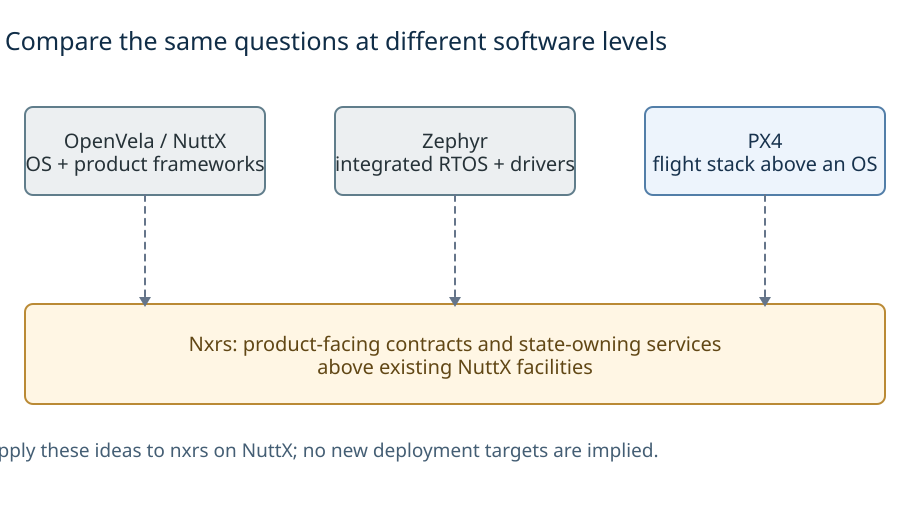

# Learning from OpenVela, Zephyr and PX4

These studies compare **how OpenVela/NuttX, Zephyr and PX4 organize embedded software, and which ideas can improve nxrs**. The goal is to improve nxrs’s existing NuttX-based design, not to add RTOS ports or replace NuttX. Portability is discussed to explain what an interface hides and what it still depends on.

The projects operate at different levels. **NuttX/OpenVela** shows an OS and device foundation extended with product frameworks; **Zephyr** shows an integrated RTOS, device/configuration model and kernel contracts; **PX4** shows a domain application stack and middleware built above an OS. PX4 is not another RTOS kernel. Treating all three as interchangeable kernels would obscure the most useful lessons. See each reference's [overview](#what-to-compare).

*Dotted arrows indicate ideas to borrow, not code dependencies or new deployment targets.* [D2](diagrams/comparison.d2)

## Start with a development question

The point of this comparison is to help make a design decision, not to memorize three sets of API names. The [developer guide](developer-guide.md) works through these questions with one small sensor-processing example:

| You need to decide… | Start here |
| --- | --- |
| Is this a function, a work item, or a separate thread? | [Execution placement](developer-guide.md#where-should-the-code-run) |
| Does each reader need every record, or only current state? | [Delivery semantics](developer-guide.md#what-must-cross-the-boundary) |
| How much buffering is enough, and will it meet the deadline? | [A worked capacity and latency example](developer-guide.md#how-much-buffering-is-enough) |
| Why does stop hang even with a dedicated stop queue? | [Progress and shutdown](developer-guide.md#what-must-keep-making-progress) |
| What changes when a sensor, bus, consumer or core changes? | [Change impact](developer-guide.md#what-changes-when-the-product-changes) |

For implementation entry points, each system's **Overview** identifies where application, driver and configuration changes belong. **Debugging and performance** maps concrete symptoms to evidence. Read those together with the relevant data-flow diagram: a diagram is useful only when it helps predict what the code will do.

## Reading the collection

Each system's **README** has ten sections, each with a compact diagram readable at normal document width. The **architecture atlas** provides larger maps and detailed explanations; **sources** records exact revisions and evidence limits; the **diagram guide** explains reproduction and viewing sizes. Detail belongs with the system it describes. Shared comparison does not require shared rendering dependencies or a universal component diagram.

| Reference | Architectural analysis | Detailed views | Evidence |
| --- | --- | --- | --- |
| OpenVela / NuttX | [Analysis](openvela/README.md) | [Five-view atlas](openvela/architecture-atlas.md) | [Sources](openvela/sources.md) |
| Zephyr | [Analysis](zephyr/README.md) | [Six-view atlas](zephyr/architecture-atlas.md) | [Sources](zephyr/sources.md) |
| PX4 | [Analysis](px4/README.md) | [Execution and data-flow atlas](px4/architecture-atlas.md) | [Sources](px4/sources.md) |

## What to compare

Use the table to compare the same topic across systems. Shared headings do not imply equivalent features or identical execution paths. The atlases retain the sensor, Bluetooth, ownership and control details that distinguish the systems.

| Question | OpenVela / NuttX | Zephyr | PX4 |
| --- | --- | --- | --- |
| What layer is this, and what problem does it solve? | [Overview](openvela/README.md#1-overview) | [Overview](zephyr/README.md#1-overview) | [Overview](px4/README.md#1-overview) |
| Which languages, runtimes and lifetime rules apply? | [Languages](openvela/README.md#2-languages-and-runtime) | [Languages](zephyr/README.md#2-languages-and-runtime) | [Languages](px4/README.md#2-languages-and-runtime) |
| What do API and portability boundaries actually promise? | [APIs](openvela/README.md#3-apis-and-abstraction-boundaries) | [APIs](zephyr/README.md#3-apis-and-abstraction-boundaries) | [APIs](px4/README.md#3-apis-and-abstraction-boundaries) |
| Who executes, blocks, schedules and handles interrupts? | [Execution](openvela/README.md#4-threads-scheduling-and-interrupts) | [Execution](zephyr/README.md#4-threads-scheduling-and-interrupts) | [Execution](px4/README.md#4-threads-scheduling-and-interrupts) |
| Where do state and buffers live; what is protected? | [Memory](openvela/README.md#5-memory-and-data-ownership) | [Memory](zephyr/README.md#5-memory-and-data-ownership) | [Memory](px4/README.md#5-memory-and-data-ownership) |
| What is copied, retained, consumed, notified or acknowledged? | [Data flow](openvela/README.md#6-messages-data-flow-and-wakeups) | [Data flow](zephyr/README.md#6-messages-data-flow-and-wakeups) | [Data flow](px4/README.md#6-messages-data-flow-and-wakeups) |
| Where are hardware differences and measurement semantics resolved? | [Sensor data](openvela/README.md#7-drivers-and-sensor-data) | [Sensor data](zephyr/README.md#7-drivers-and-sensor-data) | [Sensor data](px4/README.md#7-drivers-and-sensor-data) |
| How are instances selected, started, stopped and reclaimed? | [Startup / stop](openvela/README.md#8-build-startup-and-shutdown) | [Startup / stop](zephyr/README.md#8-build-startup-and-shutdown) | [Startup / stop](px4/README.md#8-build-startup-and-shutdown) |
| What can be observed or tested; what remains unproved? | [Debugging](openvela/README.md#9-debugging-and-performance) | [Debugging](zephyr/README.md#9-debugging-and-performance) | [Debugging](px4/README.md#9-debugging-and-performance) |
| What should nxrs borrow, adapt or avoid, and why? | [Lessons](openvela/README.md#10-what-nxrs-should-borrow) | [Lessons](zephyr/README.md#10-what-nxrs-should-borrow) | [Lessons](px4/README.md#10-what-nxrs-should-borrow) |

## Where nxrs fits

**Architectural evolution is not a ranking from old to new.** These systems address several recurring problems:

1. **Execution and hardware mechanisms:** scheduling, interrupts, memory, buses, drivers and basic IPC.
2. **Reusable contracts:** device classes, standardized OS APIs, subsystem interfaces and typed measurements.
3. **Application composition:** state ownership, execution placement, triggers, retention, lifecycle and observability.
4. **Explicit, testable obligations:** language-level ownership where applicable, bounded admission, measurement-time semantics, cancellation, and measured cost.

All three systems address more than one of these problems. C/C++ systems are not inherently missing ownership disciplines, and adopting Rust does not prove real-time behavior, memory isolation or bounded resource use. The question is **which requirements an interface expresses, which the implementation enforces, and which still depend on application policy and tests**.

Nxrs belongs primarily at the layer that connects state-owning services to product-facing device interfaces above existing OS facilities. Its baseline uses ordinary Rust `main()`, capability-local facades and selected providers, state-owning services and direct local computation. The concurrency document proposes provider-owned acquisition and typed delivery into independently bounded admission classes with one logical blocking selection point. It does not define a replacement RTOS, a mandatory actor framework or a global publish/subscribe graph. [HAL architecture][nxrs-hal] · [Concurrency baseline][nxrs-events]

**Its intended value is not merely wrapping POSIX or using Rust syntax.** The design hypothesis is that product-facing contracts, explicit ownership and small composition boundaries can preserve the useful structure of mature embedded frameworks without requiring their entire middleware or configuration stack. That hypothesis needs evidence of correctness, understandable behavior and acceptable linked/RAM/timing cost; this collection does not establish superiority over the prior art.

### Compare obligations, not slogans

| Requirement | OpenVela / NuttX | Zephyr | PX4 | Nxrs evaluation |
| --- | --- | --- | --- | --- |
| Reuse below product logic | Device classes and subsystem adapters | Device-class operations and configured instances | Bus/driver facilities and normalized reports | Reuse proven drivers; define only the product-facing difference. |
| Execution ownership | Tasks/pthreads, worker contexts, subsystem loops | Threads and workqueues selected by the application/subsystem | Dedicated tasks plus shared serial work-item execution | Keep one state owner; add an independent context only for a real blocking, isolation or timing reason. |
| Data lifetime | Driver buffers, reader state, subsystem transport contracts | Copied records, intrusive items, cached samples, explicit buffers; optional zbus observer modes | Topic retention plus independent reader generations | Declare move/copy/borrow, capacity, loss and recovery per path. |
| Isolation | Selected NuttX memory organization | Optional userspace and object/memory permissions | Normally shared application memory in the reviewed paths | Do not confuse Rust ownership or a service boundary with MPU/MMU isolation. |
| Completion | Device/framework-specific | Queue/work API-specific | Publication, scheduling and processing are distinct | Admission, processing, acknowledgment, stop and join are separate milestones. |
| Evidence | OS and driver tests, subsystem traces | Kernel traces, driver emulation, native_sim | Worker/topic diagnostics and product simulation | Correlate OS execution with semantic sample age, gaps and lifecycle outcomes. |

The cells summarize the linked per-system analyses, not a claim of whole-product equivalence. Device selection does not imply exclusive ownership; a shared buffer does not imply a broker; a callback does not imply a context switch; a language binding does not imply a runtime port.

### Compare the same level of abstraction

A kernel queue is a mechanism; a subsystem bus is a communication policy built from mechanisms. Zephyr's optional **zbus** therefore belongs in the comparison with PX4's uORB, alongside—not instead of—`k_msgq`, `k_fifo` and `k_work`. A zbus listener runs in the publisher's context; an ordinary subscriber receives a channel reference and later reads current state; a message subscriber receives a stored message copy. Those choices change publisher cost and retention. [Zephyr's worked comparison](zephyr/README.md#optional-publishsubscribe-with-zbus)

Likewise, OpenVela's Bluetooth framework supplies lifecycle and stack adaptation that a bare descriptor does not. An application should reuse that domain API when it needs that subsystem, rather than bypassing it merely to make every call look like POSIX. [OpenVela API boundaries](openvela/README.md#3-apis-and-abstraction-boundaries)

Explicit nxrs wiring is attractive when the product has a known, small set of owners. It also makes the application responsible for fan-out, per-consumer loss policy, startup dependencies and useful diagnostics. A topic system earns its extra machinery when independently developed modules, logging and multiple observers benefit from it. The question is not “which one has fewer boxes?” but “which responsibilities would we otherwise have to implement and maintain?”

## Ideas to borrow and how to test them

These are design recommendations, not newly implemented nxrs behavior.

| Decision | Prior-art lesson | What to retain or change in nxrs | Evidence needed before adoption |
| --- | --- | --- | --- |
| **Borrow: layered device reuse** | OpenVela separates generic device behavior from chip/platform adaptation. | Keep existing NuttX access inside capability providers; contain foreign types and only necessary ABI glue. Do not create another generic POSIX wrapper. | Real device tests for initialization, errors, units, timestamps and resource ownership. |
| **Borrow: selection is not lifetime** | Zephyr distinguishes descriptions, compiled devices, readiness and actual access. | Validate product bindings and resource identities; make session readiness/ownership explicit. | Reject missing/duplicate incompatible resources and verify unused-provider exclusion. |
| **Borrow: data is not a wakeup** | PX4 and NuttX retain sensor data separately from execution notification; Zephyr work can coalesce. | Give each input a retention and trigger policy. Preserve source gaps and ensure partial drains cannot strand data. | Burst, overrun, repeated-wakeup, stale-data and partial-drain tests. |
| **Adapt: bounded communication** | Byte queues, intrusive queues, topic rings and work lists have different contracts. | Preserve Rust move/drop semantics and separate stop/important/ordinary capacity where needed. No universal queue abstraction that hides these differences. | Full/closed outcomes, overload progress, correct destruction, stop under saturation and fairness tests. |
| **Defer: shared workers** | PX4 and Zephyr trade fewer stacks for same-worker interference. | Retain direct computation within an owner; introduce a shared executor only for a measured need. | Matched tail latency, handler bounds, stack/heap and final linked-image measurements. |
| **Borrow: layered observability** | OS execution alone does not explain application data age; topic rate alone does not explain scheduling. | Correlate ISR/acquisition, admission, dispatch and output using timestamps, sequence IDs and lifecycle events. | Measured instrumentation overhead and trace-loss visibility; reproducible fault cases. |
| **Exclude from this work: new RTOS ports** | Interface reuse and whole-runtime support are different obligations. | Learn from Zephyr/OpenVela/PX4 without adding a target port, global service graph or copied framework. | No port milestone is implied by this research. |

The existing nxrs multi-queue candidate remains bounded Crossbeam plus selection; simpler std bounded channels remain valid. Neither is assumed ISR-safe or allocation-free in every phase. Keep hardware waits/parsing/normalization below the service, pass only normalized semantic events through typed sinks, and use direct calls/borrows for tightly coupled calculations. Independent reserved capacity is not infinite capacity, CPU reservation or preemption of an active handler. [Concurrency baseline][nxrs-events]

## Terms and limits

Use **execution context** for an actual ISR, task, thread or worker; **component/service** for a logical owner; **work item** for scheduled handler state; and **queue/ring** for the specified storage or runnable list. Name which of those is meant by “event.” Use **contract** for behavior as well as signatures: units, time, lifetime, error outcomes, loss, cancellation and completion. HAL means nxrs's capability/provider boundary here; a NuttX lower half or OpenVela VHAL is a distinct, explicitly named mechanism.

Distinguish **observed source behavior**, **documented API guarantees**, **architectural inference**, and **nxrs recommendation** in the surrounding wording. Pinned examples take precedence for exact implementation details; rolling manuals provide qualified context. All nxrs comparisons use the same [baseline source][nxrs-readme], while earlier snapshots remain identified in the source indexes only where needed to preserve example provenance. A proposed architecture present in the repository is not automatically implemented or target-qualified.

The prose is English; C, C++, Rust and upstream API identifiers retain their technical meaning. Diagram legends identify dependency, data/ownership, notification and protection separately; actual colors and renderer settings are documented per atlas. Source dates, commit pins and validation provenance are recorded separately in the evidence/reproduction documents.

**Not established here:** benchmark rankings, worst-case execution guarantees, universal firmware support, a memory-safety proof, or the qualification of a new physical HAL. Existing native/browser demonstrations remain useful test evidence within their stated scope, not a reason to introduce another RTOS target. [Nxrs qualification boundary][nxrs-events]

[nxrs-hal]: https://github.com/yongkyuns/nxrs/blob/5c0d6360ef5190346ddfd41aec766895800ba287/docs/hal-platform-architecture.md
[nxrs-events]: https://github.com/yongkyuns/nxrs/blob/5c0d6360ef5190346ddfd41aec766895800ba287/docs/concurrency-event-communication.md
[nxrs-readme]: https://github.com/yongkyuns/nxrs/blob/5c0d6360ef5190346ddfd41aec766895800ba287/README.md
[nxrs-device]: https://github.com/yongkyuns/nxrs/blob/5c0d6360ef5190346ddfd41aec766895800ba287/docs/nuttx-device-access.md
