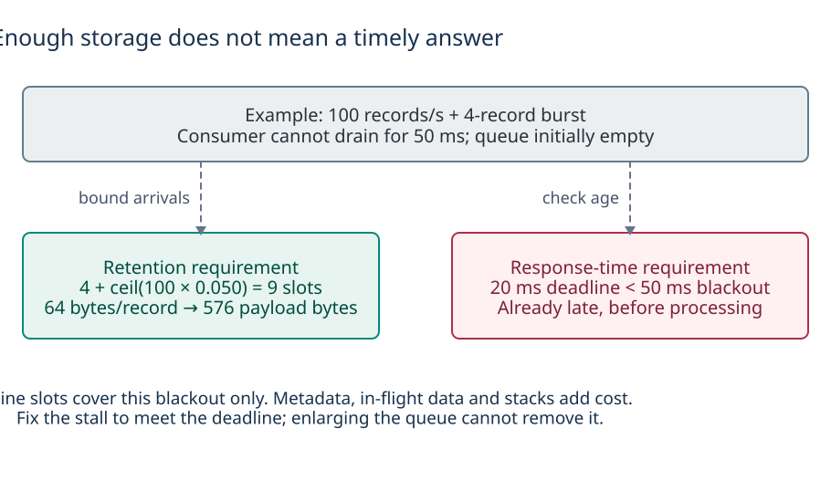
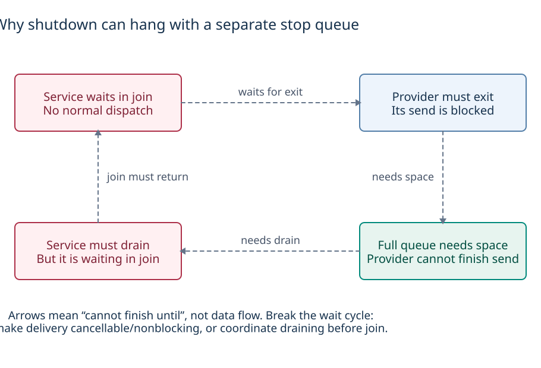

# Making architecture decisions

A useful architecture description should let you predict what changes when you add a feature—and explain why a working system becomes late, loses data, or hangs during shutdown. This guide applies the [three system studies](README.md) to those decisions. The examples use a small sensor-processing application; they are design exercises, not measurements of any RTOS.

## Where should the code run?

Suppose a product acquires measurements, updates an estimate, displays current state, accepts commands and records diagnostics. Those are five responsibilities, but they do **not** automatically require five threads, five queues or five services. Start by identifying state owners and operations that can block.

| Placement | Use it when… | Main cost or constraint | Prior-art example |
| --- | --- | --- | --- |
| A function on the current owner | The calculation belongs to the same state update and is bounded | Its execution time is part of that owner's response time | Calculation within a PX4 module; ordinary application functions. |
| A work item on an existing worker | The operation is bounded and can tolerate interference from other items on that worker | One shared stack/context, but a preceding slow item delays everything behind it | Zephyr workqueue; PX4 `ScheduledWorkItem`; an appropriate NuttX workqueue. Their allowed operations differ. |
| A dedicated thread/task | The component must wait for hardware, has an independent timing/lifecycle requirement, or needs isolation from slow work | Stack, scheduling and synchronization costs; cancellation must wake its waits | NuttX acquisition pthread; Zephyr application thread; PX4 task-based module. |
| A callback | The API explicitly permits the work in its documented calling context | A callback is not a scheduling policy: it may run on the publisher, a worker or an interrupt path | zbus listener on the publisher; driver-specific sensor trigger callbacks. |

Check the actual restrictions before using the work-item row. NuttX HPWORK is for short driver bottom halves; PX4 shared workers must not contain blocking I/O; Zephyr workqueue threads can permit blocking calls, but those calls still delay later items on that queue. These are different contracts, not three names for one executor. [OpenVela execution](openvela/README.md#4-threads-scheduling-and-interrupts) · [Zephyr execution](zephyr/README.md#4-threads-scheduling-and-interrupts) · [PX4 execution](px4/README.md#4-threads-scheduling-and-interrupts)

**A practical starting point for nxrs:** keep tightly coupled parsing-independent calculations on the state owner. Let the provider handle hardware waiting, acquisition and protocol normalization. Add an execution context only for a real blocking or timing requirement; do not add a relay thread whose only job is forwarding normalized data. The service can own the session without reading the device on its own dispatch thread. This is the documented nxrs direction, not a claim that every physical provider is already implemented. [Nxrs concurrency baseline][nxrs-events]

### What does adding a thread fail to solve?

A new thread does not give exclusive access to the bus, a private sensor cache, or immunity to a lock held by another thread. Identify the **whole transaction** that must be consistent. For Zephyr Fetch/Get, protecting each API call independently can still allow another fetch to replace the sample between fetch and get. Protect the transaction or give acquisition to one owner and pass the resulting record. Conversely, do not hold a device lock while waiting for a consumer to process that record. [Fetch/Get rules][fetch-get]

Moving a component off a shared worker may uncover races previously hidden by serial execution. Recheck callbacks, shared state, device access and stop/restart—not just whether the new task starts. Raising a worker's priority cannot make the next item preempt the item currently occupying that same worker. [PX4 execution](px4/README.md#can-i-put-a-logger-or-slow-operation-on-this-worker) · [Zephyr workqueue behavior][work]

## What must cross the boundary?

Use an explicit delivery policy for each consumer. In this example, the estimator needs each admitted sample in order, the display needs only current state, commands need an outcome, and logging has a separately budgeted loss policy.

| Information | What must be retained? | What the receiver does | What overload must reveal |
| --- | --- | --- | --- |
| Measurements for integration | Ordered records with measurement times and sequence/gap information | Drain within a bounded budget; detect missing history | A lost record or stale batch, not merely a missed wakeup. |
| Current display state or a setpoint | The most recent value plus freshness/version information | Read when needed; skip obsolete intermediate values deliberately | Excessive age, not necessarily every skipped version. |
| Command | Request identity, parameters and enough state to report completion | Accept/reject, execute, and return a defined outcome | Full/rejected admission versus failure after acceptance; retry/duplicate policy. |
| Bulk frame or log buffer | Payload storage plus explicit ownership/lifetime | Borrow locally or transfer a buffer/pool handle | Exhausted buffers, partial fan-out or dropped recording data. |

A queued pointer is not a copied payload, a publication is not an acknowledgment, and a work notification is not a retained sample. Select a mechanism only after deciding which row applies. [NuttX buffered sensors](openvela/README.md#6-messages-data-flow-and-wakeups) · [Zephyr queues and zbus](zephyr/README.md#6-messages-data-flow-and-wakeups) · [PX4 topic retention](px4/README.md#6-messages-data-flow-and-wakeups)

### Why not use one universal message bus?

A bus can be useful. PX4's topics let modules and diagnostic readers observe the same data with independent reader progress. Zephyr's optional zbus offers inline listeners, current-channel notifications and copied-message observers. OpenVela subsystem APIs add domain state and lifecycle beyond raw file operations. Recreating those features with hand-wired queues also has a maintenance cost. [Comparison at the same abstraction level](README.md#compare-the-same-level-of-abstraction)

For a fixed nxrs product, explicit typed endpoints can keep dependencies and ownership visible. But fan-out still needs a policy: if the estimator accepts a sample while logging rejects it, the producer must know whether to continue, retry only the logger, or record a gap. Retrying the whole fan-out can duplicate delivery to the estimator. A bounded queue for each reader is not an atomic broadcast. State those rules before choosing helpers or declaring a design simpler. [Nxrs admission and fan-out requirements][nxrs-events]

## How much buffering is enough?

[](diagrams/overload-budget.svg)

*An explicitly chosen workload: the capacity calculation protects against one bounded blackout, while the deadline test already fails. It is not an RTOS benchmark. [D2](diagrams/overload-budget.d2).*

Assume the pending-record queue starts empty. Bound arrivals in any interval of length `t` seconds by:

```text
A(t) <= B + ceil(r * t)
B = 4 extra burst records
r = 100 records/second
J = 0.050 seconds with no queue draining

Records arriving during J <= 4 + ceil(100 * 0.050) = 9
```

Under these assumptions, **nine waiting-record slots** cover arrivals during that one blackout. This is not a universal queue size: already pending records, different burst bounds, recurring stalls, batching and the receiver's later service rate change the required capacity. Include records in every upstream/downstream buffer, not only the queue being sized.

For hypothetical **64-byte inline records**, nine payload slots occupy **576 bytes**. This excludes queue metadata, alignment, wait bookkeeping, the record currently being processed, driver storage, copied observer messages, thread stacks and allocator overhead. A Rust type containing a pointer or handle can refer to additional payload storage. Measure the final linked image and peak runtime memory separately. [Nxrs footprint and allocation requirements][nxrs-events]

If processing resumes at 200 records/second while arrivals continue at 100, the **fluid approximation** for clearing a backlog of nine is `9 / (200 - 100) = 0.090 seconds`. That is an average-rate recovery estimate, not a discrete worst-case latency bound. Further bursts, a second blackout, synchronization, higher-priority work and work done between drains can invalidate it. If sustained processing capacity is below the input rate, a larger finite buffer only postpones overload.

Now impose a **20 ms output deadline** on each measurement. A sample arriving at the start of the 50 ms blackout already misses it before processing begins—even with an enormous queue. Fix execution placement, interference or blocking first; retention and freshness are separate requirements. For a current-state consumer, dropping obsolete values may be appropriate, but it does not recover measurement history needed by an integrator.

### Which timestamps would demonstrate the problem?

Record physical measurement time where available, acquisition completion, enqueue/admission, handler entry, handler exit and output publication. Separate those intervals before blaming the scheduler. Timestamps from different clocks require a known mapping and uncertainty; “now” after a read is not a substitute for measurement time. Include source identity, sequence and session generation so restarts and gaps are visible. [Driver and sensor semantics](px4/README.md#7-drivers-and-sensor-data) · [Nxrs measurement contract][nxrs-events]

The three [debugging sections](README.md#common-review-questions) give system-specific tools and symptoms. A useful test stresses the path with a known burst, slow consumer and stalled driver, then checks age, gaps, progress and memory. Average CPU load, an intact trace, or a nominal publication rate alone does not demonstrate deadline compliance.

## What must keep making progress?

[](diagrams/progress-deadlock.svg)

*Arrows describe “cannot finish until,” not data movement. This deliberately broken shutdown creates a wait cycle even if stop has its own reserved queue. [D2](diagrams/progress-deadlock.d2).*

Consider a provider blocked sending to a full measurement queue. The service receives a stop request and immediately joins the provider, so it stops draining that queue. The provider cannot exit until its send finishes; the send cannot finish until the service drains; the service cannot drain because it is waiting in join. A dedicated stop queue solves **admission of stop**, not this progress cycle.

The protocol must break that dependency. A suitable design might use nonblocking admission with bounded retained/rejected-event handling, a cancellable send, or a coordinated drain during stopping. Hardware waits need their own cancellation/wakeup mechanism. The design must specify how cancellation wins and how buffers/messages are disposed of; do not assume closing an arbitrary descriptor safely cancels every blocking operation. [Nxrs shutdown requirements][nxrs-events] · [NuttX queue-operation contracts][mq]

| Stage | Required evidence before advancing |
| --- | --- |
| Request stop | The request is observable despite ordinary traffic saturation. |
| Disable further production and wake waits | No producer is trapped in a hardware wait, queue wait or lock cycle that requires a stopped consumer. |
| Resolve pending delivery and in-flight callbacks | Explicit drain/discard/error policy; callbacks can no longer touch reclaimed state. |
| Join/release resources | The execution owner has finished and all borrowers are done; join cannot prevent progress needed for exit. |
| Start a new session, when supported | Old queued events can be distinguished from the new source/session. |

This is an application protocol, not a promise supplied by every OS cancel call. Zephyr synchronous work cancellation has context constraints and cannot prevent another producer resubmitting later. PX4 must unregister scheduling/callback sources and resolve execution before destroying module state. NuttX task-group cleanup is not proof that a hardware source has stopped. [Zephyr shutdown](zephyr/README.md#8-build-startup-and-shutdown) · [PX4 shutdown](px4/README.md#8-build-startup-and-shutdown) · [OpenVela shutdown](openvela/README.md#8-build-startup-and-shutdown)

## What changes when the product changes?

| Product change | Architectural question to ask | Evidence before accepting the change |
| --- | --- | --- |
| Replace a sensor chip | Does the replacement preserve units, axes, measurement time, supported rates, batching, errors and reset behavior—not just function signatures? | Replay/driver conformance plus physical timing/error tests for the selected chip. |
| Add a display or logger | Does the new reader change producer time or consume the critical path's capacity? | Per-consumer loss policy and burst/slow-reader tests; measured callback/copy cost. |
| Share a bus or change sampling rate | Which transactions serialize, and how long can acquisition wait? | Bus/lock occupancy, FIFO overrun, deadline and shutdown measurements. |
| Move processing to another thread/core | Which state was only safe because of prior serial execution? | Shared-state and callback audit, concurrency tests, cache/DMA requirements and measured interference. |
| Move across a protection or processor boundary | Are pointers, callbacks and ordinary calls still meaningful across it? | An explicit transport/access contract, serialization/buffer ownership and fault handling—not an added arrow on a diagram. |
| Add sleep or device power management | Does initialized/ready mean powered and available for this operation? Who owns suspend/resume and shared use? | Driver power-state rules, wake/resume time and recovery tests under concurrent clients. |

These are change-review questions, not implemented support claims. Zephyr's runtime device PM is a useful concrete example: device use counts and suspend/resume are additional lifecycle mechanisms, not a consequence of obtaining a device pointer. Its driver/dependency behavior must be checked rather than generalized to every peripheral. This collection does not yet analyze complete low-power, security or inter-processor subsystems. [Zephyr runtime PM][runtime-pm] · [Scope of the studies](README.md)

## What would justify an nxrs design decision?

The target is not to reproduce every feature of a larger framework. Nor is a smaller diagram evidence that those responsibilities disappeared. Keep a decision only when its benefits survive the product's workload and fault cases.

A proposal should identify the state owner, execution context, input/retention rule, buffer lifetime, resource budget, stop/restart behavior and observable failure. Compare alternatives using the same workload and target configuration. If explicit wiring becomes repeated discovery/fan-out/lifecycle infrastructure, reevaluate a small shared abstraction. If a shared worker saves RAM but misses the latency target, keep the extra thread. If a direct call preserves ownership and meets the budget, do not replace it with a queue merely for stylistic uniformity. [Borrowing decisions](README.md#borrowing-decisions-and-acceptance-criteria)

The system studies supply mechanisms and source entry points. The arithmetic and failure cases here show how to reason about them; they do not establish WCET, functional safety, physical-driver qualification or a new RTOS port. The companion [example checks](check_examples.py) catch arithmetic/ordering regressions in these illustrations, not real scheduler behavior.

[nxrs-events]: https://github.com/yongkyuns/nxrs/blob/5c0d6360ef5190346ddfd41aec766895800ba287/docs/concurrency-event-communication.md
[fetch-get]: https://docs.zephyrproject.org/latest/hardware/peripherals/sensor/fetch_and_get.html
[work]: https://docs.zephyrproject.org/latest/kernel/services/threads/workqueue.html
[mq]: https://nuttx.apache.org/docs/latest/reference/user/04_message_queue.html
[runtime-pm]: https://docs.zephyrproject.org/latest/services/pm/device_runtime.html
