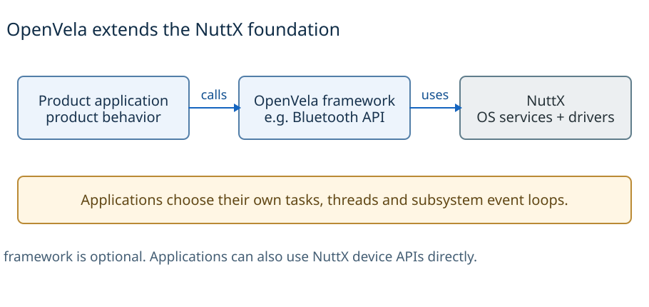
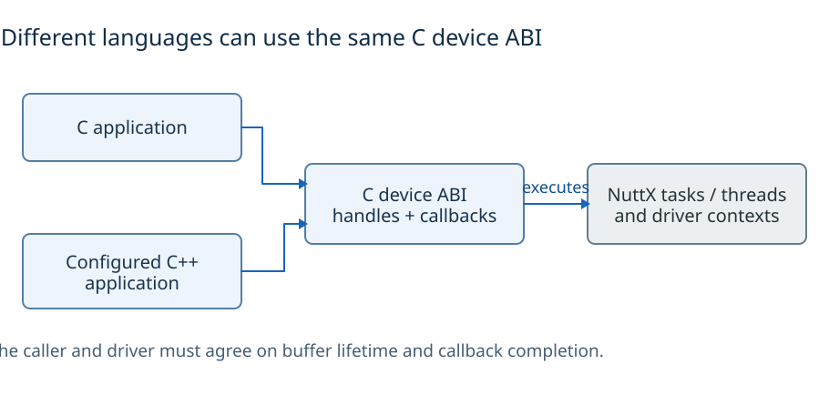
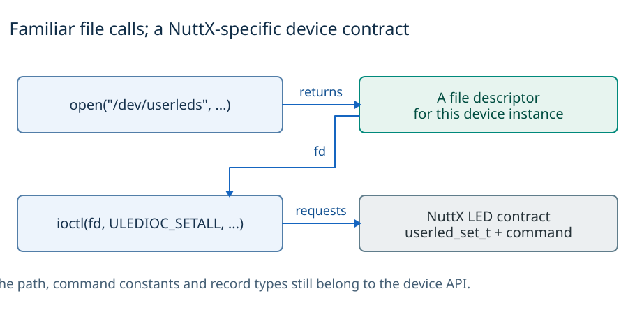
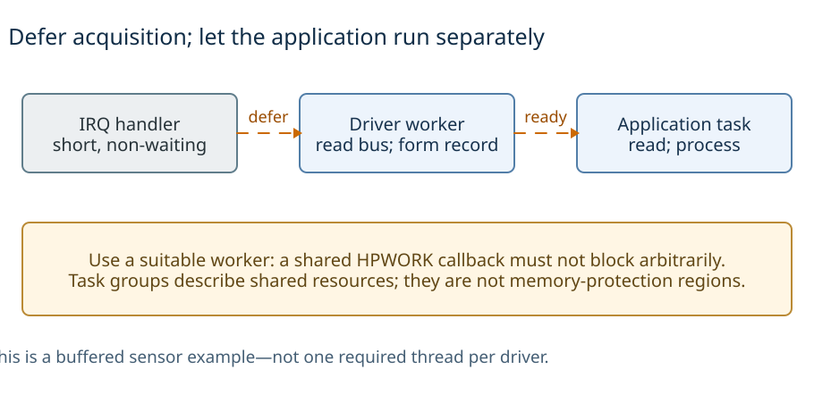
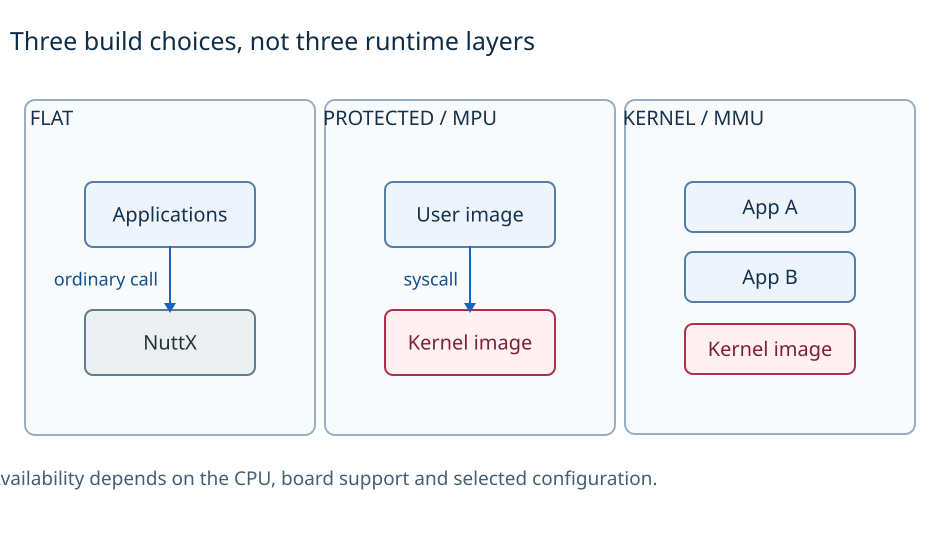
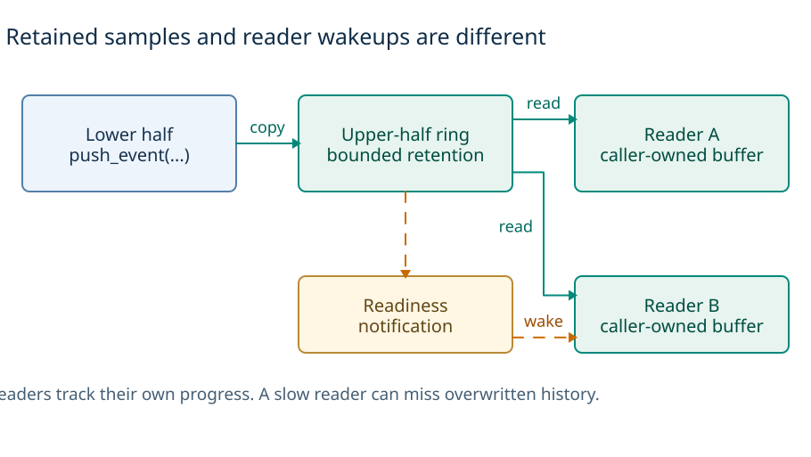
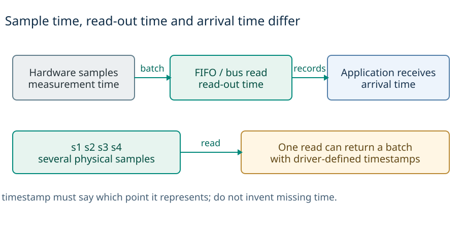
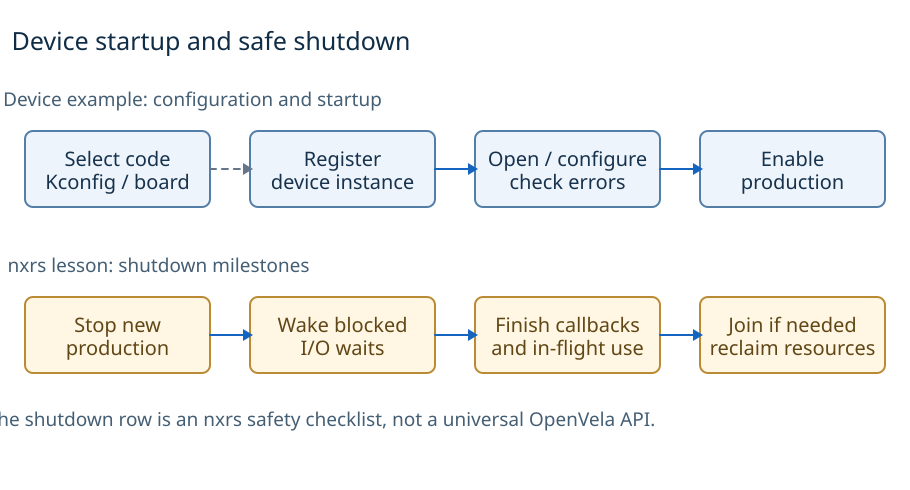
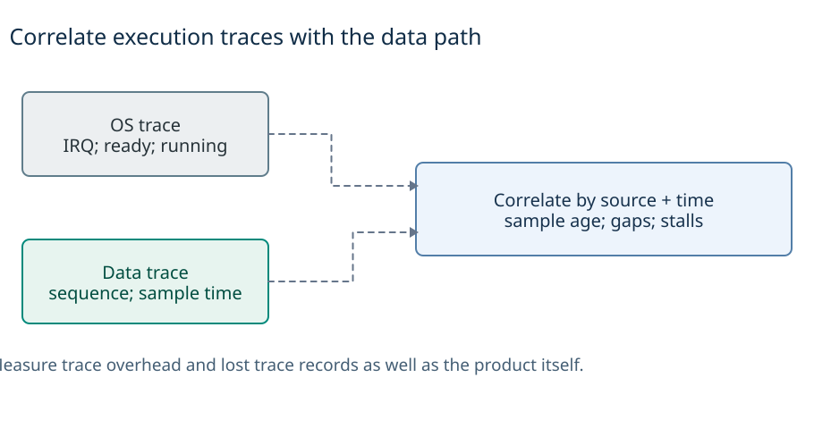
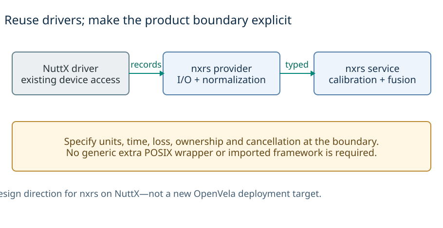

# OpenVela / NuttX architecture

OpenVela builds product frameworks on top of NuttX’s scheduler, drivers and OS APIs. It is useful to nxrs as an example of **reusing the OS and drivers while keeping product behavior separate from device-specific code**.

[Comparison guide](../README.md) · [Architecture atlas](architecture-atlas.md) · [Sources](sources.md) · [Diagram reproduction](diagrams/README.md)

## 1. Overview

*A representative framework call path. These are software responsibilities, not three processes.* [D2](diagrams/inline/overview.d2) · [OpenVela overview][vela-overview] · [Bluetooth example][vela-bt]

OpenVela is a NuttX-based platform with additional frameworks, libraries, product services and integration. NuttX supplies scheduling, synchronization, file/device services and the embedded OS foundation. OpenVela frameworks add domain-specific APIs and adaptation, for example Bluetooth. This differs from PX4's flight-domain composition and from Zephyr's native kernel/device programming model. [Project overview][vela-overview] · [Framework organization][vela-frameworks]

This organization does not require one global HAL, message graph or event loop. The examples focus on a NuttX sensor-class path, the official LED example, and the inspected Bluetooth subsystem. Other subsystems may make different choices. Framework code can call a device API directly or expose a higher-level API to its clients. [Sensor model][nuttx-sensors] · [LED example][vela-led] · [Bluetooth][vela-bt]

## 2. Languages and runtime

*C and configured C++ applications can call the C device interface; the ABI does not select a new execution model.* [D2](diagrams/inline/languages.d2) · [C++ support][cpp] · [Task groups][tasks] · [Sensor interface][nuttx-sensors]

The inspected NuttX device interfaces and Bluetooth boundaries are C interfaces: structures, callback tables, buffers, opaque handles and explicit initialization/cleanup. Those interfaces define operations and data representation; they do not automatically encode exclusive ownership, buffer lifetime or completion of all callbacks in the type system. Execution still happens in NuttX tasks, threads and subsystem loops—not in one process per source directory. [Sensor model][nuttx-sensors] · [Bluetooth API and driver model][vela-bt] · [Task groups][tasks]

This is a review of those native paths, not an inventory of every language/runtime available in OpenVela's application frameworks. A higher-level language or binding must still satisfy the underlying C lifetime and execution rules. Conversely, a C interface does not imply poor architectural separation: the upper/lower-half boundary and Bluetooth stack adapters are concrete reusable contracts.

For nxrs, Rust ownership is useful above the interface, while device access and foreign-function interfaces (FFI) still need explicit safety and shutdown requirements. The current baseline prefers Rust std descriptor I/O tested on the target and minimal target-specific ABI glue inside each provider. It does not require a separate generic POSIX/device adaptation layer. [Nxrs device-access policy][nxrs-device]

NuttX also supports configured C++ applications. Compiler/library selection and initialization remain runtime and build requirements; C++ source support does not change the C device ABI or supply isolation. The useful comparison is not “OpenVela only C versus nxrs only Rust,” but which requirements each application layer makes explicit. [NuttX C++ application example][cpp]

## 3. APIs and abstraction boundaries

*The LED example separates the file operation from the device-specific meaning of the request.* [D2](diagrams/inline/apis.d2) · [LED example][vela-led]

[Detailed diagram: OpenVela responsibility and contract map](diagrams/openvela-abstractions.svg). OV1: logical responsibilities and calls/data, not three processes. [Detailed explanation](architecture-atlas.md#ov1-architecture-and-device-contracts) · [D2](diagrams/openvela-abstractions.d2).

**Familiar file operations do not make the device protocol POSIX-standard.** The LED example uses `open("/dev/userleds", ...)` and `ioctl(fd, ULEDIOC_SETALL, ...)`; the path, request constant and `userled_set_t` belong to the NuttX LED contract. Hardware independence within that contract does not imply source or behavioral portability to another OS. [LED example][vela-led]

| Dependency in upper-layer code | What it establishes |
| --- | --- |
| `<nuttx/config.h>` | Build configuration coupling, not by itself execution of a kernel service. |
| `<nuttx/list.h>` | A utility/type dependency, not by itself a private runtime dependency. |
| `<nuttx/leds/userled.h>` | A public, hardware-independent but NuttX-specific class contract. |
| Actual scheduler/IRQ/internal calls | A stronger execution dependency; inspect symbols and their allowed context. |

### Why a NuttX header does not always imply a kernel call

Bluetooth's `Makefile.host` imports NuttX configuration/list headers while describing a host bttool/client subset. This is evidence about that subset's dependencies, not proof that the complete Bluetooth stack runs unchanged on a host. The recipe was not executed for this review. [Host build recipe][vela-host]

### Device and framework interfaces

The sensor upper half supplies common file operations, buffering and multi-client behavior; the lower half supplies device operations and hardware interaction. Board registration and bus/controller support remain below that contract. Not every device driver is required to have exactly two halves. [Sensor model][nuttx-sensors] · [Board/SoC/driver example][vela-led]

Bluetooth adds another set of boundaries: public domain API, optional client/server transport, service execution, stack adaptation (SAL), and platform/hardware adaptation (HAL/VHAL). Its VHAL uses NuttX HCI/ioctl interfaces; the driver integration uses `bt_driver_s`. A module's abstraction promise must be read at the right boundary. [Bluetooth][vela-bt] · [VHAL source][vela-vhal]

## 4. Threads, scheduling and interrupts

*Orange arrows request later execution. The upper-half readiness notification does not run the application or carry the sample.* [D2](diagrams/inline/execution.d2) · [Sensor model][nuttx-sensors] · [Workqueue restrictions][workqueues]

A NuttX **task** establishes a task group; a **pthread** joins its creator's group and shares group resources such as descriptors. Both are scheduled execution contexts with stacks. Resource grouping is not memory protection in a flat build. POSIX-looking creation APIs therefore cannot be substituted without considering resource-sharing behavior. [Tasks versus threads][tasks]

### Deferred work

NuttX workqueues execute queued callbacks in worker context rather than the caller. HPWORK is intended for time-critical driver bottom halves; LPWORK and user work facilities have different purposes and configuration. Deferred execution is not permission to make an unbounded blocking call in a shared worker. A single worker serializes its callbacks; configured pools or other contexts require their own concurrency analysis. These are NuttX facilities, **not PX4's `wq:*` implementation**. [Workqueues][workqueues]

The sensor example separates hardware interrupt notification, driver-appropriate deferred acquisition, retained data and the consuming application. The ISR need not run application computation. Upper-half code/ring storage is not an invented broker thread; publishing and waking a reader are different from the reader executing. [OV3 execution view](architecture-atlas.md#ov3-sensor-execution-storage-is-not-a-thread) · [Sensor model][nuttx-sensors]

Bluetooth's LOCAL versus SOCKET_IPC choice is independent of its service-loop thread settings. LOCAL omits framework socket transport; it does not prove that all operations complete on the caller's stack. SOCKET_IPC introduces serialized transport, not necessarily separate protected processes. The inspected Kconfig does not establish a universal callback context for every API. [Bluetooth Kconfig][bt-config] · [OV4 boundaries](architecture-atlas.md#ov4-bluetooth-four-different-kinds-of-boundary)

## 5. Memory and data ownership

*Flat builds share memory; protected builds separate kernel and user privilege; kernel builds can provide distinct user address environments.* [D2](diagrams/inline/memory.d2) · [Pinned memory options][memory-config] · [Protected builds][protected]

[OV2 compares the three build organizations](architecture-atlas.md#ov2-memory-organization-is-a-build-choice). In the inspected OpenVela NuttX Kconfig, FLAT is the default: one unprotected executable organization. Separate stacks, task groups and logical services are not address-space isolation. PROTECTED uses a supported MPU path with privileged kernel and unprivileged user images; it does not isolate every user task like a Linux process. KERNEL requires MMU/address-environment support and separately loaded applications. Board support and configuration determine availability. [Pinned memory options][memory-config] · [Protected build guide][protected]

### Buffers, stacks and heaps

Heap organization depends on the selected build/configuration; do not infer one allocator per service or a universal user/kernel heap split. Driver rings, application read buffers, task stacks and framework transport buffers are separate resource budgets even when they share one address space. The buffered sensor path copies records into retained storage and later into caller storage; the proactive fetch path can use the caller's buffer instead. A component boundary alone proves neither zero-copy nor allocation freedom. [Sensor storage/fetch model][nuttx-sensors]

C callbacks and borrowed buffers must outlive all users. Rust can make selected nxrs ownership transfers explicit, but raw pointers, FFI, DMA/cache coherence, cancellation and OS access rights remain separate obligations. Memory safety, bounded memory consumption and isolation are different claims.

## 6. Messages, data flow and wakeups

*Teal arrows copy records. The orange notification changes readiness; it does not contain a sample. The second reader has independent progress.* [D2](diagrams/inline/data-flow.d2) · [Buffered sensor model][nuttx-sensors]

The buffered sensor path is **lower-half acquisition → `push_event` → upper-half ring → application `read`**. Readiness can wake a waiting reader but carries no sample itself. Readers have independent progress; a delayed reader may lose retained history. Increasing retention does not reserve CPU time or guarantee lossless delivery. Proactive/fetch and polling modes are different paths, not exceptions to hide inside a generic queue drawing. [Sensor model][nuttx-sensors] · [OV3](architecture-atlas.md#ov3-sensor-execution-storage-is-not-a-thread)

| Mechanism | Data/lifetime meaning | Not implied |
| --- | --- | --- |
| Sensor-class buffered read | Retained records with reader progress and caller-owned output | A queue slot per callback, infinite history, or producer backpressure for every reader. |
| Deferred work | A request to execute code in worker context | One preserved payload for every notification. |
| Framework LOCAL API | No framework socket transport | Synchronous completion of the domain operation. |
| Framework SOCKET_IPC | Serialized client/server communication | MPU/MMU isolation, a universal acknowledgment protocol or identical latency to LOCAL. |

The rows refer to the [sensor model][nuttx-sensors], [workqueue contract][workqueues] and [Bluetooth configuration][bt-config], not one uniform OpenVela event API. The NuttX sensor framework is not the PX4 uORB implementation despite the name used in its documentation. Read the actual storage and call paths before transferring conclusions between them.

**Design consequence:** independently acquired streams do not create a coherent cross-device epoch by sharing an OS or transport. Record retention, notification, application processing and operation completion require distinct contracts. A finite resource may fill; the application/framework must define waiting, loss, retry, fault visibility and completion as appropriate.

## 7. Drivers and sensor data

*A FIFO read may return several samples. One interrupt, bus transaction, record and application dispatch are not necessarily one-to-one.* [D2](diagrams/inline/sensor-data.d2) · [Sensor modes and records][nuttx-sensors] · [nxrs measurement contract][nxrs-events]

Board code binds/registers hardware; bus/controller support implements transfers; the device-specific lower half handles device operations; the upper half supplies reusable class behavior. Bluetooth separately adapts the host stack and physical controller/HCI transport. This is reusable layering, not proof of one OS-neutral wrapper around all OpenVela code. [LED integration][vela-led] · [Bluetooth driver interface][vela-bt]

For the sensor example, distinguish interrupt, hardware sample, bus read, retained record and application read. Their counts need not match. A timestamp taken after a blocked read is not necessarily physical measurement time. The API's actual units, axes, data representation, interval, batching, gap and validity semantics must be checked for the selected driver. The atlas does not prescribe an EKF or GNSS-driven application policy to OpenVela. [Sensor operations and modes][nuttx-sensors]

The nxrs `ImuSample` example contains `accel_mps2`, `gyro_rps`, `timestamp_ms` and an `Imu::sample(now_ms)` operation. It illustrates the product contract, not a complete event-producing physical provider. Protocol framing/normalization belongs in the provider; product calibration/fusion and degraded-mode decisions belong to the service. [IMU example][nxrs-imu] · [Nxrs ownership baseline][nxrs-events]

## 8. Build, startup and shutdown

*Startup combines build choices and runtime actions. Safe shutdown must stop new production and finish in-flight use before reclaiming state.* [D2](diagrams/inline/lifecycle.d2) · [LED startup][vela-led] · [Task lifetime][tasks] · [nxrs shutdown requirements][nxrs-events]

The LED example shows board selection, Kconfig/driver selection, board device registration and application inclusion as distinct steps. Bluetooth Kconfig independently selects framework/transport, stack/service features and service-loop resources. Compile-time inclusion does not prove successful initialization or active hardware. A device instance and an implementation choice are not the same thing. [LED build/registration][vela-led] · [Bluetooth Kconfig][bt-config]

There is no universal shutdown protocol established by these examples. Closing a descriptor, cancelling pending work, completing in-flight callbacks and terminating a task are different actions. Task-group resources persist until their last member exits; that alone does not prove a device/subsystem stopped delivering data. [Task-group lifetime][tasks]

**Evaluation rule for nxrs:** select resources before start; install delivery endpoints before enabling production; roll back partial start; ensure a blocked device wait can be cancelled; stop producers, establish completion of callbacks and in-flight operations, then reclaim buffers and join. Stop requested, provider stopped and joined are separate milestones. Do not describe that application-level protocol as an automatic OpenVela guarantee. [Nxrs lifecycle requirements][nxrs-events]

## 9. Debugging and performance

*OS events show who ran; data timestamps and sequence counters show what happened to a measurement. Correlating both exposes delays and gaps.* [D2](diagrams/inline/debugging.d2) · [NuttX tracing][trace] · [nxrs measurement plan][nxrs-events]

Analyze interrupt/acquisition delay, bus occupancy, worker wait, retained-data age, reader processing and any subsystem transport separately. Thread priority and separate queue capacity do not establish a complete deadline bound. Sharing a workqueue saves contexts/stacks but creates interference; extra threads add resource and scheduling costs. This is an evaluation model, not a performance ranking. [Workqueue responsibilities][workqueues]

NuttX's scheduler instrumentation can expose scheduling/interrupt/system-call activity where configured; combine OS traces with source sequence, FIFO/ring overrun, sample timestamps and subsystem outcomes. A task list or average CPU load cannot establish end-to-end data age. Host/client build recipes, simulator tests and physical hardware tests cover different boundaries; the Bluetooth host recipe is not a qualified full-stack host port. [Tracing guide][trace] · [Host subset][vela-host]

For nxrs, reuse existing allocation and matched footprint/RTOS probes. Separate construction, first blocking use, steady state and teardown; measure final linked code/static RAM, stacks and heap rather than summing libraries. Keep instrumentation cost separate from timing and test saturation, faults and shutdown with a real driver as well as synthetic providers. The current reference contributes architecture analysis, not those target results. [Qualification baseline][nxrs-events]

## 10. What nxrs should borrow

*Reuse NuttX below the provider. Normalize device data in the provider; keep product calibration and fusion in the state-owning service.* [D2](diagrams/inline/nxrs-lessons.d2) · [nxrs device access][nxrs-device] · [Capability contracts][nxrs-hal] · [Concurrency proposal][nxrs-events]

**Borrow:** reusable device behavior below a product-facing contract, subsystem-specific adaptation and explicit instance/resource binding. **Adapt:** use native Rust ownership and semantic capability types above existing NuttX facilities; make callback context, timestamp, loss and completion visible. **Do not import by default:** OpenVela's full framework catalog, another generic OS wrapper, a service graph, or an OpenVela target port. These recommendations follow the inspected boundaries rather than a claim that one system replaces another.

[Detailed diagram: Nxrs contract and NuttX driver reuse](diagrams/nxrs-capability-boundary.svg). OV5: how to use the prior-art lesson within nxrs's NuttX-based architecture. [D2](diagrams/nxrs-capability-boundary.d2) · [Common borrowing decisions](../README.md#ideas-to-borrow-and-how-to-test-them).

Keep facade and `api/` crates separate: providers depend on the contract, while the facade selects an implementation; the contract must not depend back on providers. Product-platform metadata is build selection, not a global HAL object. Isolated stop/important/ordinary capacity and one logical wait remain the proposed service model, not an inherited OpenVela behavior. [HAL architecture][nxrs-hal] · [Concurrency baseline][nxrs-events]

### The camera example and current device-access policy

The historical camera example remains useful evidence of containment: its C bridge included NuttX configuration, used `open/read/ioctl`, and implemented a project-specific read-device format query, **not V4L2**. It is not the current general device-access prescription; the common nxrs baseline favors direct qualified Rust std I/O with only necessary target-ABI glue. Earlier example snapshots are retained in the source index. [Historical camera bridge][nxrs-camera-c] · [Historical Rust provider][nxrs-camera-rust] · [Baseline policy][nxrs-device]

**What still needs testing:** matching an interface does not prove its behavior, resource bounds or execution environment. Native/browser demonstrations retain their own qualification scope, but expanding nxrs to other RTOSes is not an objective of this reference. [Evidence and limits](sources.md)

[vela-led]: https://github.com/open-vela/docs/blob/dev/en/quickstart/development_board/STM32F411.md
[nuttx-sensors]: https://nuttx.apache.org/docs/latest/components/drivers/special/sensors/sensors_uorb.html
[vela-bt]: https://github.com/open-vela/frameworks_bluetooth/tree/c423c51e69acad244b1d44f138918cbedbc70d40
[vela-host]: https://github.com/open-vela/frameworks_bluetooth/blob/c423c51e69acad244b1d44f138918cbedbc70d40/Makefile.host
[vela-vhal]: https://github.com/open-vela/frameworks_bluetooth/blob/c423c51e69acad244b1d44f138918cbedbc70d40/service/vhal/bt_vhal.c
[nxrs-architecture]: https://github.com/yongkyuns/nxrs/blob/820536962f5bea9d71f4f9960ae0f42d33184b30/docs/hal-platform-architecture.md
[nxrs-imu]: https://github.com/yongkyuns/nxrs/blob/820536962f5bea9d71f4f9960ae0f42d33184b30/hal/imu/api/src/lib.rs
[nxrs-camera-c]: https://github.com/yongkyuns/nxrs/blob/820536962f5bea9d71f4f9960ae0f42d33184b30/hal/camera/nuttx/ffi/camera.c
[nxrs-camera-rust]: https://github.com/yongkyuns/nxrs/blob/820536962f5bea9d71f4f9960ae0f42d33184b30/hal/camera/nuttx/src/lib.rs
[nxrs-readme]: https://github.com/yongkyuns/nxrs/blob/5c0d6360ef5190346ddfd41aec766895800ba287/README.md
[sensor]: https://nuttx.apache.org/docs/latest/components/drivers/special/sensors/sensors_uorb.html
[led]: https://github.com/open-vela/docs/blob/dev/en/quickstart/development_board/STM32F411.md
[memory-config]: https://github.com/open-vela/nuttx/blob/9e79ad292fd103d3b9ef737757081a3f7fbbf9a4/Kconfig
[protected]: https://nuttx.apache.org/docs/13.0.0/guides/protected_build.html
[bt-config]: https://github.com/open-vela/frameworks_bluetooth/blob/c423c51e69acad244b1d44f138918cbedbc70d40/Kconfig
[bt-readme]: https://github.com/open-vela/frameworks_bluetooth/blob/c423c51e69acad244b1d44f138918cbedbc70d40/README.md
[bt-vhal]: https://github.com/open-vela/frameworks_bluetooth/blob/c423c51e69acad244b1d44f138918cbedbc70d40/service/vhal/bt_vhal.c
[nxrs-hal]: https://github.com/yongkyuns/nxrs/blob/5c0d6360ef5190346ddfd41aec766895800ba287/docs/hal-platform-architecture.md
[nxrs-events]: https://github.com/yongkyuns/nxrs/blob/5c0d6360ef5190346ddfd41aec766895800ba287/docs/concurrency-event-communication.md
[nxrs-device]: https://github.com/yongkyuns/nxrs/blob/5c0d6360ef5190346ddfd41aec766895800ba287/docs/nuttx-device-access.md
[vela-overview]: https://github.com/open-vela/docs
[vela-frameworks]: https://github.com/open-vela/frameworks
[tasks]: https://nuttx.apache.org/docs/latest/implementation/tasks_vs_threads.html
[workqueues]: https://nuttx.apache.org/docs/latest/reference/os/wqueue.html
[task-control]: https://nuttx.apache.org/docs/latest/reference/user/01_task_control.html
[trace]: https://nuttx.apache.org/docs/latest/debugging/tasktraceuser.html

[cpp]: https://nuttx.apache.org/docs/latest/guides/cpp_cmake.html
