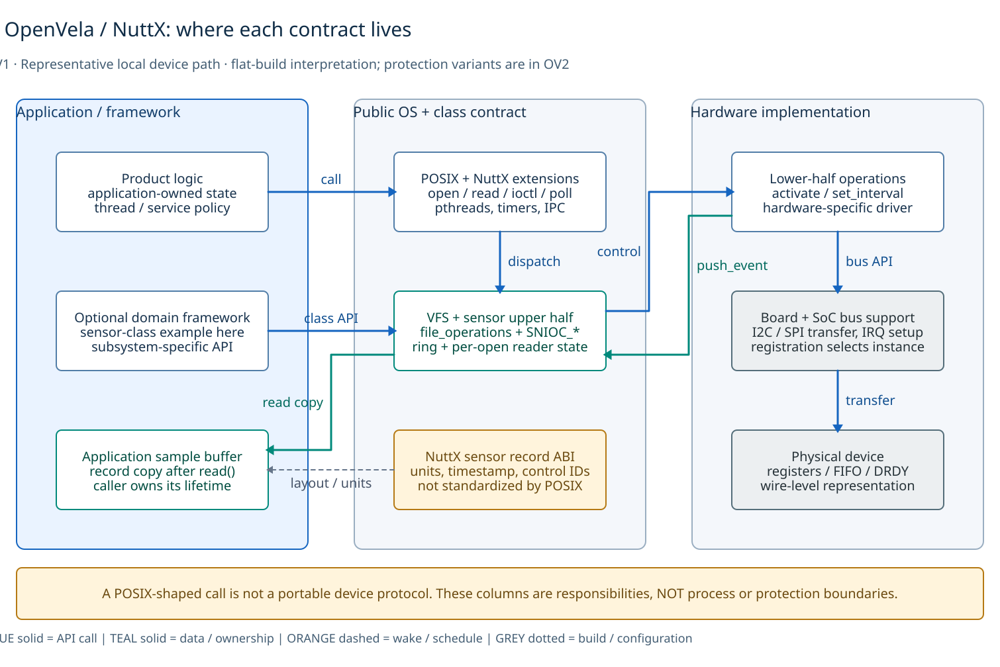
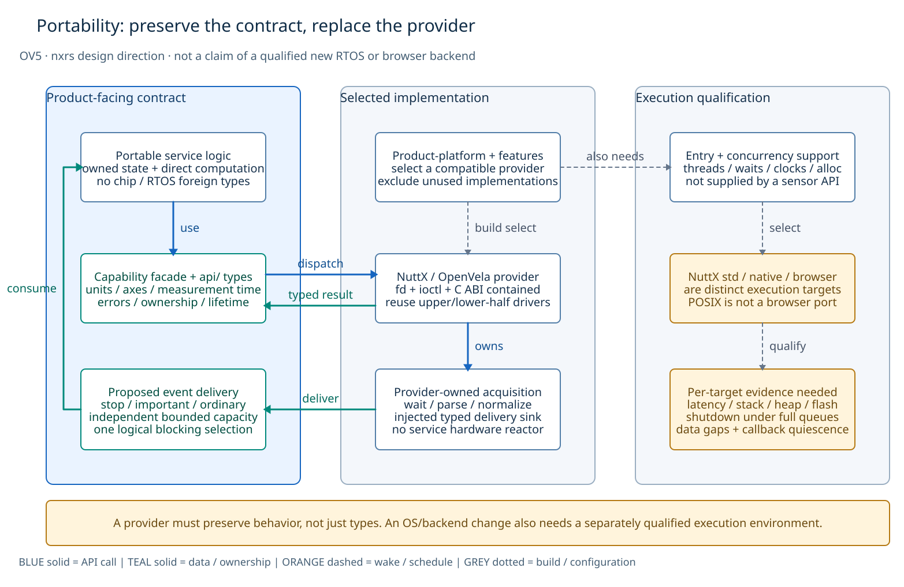

# OpenVela, POSIX, and nxrs: where portability actually lives

**Reference note · reviewed 2026-09-30 · non-normative.** This is a targeted source review, not a complete dependency audit or a performance comparison. Nxrs is sampled at `820536962f5bea9d71f4f9960ae0f42d33184b30`; OpenVela Bluetooth at `c423c51e69acad244b1d44f138918cbedbc70d40`. The [HAL capability architecture](../../hal-platform-architecture.md) remains authoritative for nxrs.

## Conclusion

**Yes, OpenVela has hardware and subsystem abstractions, but POSIX is only part of the boundary.** NuttX device-class interfaces hide hardware differences; OpenVela frameworks add domain APIs and adaptation layers. Nxrs places a provider-independent Rust capability boundary above its selected implementations. These approaches can be complementary rather than competing. [1][vela-led] [2][nuttx-sensors] [3][vela-bt] [6][nxrs-architecture]

## Why upper-layer code still includes NuttX headers

A portable operation does not imply a portable device protocol. The official OpenVela LED example uses `open("/dev/userleds", ...)`, then `ioctl(fd, ULEDIOC_SETALL, ...)`. The file operation is familiar, but the path, `userled_set_t`, and request constant belong to the NuttX LED contract. POSIX does not define this LED API. [1][vela-led]

| Dependency seen in upper-layer source | What it establishes |
| --- | --- |
| `<nuttx/config.h>` | Build-time configuration coupling; not, by itself, a call into kernel internals. |
| `<nuttx/list.h>` | Dependency on a utility/type implementation; not, by itself, a runtime kernel dependency. |
| `<nuttx/leds/userled.h>` | Use of a public NuttX device-class interface. Hardware-independent can still be OS-specific. |
| Direct scheduler/IRQ/internal APIs, **if actually called** | A stronger execution dependency that a different OS backend would need to replace. Inspect the symbols used, not just the include prefix. |

The first three cases are demonstrated by OpenVela's LED example and Bluetooth host build recipe. The fourth is a review rule, not a claim that every OpenVela framework makes such calls. [1][vela-led] [4][vela-host]

A particularly useful counterexample: Bluetooth's `Makefile.host` builds a host-side **bttool/client subset**, yet imports NuttX configuration and list headers. That demonstrates why an include alone cannot identify the runtime dependency. It does **not** prove that the entire Bluetooth framework runs unmodified on a host; this review did not execute that recipe. [4][vela-host]

## How OpenVela hides hardware

*Representative class-driver path, not a requirement that every application uses a framework or every driver has exactly two halves. [D2 source](diagrams/openvela-abstractions.d2).*

For NuttX's sensor class, the **upper half** owns common device behavior such as file operations, buffering, and multi-client handling. The **lower half** supplies device operations and hardware interaction. The board/SoC layer supplies controller support and board setup. The OpenVela LED tutorial explicitly separates board registration, STM32 peripheral support, and generic drivers. [2][nuttx-sensors] [1][vela-led]

This permits reuse across boards that provide the same device contract: moving pins or changing the controller belongs below the application. Moving to a different OS is a separate task; its device paths, control requests, data structures, and behavior must also be adapted.

OpenVela also abstracts **above** file descriptors. Its Bluetooth repository separates public APIs, services, protocol-stack adaptation (**SAL**), and hardware adaptation (**HAL/VHAL**), and describes integration with multiple Bluetooth stacks. The NuttX-facing `service/vhal/bt_vhal.c` includes Bluetooth HCI/ioctl headers, while the driver integration uses `struct bt_driver_s`. This is a concrete example of a subsystem exposing a higher-level API while its adaptation implementation remains platform-specific—not evidence of one universal OS-neutral wrapper around all OpenVela code. [3][vela-bt] [5][vela-vhal]

## What nxrs adds—and what it does not

*Conceptual use path. Dashed branches are alternative build selections, not a runtime registry. The facade and API are separate crates; providers depend on `api/`, not vice versa. [D2 source](diagrams/nxrs-capability-boundary.d2).*

Nxrs applications/services use capability facades such as `nxrs-imu` and `nxrs-camera`. Each capability's `api/` crate defines provider-independent types and operations; the facade selects an optional provider through Cargo features. Product-platform metadata owns the provider/board/OS selection. There is no global HAL platform object. [6][nxrs-architecture]

The IMU contract, for example, supplies `ImuSample` with `accel_mps2`, `gyro_rps`, and `timestamp_ms`, and an `Imu::sample(now_ms)` operation. Product logic need not know a sensor's bus or a NuttX record layout. Providers still have to satisfy the intended sampling, timing, and error semantics; matching a Rust signature alone is insufficient. [7][nxrs-imu]

**Nxrs also includes NuttX headers.** Its camera provider's C bridge includes `<nuttx/config.h>` and performs `open`/`read`/`ioctl`; its Rust provider translates this into the capability contract and resource ownership. The intended difference is containment below the facade, not eliminating OS-specific implementation code. The current bridge uses a project-specific read-device format-query contract, **not V4L2**. [8][nxrs-camera-c] [9][nxrs-camera-rust]

| Question | OpenVela/NuttX | Nxrs |
| --- | --- | --- |
| What hides the chip/board? | Device classes, lower-half drivers, bus support, board registration. | A selected capability provider can reuse those same drivers. |
| What does reusable upper code depend on? | POSIX services and/or device-class or framework APIs; inspect each module. | Capability facades and provider-independent contracts. |
| Where is variation selected? | Driver/framework configuration and board integration. | Capability-local optional providers selected by product-platform metadata. |
| Does this guarantee another OS/browser works? | No: the required API and semantics must exist there. | No: a compatible provider **and execution environment** must be implemented and qualified. |

*Comparison synthesizes the examples above, not an exhaustive OpenVela policy. [1][vela-led] [3][vela-bt] [6][nxrs-architecture]*

Execution is separate from device abstraction: nxrs's std-based service/thread paths need their target support too. At the sampled revision, IMU/GNSS demonstrations use mock providers; native camera replay and NuttX camera-provider code are not proof of a complete physical IMU port or of every application running unchanged in a browser. [6][nxrs-architecture] [9][nxrs-camera-rust] [10][nxrs-readme]

## Implication for nxrs

Keep using NuttX's existing hardware abstractions inside providers rather than recreating a driver stack. Keep target headers, foreign-function interfaces, device paths, and request constants below the capability facade. Define portable semantics where product behavior depends on them—units, timestamps, readiness, ownership, and errors—rather than wrapping every standard-library call. Test the same behavior against each claimed provider/target combination. **Hardware abstraction, OS abstraction, and application portability are different promises.**

The diagrams use D2 with a **custom Material-style palette**, not a nonexistent built-in Material preset. See [rendering instructions](diagrams/README.md).

## Primary sources

[vela-led]: https://github.com/open-vela/docs/blob/dev/en/quickstart/development_board/STM32F411.md
[nuttx-sensors]: https://nuttx.apache.org/docs/latest/components/drivers/special/sensors/sensors_uorb.html
[vela-bt]: https://github.com/open-vela/frameworks_bluetooth/tree/c423c51e69acad244b1d44f138918cbedbc70d40
[vela-host]: https://github.com/open-vela/frameworks_bluetooth/blob/c423c51e69acad244b1d44f138918cbedbc70d40/Makefile.host
[vela-vhal]: https://github.com/open-vela/frameworks_bluetooth/blob/c423c51e69acad244b1d44f138918cbedbc70d40/service/vhal/bt_vhal.c
[nxrs-architecture]: https://github.com/yongkyuns/EmbeddedRust/blob/820536962f5bea9d71f4f9960ae0f42d33184b30/docs/hal-platform-architecture.md
[nxrs-imu]: https://github.com/yongkyuns/EmbeddedRust/blob/820536962f5bea9d71f4f9960ae0f42d33184b30/hal/imu/api/src/lib.rs
[nxrs-camera-c]: https://github.com/yongkyuns/EmbeddedRust/blob/820536962f5bea9d71f4f9960ae0f42d33184b30/hal/camera/nuttx/ffi/camera.c
[nxrs-camera-rust]: https://github.com/yongkyuns/EmbeddedRust/blob/820536962f5bea9d71f4f9960ae0f42d33184b30/hal/camera/nuttx/src/lib.rs
[nxrs-readme]: https://github.com/yongkyuns/EmbeddedRust/blob/820536962f5bea9d71f4f9960ae0f42d33184b30/README.md

1. [OpenVela LED example and board/SoC/driver layout][vela-led].
2. [Apache NuttX sensor driver model][nuttx-sensors].
3. [OpenVela Bluetooth architecture and integration][vela-bt].
4. [OpenVela Bluetooth host build recipe][vela-host].
5. [OpenVela Bluetooth VHAL implementation][vela-vhal].
6. [Nxrs capability architecture at the reviewed revision][nxrs-architecture].
7. [Nxrs IMU contract][nxrs-imu].
8. [Nxrs NuttX camera C bridge][nxrs-camera-c].
9. [Nxrs NuttX camera Rust provider][nxrs-camera-rust].
10. [Nxrs README and qualification scope][nxrs-readme].
