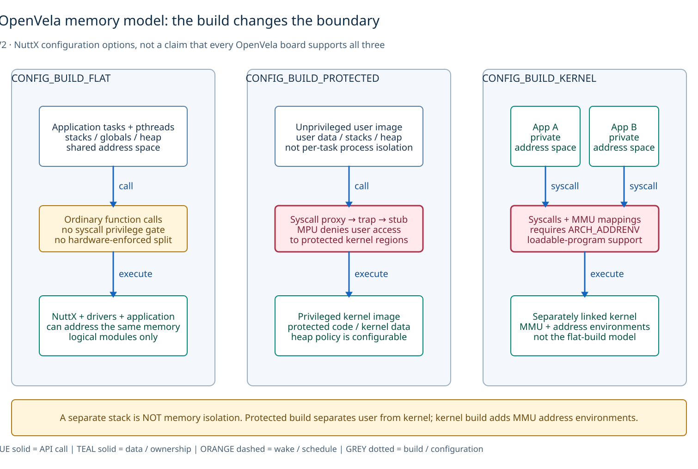
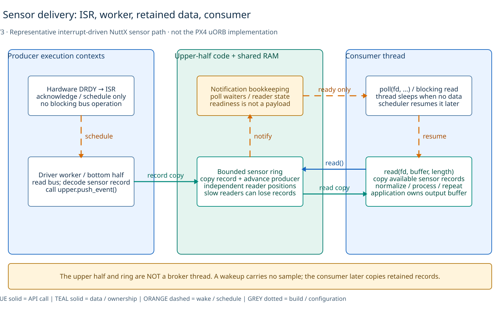
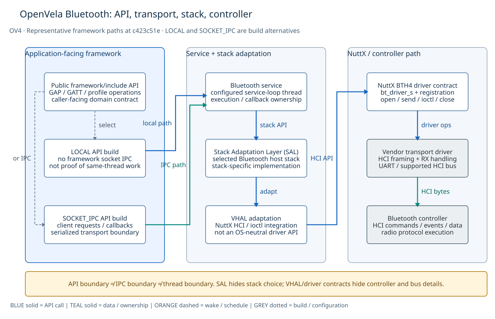

# OpenVela architecture atlas

For a visual introduction to each topic, start with the ten compact diagrams in the [main overview](README.md). This page keeps the larger maps and their detailed explanations.

These five views explain OpenVela/NuttX contracts, execution, memory and the architectural ideas relevant to nxrs. Read the [architecture study](README.md) for the common ten-topic review and the [cross-system comparison](../README.md) for borrowing decisions. These are explanatory models, not measured traces of a product firmware.

## View guide

A single stack picture cannot distinguish dependency, execution, storage and protection. The visual plan therefore separates these questions:

| View | Question and intended picture |
| --- | --- |
| **OV1 — contracts** | Three responsibility regions: product/framework, public NuttX services and device-class ABI, hardware implementation. Draw API requests separately from returned records. |
| **OV2 — memory** | Compare the three NuttX build organizations side by side. Make ordinary calls versus privilege gates explicit; do not equate tasks with isolated processes. |
| **OV3 — execution** | Trace a representative interrupt-driven sensor path through ISR, deferred work, retained storage and a sleeping consumer. Separate notification from payload transfer. |
| **OV4 — subsystem boundaries** | Use Bluetooth as a concrete framework example: local versus socket-IPC selection, service execution, stack adaptation and controller transport. |
| **OV5 — lessons for nxrs** | Reuse existing NuttX drivers beneath a behavioral product contract. Separate device access, acquisition ownership and resource/lifecycle qualification; no new RTOS port is proposed. |

Blue regions identify application/execution ownership where the title says so; pale grey-blue regions are logical responsibilities, not implicit address spaces. Teal regions identify retained data or ownership. Red gates identify protection/access transitions. Blue solid arrows are calls, teal solid arrows are data/ownership, orange dashed arrows schedule or notify, and grey dotted arrows describe build/configuration relationships. **An arrow is not automatically IPC, a context switch, a copy, or a memory barrier.** The label and the view's stated scope supply that meaning.

## OV1. Architecture and device contracts

[Editable D2](diagrams/openvela-abstractions.d2)

The map uses a **representative sensor-class path**, not an assertion that all OpenVela APIs pass through one generic facade. Ordinary file operations can remain familiar while the device name, record ABI, `SNIOC_*` requests, timing and overflow behavior are NuttX-specific. Upper-half code supplies the reusable class behavior; the lower half supplies device operations and publishes records. Bus/controller and board integration remain below that contract. A framework may expose a higher-level domain API instead of raw descriptors. [Sensor driver model][sensor] · [OpenVela LED example][led]

The two directions are intentional: a control operation reaches the lower half, whereas `push_event` transfers produced records into upper-half storage. A later `read` copies records into an application-owned buffer. The logical columns are **not three processes**; in a flat build, they reside within the same unprotected system address space. [NuttX memory configuration][memory-config]

## OV2. Memory organization is a build choice

[Editable D2](diagrams/memory-model.d2)

`CONFIG_BUILD_FLAT` is the default in the inspected OpenVela NuttX Kconfig. Application and OS code are linked into one unprotected executable organization. Separate task/thread stacks are scheduling/resource organization, not an isolation boundary. `CONFIG_BUILD_PROTECTED` requires the supported MPU path: a privileged kernel image and an unprivileged user image communicate through syscall proxies/traps/stubs. It does **not** turn each user task into a Linux-like isolated process. The heap arrangement is configuration-dependent, so the picture does not promise a universal kernel/user allocator split. [Pinned Kconfig][memory-config] · [Protected build guide][protected]

`CONFIG_BUILD_KERNEL` additionally requires MMU support and address environments, and loads applications separately from a linked kernel. The separate App A/App B cards represent those distinct user address environments; they do not imply that this mode is available on every MCU. OpenVela board support and the selected configuration must be checked rather than inferred from the operating-system name. [Pinned Kconfig][memory-config]

## OV3. Sensor execution: storage is not a thread

[Editable D2](diagrams/sensor-execution.d2)

This view chooses the **interrupt-driven, buffered push path** described by the NuttX sensor model. ISR work is bounded and defers acquisition to a driver-appropriate worker/bottom half (not a blanket permission to block NuttX high-priority work queues); that code reads the bus, forms a record, and calls the upper-half publication callback. The upper-half code and ring are not a separate broker task. Notification updates readiness and may make a waiting application runnable; the scheduler determines when it actually runs. Notification does not itself carry the sample. [Sensor implementation model][sensor]

The bounded ring retains records with independent reader progress. A slow reader can lose history; its behavior is not equivalent to a lossless per-consumer queue. The app subsequently requests/copies records and owns its output buffer. Fetch/proactive drivers can use a different path, so neither the ring nor this deferred-worker arrangement is claimed as universal. Also, the NuttX sensor framework is **not the PX4 uORB implementation**, even though the official documentation describes compatible usage ideas. [Sensor implementation model][sensor]

## OV4. Bluetooth: four different kinds of boundary

[Editable D2](diagrams/bluetooth-boundaries.d2)

The inspected Bluetooth Kconfig selects **LOCAL** or **SOCKET_IPC** framework APIs. LOCAL means no framework socket transport; it does not prove that all requested work executes on the caller's stack. SOCKET_IPC introduces a serialized client/server transport, but the transport choice alone does not establish an MPU/MMU boundary or a particular deployment. The same Kconfig independently exposes service-loop thread configuration. Request and callback wording describes the transport contract; the arrows are a representative forward path, not a complete message-sequence chart. [Bluetooth Kconfig][bt-config]

SAL adapts the selected host stack; VHAL contains platform-facing HCI/ioctl integration. The BTH4 example uses `bt_driver_s` operations and driver registration, while the vendor transport deals with the physical HCI interface. These are different contracts: application domain API, framework transport, stack adapter and controller/driver interface. The diagram does not assert one universal OpenVela OS-abstraction layer, a service per process, or simultaneous use of every supported Bluetooth stack. [Bluetooth README][bt-readme] · [VHAL implementation][bt-vhal]

## OV5. Reuse OS facilities; define the product contract

[Editable D2](diagrams/nxrs-capability-boundary.d2)

The **nxrs design-direction** view separates a capability facade/API contract from its implementation and its execution/resource budgets. The lesson from OpenVela is to reuse NuttX's device classes and hardware integration, not duplicate the driver stack. Keep device paths, control requests and foreign layouts below the product-facing capability. The sampled nxrs HAL direction prefers qualified Rust standard-library I/O where available, with narrowly scoped target ABI glue; the historical camera C bridge is evidence of containment, not a requirement for a generic C/POSIX wrapper layer. [Capability architecture][nxrs-hal] · [Device access policy][nxrs-device]

A provider must preserve axes, units, measurement-time meaning, errors, ownership and shutdown—not just match a Rust signature. Product-platform selection is a build decision, not a runtime service registry. Acquisition, waiting, parsing and normalization belong to the provider; the service receives typed results and owns application policy. Capacity-isolated stop/important/ordinary queues and one logical selection point are the **proposed concurrency baseline**, not proof that a physical provider or every channel path is qualified. [Concurrency baseline][nxrs-events]

The right-hand column makes the independent evidence obligations visible: thread stacks, waits, clocks, allocation, full-queue shutdown, data gaps and completion of all callbacks. This separation remains useful on the existing NuttX target. Neither OpenVela adoption nor a new RTOS/browser backend is proposed by this figure. A source-compatible interface, a valid execution environment and a behaviorally qualified product are distinct claims. [Languages and runtime](README.md#2-languages-and-runtime) · [Borrowing decisions](../README.md#ideas-to-borrow-and-how-to-test-them)

## Evidence, scope and reproducibility

[Source snapshots and mechanism evidence](sources.md) distinguish the OpenVela NuttX implementation, Bluetooth snapshot, upstream NuttX manuals and shared nxrs baseline. Independently reviewed repositories are not a tested release pair. Configuration-specific claims apply only to the described path; no runtime benchmark or firmware qualification is inferred from a diagram.

See [full-size viewing and reproduction](diagrams/README.md). The linked SVGs are detailed standalone views, not qualified 800-pixel reading-size diagrams.

[sensor]: https://nuttx.apache.org/docs/latest/components/drivers/special/sensors/sensors_uorb.html
[led]: https://github.com/open-vela/docs/blob/dev/en/quickstart/development_board/STM32F411.md
[memory-config]: https://github.com/open-vela/nuttx/blob/9e79ad292fd103d3b9ef737757081a3f7fbbf9a4/Kconfig
[protected]: https://nuttx.apache.org/docs/13.0.0/guides/protected_build.html
[bt-config]: https://github.com/open-vela/frameworks_bluetooth/blob/c423c51e69acad244b1d44f138918cbedbc70d40/Kconfig
[bt-readme]: https://github.com/open-vela/frameworks_bluetooth/blob/c423c51e69acad244b1d44f138918cbedbc70d40/README.md
[bt-vhal]: https://github.com/open-vela/frameworks_bluetooth/blob/c423c51e69acad244b1d44f138918cbedbc70d40/service/vhal/bt_vhal.c
[nxrs-hal]: https://github.com/yongkyuns/nxrs/blob/5c0d6360ef5190346ddfd41aec766895800ba287/docs/hal-platform-architecture.md
[nxrs-events]: https://github.com/yongkyuns/nxrs/blob/5c0d6360ef5190346ddfd41aec766895800ba287/docs/concurrency-event-communication.md

[nxrs-readme]: https://github.com/yongkyuns/nxrs/blob/5c0d6360ef5190346ddfd41aec766895800ba287/README.md

[nxrs-device]: https://github.com/yongkyuns/nxrs/blob/5c0d6360ef5190346ddfd41aec766895800ba287/docs/nuttx-device-access.md
