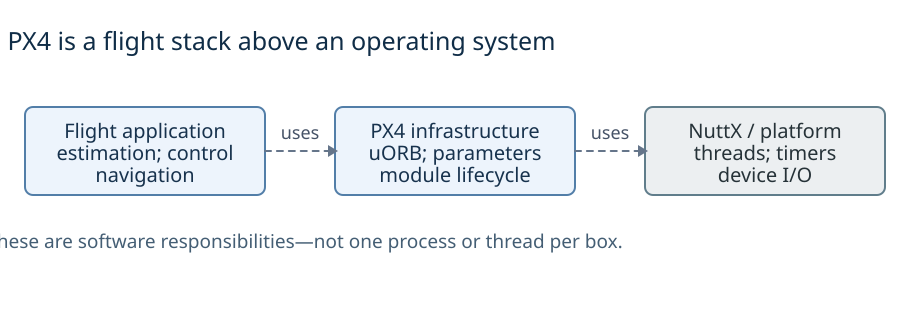
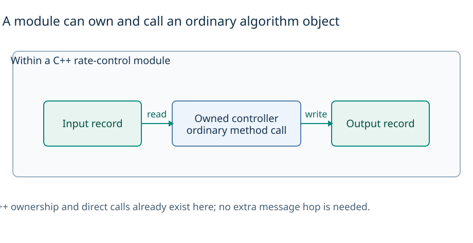
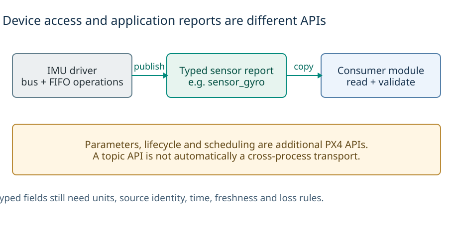
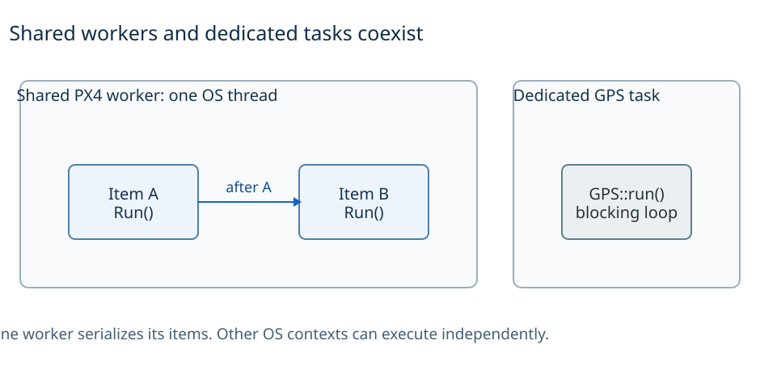
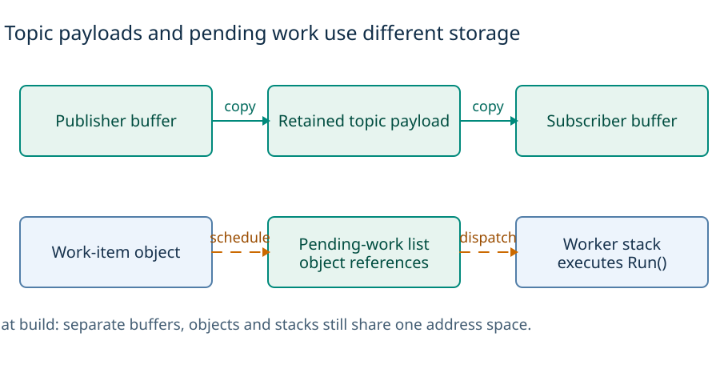
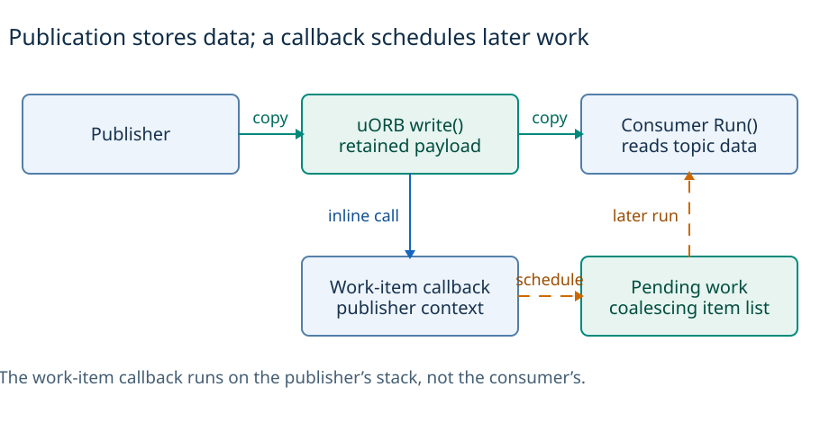
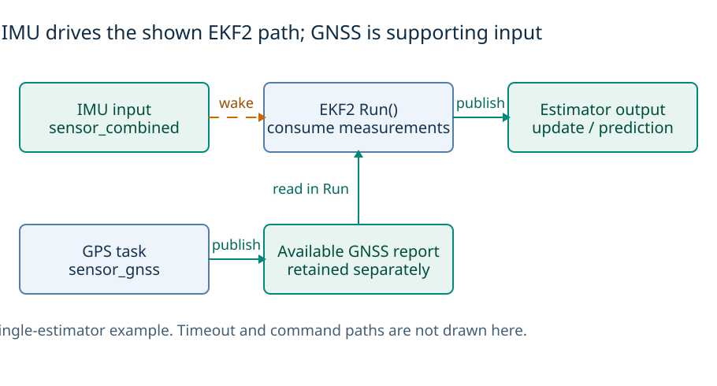
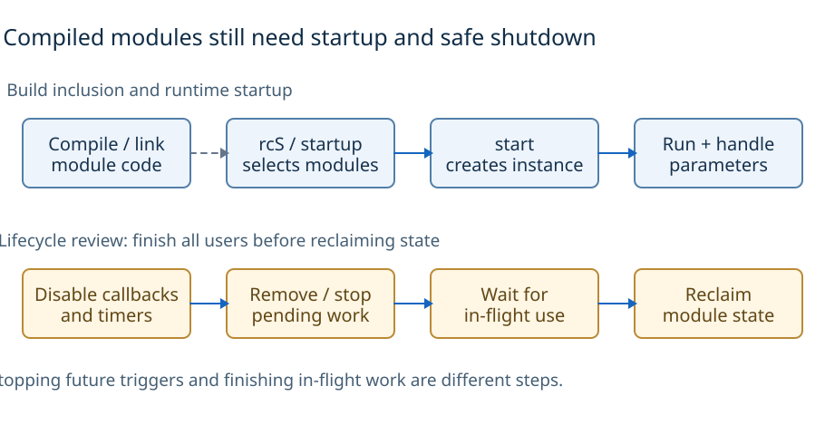
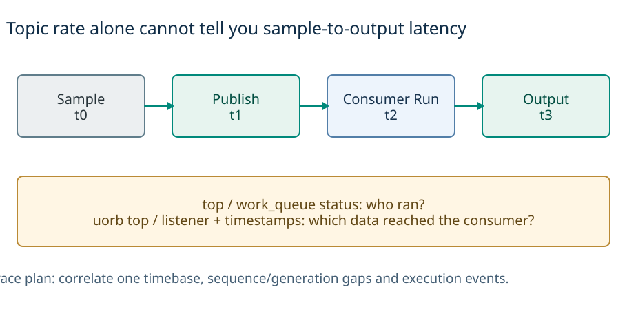
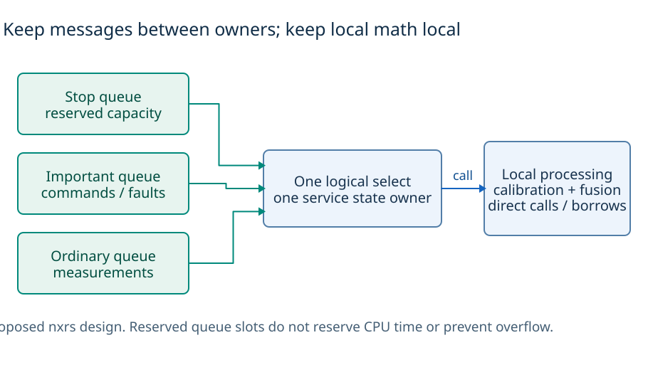

# PX4 architecture

PX4 is a flight-control stack that runs above an operating system. Its design shows how to **separate sensor data, notifications, thread scheduling and locally owned algorithms** without giving every module its own thread.

[Comparison guide](../README.md) · [Architecture atlas](architecture-atlas.md) · [Nxrs design notes](nxrs-design-notes.md) · [Sources](sources.md) · [Diagram reproduction](diagrams/README.md)

## 1. Overview

*The arrows show dependencies. Modules can also use OS facilities directly; not every call or bus transfer goes through middleware.* [D2](diagrams/inline/overview.d2) · [PX4 architecture][architecture] · [Component model](architecture-atlas.md#2-a-module-is-not-an-os-process)

PX4 combines a flight estimation/control/navigation stack with middleware, drivers, parameters, module lifecycle and communication. NuttX supplies the embedded OS foundation in the reviewed flight-controller path; native POSIX support is a separate environment. Unlike OpenVela's broad platform frameworks or Zephyr's kernel/device model, PX4 supplies a concrete organization for flight estimation, control and measurement handling. **PX4 is not an RTOS kernel.** [Architecture][architecture]

The useful distinction is what each part does: a module owns state and functionality; a work item is schedulable; a worker is an OS execution context; a topic is retained data; an algorithm object can remain ordinary local computation. None of these names alone implies an isolated process or dedicated thread. [Detailed component model](architecture-atlas.md#2-a-module-is-not-an-os-process)

## 2. Languages and runtime

*The rate-control module owns its controller object. This is local composition, not three independently scheduled components.* [D2](diagrams/inline/languages.d2) · [Rate-control source][rate] · [EKF2 source][ekf]

The inspected flight modules and middleware use C++ objects, methods and module/work-item infrastructure over C/POSIX/NuttX interfaces. `ModuleBase`, `ModuleParams`, `WorkItem` and `ScheduledWorkItem` encode different concerns; algorithm objects remain locally owned and called directly. uORB message definitions supply typed record interfaces. A C++ class does not by itself define a thread, exclusive access, a memory budget or a protected address space. [Module templates][templates] · [Rate control][rate] · [uORB guide][uorb]

The rate-control wrapper owns its controller object; EKF2 passes measurements to its estimator object and invokes updates directly. This is evidence that explicit state ownership and local composition are not unique to Rust. Nxrs can make selected ownership/transfer obligations explicit through Rust types without adding messages between every mathematical operation. [Rate control][rate] · [EKF2][ekf]

### OS threads beneath the C++ interfaces

The worker manager uses `pthread_create()` on flat NuttX and native POSIX, with a task-spawn route for non-flat NuttX. That wrapper distinguishes task and kernel-thread creation. PX4 does not universally avoid pthreads; the source chooses an execution facility appropriate to its environment. Task groups also differ from pthread resource sharing. [Worker manager][manager] · [NuttX task wrapper][tasks] · [Task groups][task-groups]

## 3. APIs and abstraction boundaries

*The IMU driver uses bus/register facilities and publishes sensor reports. NuttX underneath does not require every sensor to use a generic file-descriptor path.* [D2](diagrams/inline/apis.d2) · [IMU driver][icm] · [uORB interface][uorb]

[Detailed diagram: PX4 dependencies above the OS](diagrams/architecture.svg). Logical dependencies, not a broker thread or a requirement that every bus transfer pass through uORB. [D2](diagrams/architecture.d2).

PX4 exposes application-facing topic, parameter, lifecycle and scheduling facilities in addition to OS calls. The inspected IMU accesses registers/FIFO through PX4 bus/driver facilities; the presence of NuttX does not mean every sensor uses a uniform NuttX `open/read/ioctl` class path. GNSS protocol helpers publish normalized reports rather than handing UART bytes to the estimator. [IMU driver][icm] · [GPS driver][gps]

A typed record is only part of the contract. Units, sensor identity, measurement time, freshness, retained history, notification, completion and error policy must also be understood. POSIX-like platform wrappers do not guarantee identical resource-sharing or join semantics, and an application-level topic abstraction is not automatic cross-process IPC. [Task wrapper][tasks] · [Topic copy contract][node-copy]

The lesson for nxrs is to retain a deliberate product-facing capability contract while reusing suitable OS/device mechanisms beneath it. This does not require a PX4 dependency, global topic namespace, module shell or new RTOS target. [Nxrs HAL architecture][nxrs-hal]

## 4. Threads, scheduling and interrupts

*The two regions are actual execution contexts. Work items share the worker’s stack; a dedicated GPS task owns its blocking loop. The picture is not an exhaustive thread list.* [D2](diagrams/inline/execution.d2) · [Worker implementation][worker] · [GPS loop][gps]

[The overview maps](architecture-atlas.md#overview-execution-maps) show dedicated GPS execution alongside `wq:SPIx`, `wq:INS0` and `wq:nav_and_controllers`. These are selected paths, not an exhaustive thread list. PX4 `wq:*` workers are not NuttX HPWORK/LPWORK. [Worker implementation][worker] · [GPS loop][gps]

Dedicated tasks own blocking loops/stacks. A shared worker waits on a semaphore, removes pending work under a lock, releases the lock and calls `RunPreamble()`/`Run()`. Work items on that worker execute serially without preempting one another; the OS can schedule/preempt other contexts, and multiple workers can run concurrently where supported. The queue lock is not held across the handler. [Worker loop][worker]

Callbacks, explicit scheduling and timers can make work pending. The timer trampoline schedules work rather than running the whole algorithm. Long sleeps or waits are inappropriate inside shared work; even deferred synchronous bus transfers consume worker time and need an acceptable bound. A worker manager creates/tracks contexts, not a central dispatch path for every sensor message. [Scheduling][scheduled] · [Driver][icm] · [Manager][manager]

`VehicleAngularVelocity`, rate control and allocation use `rate_ctrl`; position/attitude control use `nav_and_controllers` in the inspected source. Shared placement saves per-item stacks but couples latency. Listed module order is not a guarantee of adjacent execution. [Angular velocity][angular] · [Rate][rate] · [Allocation][allocation] · [Position][position] · [Attitude][attitude]

## 5. Memory and data ownership

*Teal arrows copy payloads; the lower path schedules a work-item identity. The runnable queue is not a queue of sensor measurements.* [D2](diagrams/inline/memory.d2) · [Topic storage][node] · [Subscriber copies][node-copy] · [Worker queue][worker]

The reviewed local paths use shared application memory; the flat NuttX picture has no application/kernel protection boundary merely because the drawing has layers. Separate module objects, task groups or stacks do not create separate address spaces. Native POSIX shell-facing commands can contact the main PX4 instance without making each running flight module a separate process. Non-flat configurations require their own source/target analysis rather than extrapolating the flat map. [Architecture][architecture] · [Startup][startup] · [Task groups][task-groups]

uORB copies payloads into retained topic storage and later copies into subscriber buffers. Each subscriber tracks its own generation/cursor. The runnable queue holds work-item references, **not measurement payloads**. Local algorithm state, sensor FIFO, transport retention, estimator buffers and worker stacks are distinct resource budgets even in shared RAM. [Publication][node] · [Copy][node-copy] · [Worker queue][worker]

### Allocation and retained data

Topic data storage is lazily allocated and reused by subsequent ordinary writes in the inspected local path. This is not a blanket allocation-free, lock-free or zero-copy guarantee. Payload sizes, callbacks, reader count and synchronization affect cost; language-level objects or a smaller thread count do not establish a fixed memory or latency advantage. [DeviceNode implementation][node]

## 6. Messages, data flow and wakeups

*This is the local work-item callback path. Teal transfers data; blue invokes the callback inline; orange schedules later execution. Pending notifications can coalesce.* [D2](diagrams/inline/data-flow.d2) · [Publication][node] · [Work-item callback][callback] · [Worker][worker]

The ordinary local publication path checks/copies a payload, advances a generation, calls registered callbacks synchronously in the publisher's context, and notifies polling subscribers. The work-item callback applies its gates and schedules later consumer execution. There is no mandatory local broker-loop hop. Optional inter-system transports are outside this path. [Publication][node] · [Callback][callback]

| Milestone | Established | Not established |
| --- | --- | --- |
| Publication | Payload entered retained topic storage | Every subscriber saw it. |
| Scheduling | Work became pending | One execution per publication. |
| Processing | Consumer read data and ran | Request acknowledgment or actuator completion. |

### Coalescing and retained history

The intrusive pending-work queue suppresses duplicate pending insertion; a popped/running item can be queued again. Multiple notifications may therefore coalesce without implying equivalent payload retention. uORB defaults to depth one, with larger declared queue lengths for bounded history. A late reader can lose old generations; reads by one subscriber do not consume the record for all others. This is not a competing-consumer queue. [Intrusive queue][intrusive] · [Retention/copy][node-copy] · [Topic guide][uorb]

A plain copy can return retained state without new publication; `updated()`/`update()` distinctions matter when counting measurements. Topic generations do not form a transactional cross-topic snapshot or global event order. Separate topics isolate retention, not CPU time or lossless delivery. Command acknowledgment, including EKF2's command-ack logic, is a higher-level protocol rather than an automatic property of publication. [Copy path][node-copy] · [EKF2 commands][ekf]

[More detail on publication, coalescing, retention, allocation and ordering](architecture-atlas.md#4-uorb-data-storage-plus-notification-not-a-broker-loop).

## 7. Drivers and sensor data

*The orange edge is the main wakeup. EKF2 reads available GNSS data during its run; a new GNSS report is not another full-EKF trigger in this illustrated path. The IMU payload copy is omitted to keep the trigger distinction visible.* [D2](diagrams/inline/sensor-data.d2) · [EKF2 source][ekf] · [GPS source][gps] · [Full path](architecture-atlas.md#6-gnss-and-estimator-coordination)

The ICM42688P data-ready callback records time and schedules acquisition. Later driver work reads/checks FIFO data and handles failures, with interval/backup scheduling in relevant modes. One hardware interrupt can represent multiple samples; interrupt, transfer, publication and consumer-run counts differ. [Driver state machine][icm]

`VehicleIMU` owns calibration/integration and timing/gap state. Its gyro subscription triggers work that also consumes accelerometer data. A separate angular-velocity path feeds fast rate control rather than requiring every feedback update to wait for a GNSS-aided position solution. Protocol-specific GNSS helpers handle receiver configuration/parsing and publish `sensor_gnss` in the inspected snapshot. [VehicleIMU][imu] · [Angular processing][angular] · [GPS][gps]

EKF2's principal trigger is `sensor_combined` in its single-estimator path or `vehicle_imu` in multi-instance mode; it ingests supporting inputs during its execution and also uses timeout/command paths. GNSS availability is not an independent full-EKF wake in the illustrated path. Delayed fusion buffers and an output predictor compensate timing according to configuration; they do not recover lost transport history. **Measurement, publication and consumer-execution time are distinct.** [EKF2][ekf] · [EKF guide][ekf-guide]

The detailed [IMU](architecture-atlas.md#5-imu-interrupt-acquisition-and-two-processing-branches), [GNSS/estimator](architecture-atlas.md#6-gnss-and-estimator-coordination) and [control cascade](architecture-atlas.md#7-the-control-cascade-has-different-triggers) sections explain the specific queues, feedback triggers, retained setpoints, allocation/output responsibilities and single/multi-estimator differences. These product choices should inform nxrs's contracts, not be imposed on a generic OS sensor API.

## 8. Build, startup and shutdown

*The lower row is a lifecycle review sequence, not proof that every PX4 module implements complete restart safety. Task-join limitations remain relevant.* [D2](diagrams/inline/lifecycle.d2) · [Startup][startup] · [Angular-velocity lifecycle][angular] · [Worker][worker] · [Task wrapper][tasks]

Modules are normally compiled into a PX4 executable; startup scripts beginning with `rcS` select/start components. Module `start`, `stop` and `status` facilities, workqueue placement and runtime parameter handling have distinct responsibilities. Build inclusion does not mean an instance is running, and configuration/airframe selection can change the depicted pipeline. [Startup][startup] · [Templates][templates]

### Stopping safely

For shutdown, stop future callbacks/timers, account for queued work, wait for in-flight uses and only then reclaim state. The inspected angular-velocity path unregisters callbacks before deinitialization; the worker tracks in-flight execution. These are concrete examples, not a proof of every module's restart correctness. The NuttX task-join wrapper itself documents limitations. [Angular lifecycle][angular] · [Worker lifecycle][worker] · [Join wrapper][tasks]

This is the same lifecycle question asked of OpenVela and Zephyr: which mechanism prevents a new submission, which waits for existing work, and who owns the final resource reclamation? A generic module API or safe language alone cannot answer all three.

## 9. Debugging and performance

*These are proposed measurement points, not measured timings. Split acquisition delay, worker wait and execution cost rather than inferring latency from publication rate.* [D2](diagrams/inline/debugging.d2) · [Diagnostics][architecture] · [Driver counters][icm] · [nxrs timing tests][nxrs-events]

Separate acquisition/FIFO delay, publication/callback cost, runnable wait, handler execution, downstream waits and output latency. Buffers absorb bounded stalls, not an indefinitely slower consumer. No sample loss does not prove a control deadline; extra workers can reduce interference while increasing stack/scheduling cost. These are analysis tradeoffs, not measured claims of PX4 or nxrs performance.

Combine `top`/`work_queue status` with `uorb top`/`listener`, sensor FIFO/transfer and generation-gap counters, and actual timestamps/traces. Neither worker utilization nor publication rate establishes measurement-to-actuation latency. PX4's specifically named Events Interface reports structured occurrences to logs/ground systems; it is not the worker dispatcher and does not mean every gyro sample passes through a central decision module. [Architecture/debug facilities][architecture] · [Worker status][worker] · [Driver counters][icm] · [Events Interface][events]

Simulation and native execution are useful product tests, not automatic hardware timing or complete lifecycle qualification. Nxrs should correlate OS execution and semantic data flow, then use matched target/toolchain/configuration evidence for allocation phases, final linked cost, tail latency, overload and shutdown. [Existing nxrs qualification plan][nxrs-events] · [Unperformed tests](sources.md#what-the-evidence-does-and-does-not-show)

## 10. What nxrs should borrow

*Separate capacity protects admission classes. One service owns its state and directly calls tightly coupled processing; importing a global topic graph is not required.* [D2](diagrams/inline/nxrs-lessons.d2) · [nxrs concurrency proposal][nxrs-events] · [Detailed lessons](nxrs-design-notes.md)

**Borrow:** separate data from notification, retain local state ownership, declare trigger/freshness/retention policy and provide both execution and data-flow diagnostics. **Adapt:** give important commands and stop requests independent admission/progress paths; preserve normalized measurement and gap information through typed sinks. **Defer:** shared executors until measured stack/timing requirements justify them. **Do not import by default:** PX4's global topic namespace, module shell, flight stack, worker manager or a new target port.

A global typed topic system can be appropriate for an extensible flight stack; an explicitly wired vertically integrated product may need less indirection. The choice is architectural fit, not proof that publish/subscribe is either mandatory or inherently wrong. Keep tightly coupled computation in direct calls/borrows and introduce messages at meaningful ownership/execution boundaries. [Detailed nxrs lessons](nxrs-design-notes.md) · [Shared decisions](../README.md#ideas-to-borrow-and-how-to-test-them)

The nxrs concurrency baseline remains a proposed architecture with target testing still pending. Independent bounded admission classes, one logical blocking select, provider-owned acquisition and lifecycle tests must be evaluated on their own merits; the maturity of PX4's product stack does not qualify a new nxrs channel/provider implementation. [Nxrs baseline][nxrs-events]

[architecture]: https://docs.px4.io/main/en/concept/architecture
[templates]: https://docs.px4.io/main/en/modules/module_template
[startup]: https://docs.px4.io/main/en/concept/system_startup
[hello]: https://docs.px4.io/main/en/modules/hello_sky
[uorb]: https://docs.px4.io/main/en/middleware/uorb
[ekf-guide]: https://docs.px4.io/main/en/advanced_config/tuning_the_ecl_ekf
[allocation-guide]: https://docs.px4.io/main/en/concept/control_allocation
[events]: https://docs.px4.io/main/en/concept/events_interface
[task-groups]: https://nuttx.apache.org/docs/latest/implementation/tasks_vs_threads.html
[node]: https://github.com/PX4/PX4-Autopilot/blob/b798249a61af32c355d95decd2805a6ab4e9d9f1/platforms/common/uORB/uORBDeviceNode.cpp
[node-copy]: https://github.com/PX4/PX4-Autopilot/blob/b798249a61af32c355d95decd2805a6ab4e9d9f1/platforms/common/uORB/uORBDeviceNode.hpp
[callback]: https://github.com/PX4/PX4-Autopilot/blob/b798249a61af32c355d95decd2805a6ab4e9d9f1/platforms/common/uORB/SubscriptionCallback.hpp
[worker]: https://github.com/PX4/PX4-Autopilot/blob/b798249a61af32c355d95decd2805a6ab4e9d9f1/platforms/common/px4_work_queue/WorkQueue.cpp
[manager]: https://github.com/PX4/PX4-Autopilot/blob/b798249a61af32c355d95decd2805a6ab4e9d9f1/platforms/common/px4_work_queue/WorkQueueManager.cpp
[intrusive]: https://github.com/PX4/PX4-Autopilot/blob/b798249a61af32c355d95decd2805a6ab4e9d9f1/src/include/containers/IntrusiveQueue.hpp
[scheduled]: https://github.com/PX4/PX4-Autopilot/blob/b798249a61af32c355d95decd2805a6ab4e9d9f1/platforms/common/px4_work_queue/ScheduledWorkItem.cpp
[tasks]: https://github.com/PX4/PX4-Autopilot/blob/b798249a61af32c355d95decd2805a6ab4e9d9f1/platforms/nuttx/src/px4/common/tasks.cpp
[icm]: https://github.com/PX4/PX4-Autopilot/blob/b798249a61af32c355d95decd2805a6ab4e9d9f1/src/drivers/imu/invensense/icm42688p/ICM42688P.cpp
[imu]: https://github.com/PX4/PX4-Autopilot/blob/b798249a61af32c355d95decd2805a6ab4e9d9f1/src/modules/sensors/vehicle_imu/VehicleIMU.hpp
[angular]: https://github.com/PX4/PX4-Autopilot/blob/b798249a61af32c355d95decd2805a6ab4e9d9f1/src/modules/sensors/vehicle_angular_velocity/VehicleAngularVelocity.cpp
[gps]: https://github.com/PX4/PX4-Autopilot/blob/b798249a61af32c355d95decd2805a6ab4e9d9f1/src/drivers/gps/gps.cpp
[ekf]: https://github.com/PX4/PX4-Autopilot/blob/b798249a61af32c355d95decd2805a6ab4e9d9f1/src/modules/ekf2/EKF2.cpp
[rate]: https://github.com/PX4/PX4-Autopilot/blob/b798249a61af32c355d95decd2805a6ab4e9d9f1/src/modules/mc_rate_control/MulticopterRateControl.cpp
[attitude]: https://github.com/PX4/PX4-Autopilot/blob/b798249a61af32c355d95decd2805a6ab4e9d9f1/src/modules/mc_att_control/mc_att_control_main.cpp
[position]: https://github.com/PX4/PX4-Autopilot/blob/b798249a61af32c355d95decd2805a6ab4e9d9f1/src/modules/mc_pos_control/MulticopterPositionControl.cpp
[allocation]: https://github.com/PX4/PX4-Autopilot/blob/b798249a61af32c355d95decd2805a6ab4e9d9f1/src/modules/control_allocator/ControlAllocator.cpp
[nxrs-events]: https://github.com/yongkyuns/nxrs/blob/5c0d6360ef5190346ddfd41aec766895800ba287/docs/concurrency-event-communication.md
[system]: https://docs.px4.io/main/en/modules/modules_system
[nxrs-hal]: https://github.com/yongkyuns/nxrs/blob/5c0d6360ef5190346ddfd41aec766895800ba287/docs/hal-platform-architecture.md
[nxrs-readme]: https://github.com/yongkyuns/nxrs/blob/5c0d6360ef5190346ddfd41aec766895800ba287/README.md
[nxrs-device]: https://github.com/yongkyuns/nxrs/blob/5c0d6360ef5190346ddfd41aec766895800ba287/docs/nuttx-device-access.md
