# PX4 architecture atlas

Detailed execution, storage and measurement views for the [architectural analysis](README.md). The concrete examples follow the inspected multicopter/sensor-to-estimator path; aircraft, board, sensor selection and single/multi-estimator configuration can change that path. These are explanatory models, not measured timing traces. [Evidence and source pins](sources.md) · [Full-size viewing and reproduction](diagrams/README.md).

## View guide

| View | Architectural question |
| --- | --- |
| Three overview maps below | How do Hardware/NuttX, dedicated tasks, shared workers, modules and topics relate? |
| [Architecture](diagrams/architecture.svg) and [execution contexts](diagrams/execution-contexts.svg) | Which responsibilities are OS facilities, application infrastructure or component-owned work? |
| [uORB delivery](diagrams/uorb-delivery.svg) and [retention](diagrams/topic-retention.svg) | Where are copies, reader cursors, callbacks and pending executions? |
| [IMU acquisition](diagrams/imu-acquisition.svg) and [estimator inputs](diagrams/estimator-inputs.svg) | Who normalizes data; which input triggers computation; what time does a sample represent? |
| [Outer control](diagrams/outer-control.svg) and [fast control](diagrams/fast-control.svg) | Why do data flow, trigger flow and control responsibility differ? |
| [IMU propagation](diagrams/imu-to-ekf.svg) and [GNSS propagation](diagrams/gnss-to-ekf.svg) | How do detailed publication and scheduling relationships complement the maps? |
| [Nxrs direction](diagrams/nxrs-direction.svg) | Which ownership/admission lessons can nxrs borrow without importing the PX4 framework? |

The captions and local legends define arrow roles. Calls/dependencies, payload storage/copy, notification and OS scheduling are different relationships. The Hardware/NuttX band is a responsibility band, not proof of an MPU/MMU transition. Shared worker serialization is local to that worker, not a global order across the system.

## Overview execution maps

The three overview maps separate hardware/OS responsibilities, actual execution contexts, module-owned computation and retained topic data. Their different layouts expose complementary relationships; none implies a separate process or a context switch for every box or arrow.

### 1. PX4 Sensor-to-EKF Execution Map

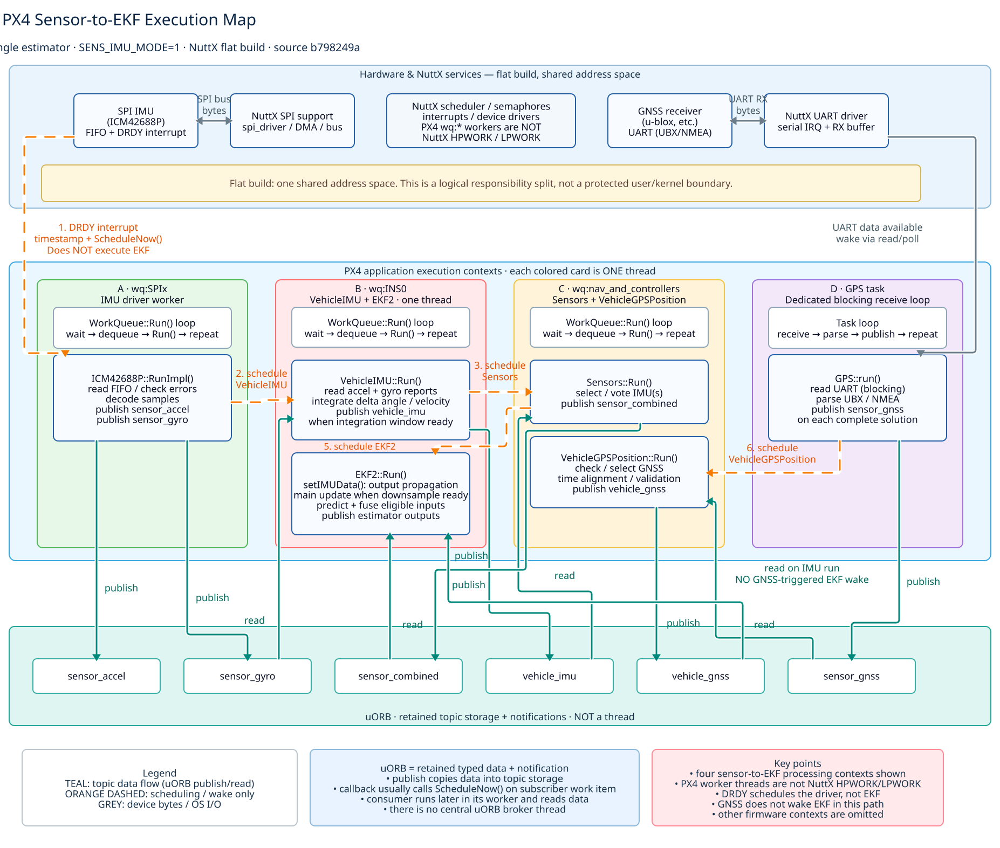

[Editable D2](diagrams/sensor-to-ekf-execution-map.d2) · [Full-size SVG](diagrams/sensor-to-ekf-execution-map.svg)

This is the banded **Hardware & NuttX → PX4 worker contexts → uORB** view with the four sensor-to-estimator execution contexts: `wq:SPIx`, `wq:INS0`, `wq:nav_and_controllers`, and the dedicated GPS task. It preserves separate data and wakeup paths. The boundaries are explicit: PX4 `wq:*` workers are not NuttX HPWORK/LPWORK, and a flat build does not imply a protected kernel/userspace address-space crossing.

### 2. PX4 Execution Loops and Data Flow

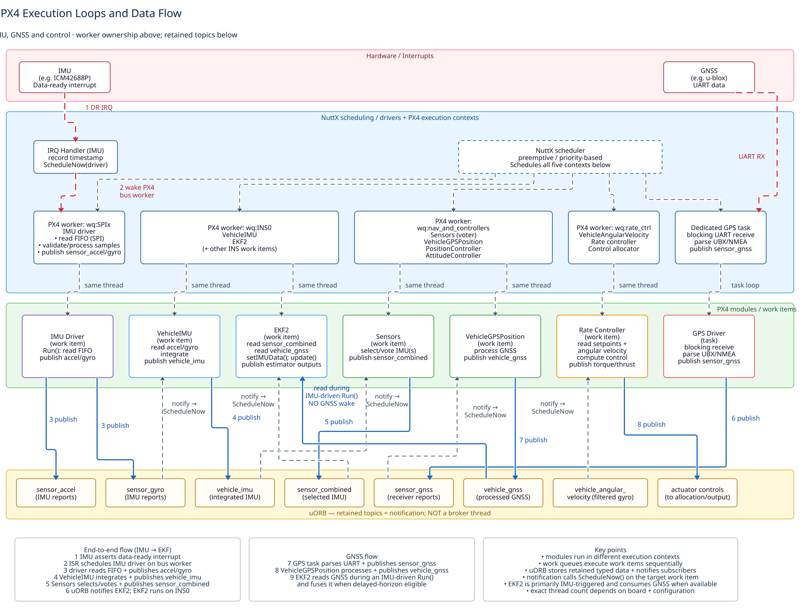

[Editable D2](diagrams/execution-loops-data-flow.d2) · [Full-size SVG](diagrams/execution-loops-data-flow.svg)

This is the horizontal-band view: **hardware/interrupts → NuttX scheduling + PX4 execution contexts → PX4 modules/work items → uORB topics**, including the control-side execution contexts. The blue execution-context band is deliberately labelled as NuttX scheduling plus PX4 worker threads rather than calling the PX4 queues kernel work queues.

### 3. Four execution loops, one sensor-to-estimator map

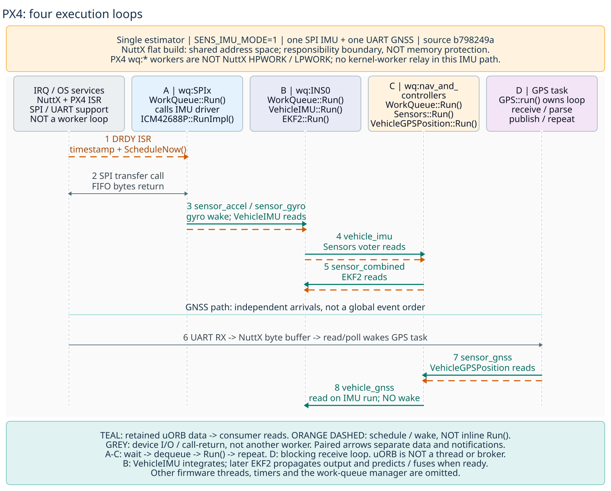

[Editable D2](diagrams/execution-map.d2) · [Full-size SVG](diagrams/execution-map.svg)

This is the timeline/lifeline-style map: IRQ/OS services plus the A-D execution columns, followed by the IMU and GNSS propagation traces. A-C run `WorkQueue::Run()`; D owns `GPS::run()`. Teal is retained uORB data, orange dashed is scheduling/wakeup, and grey is device/OS I/O. GNSS arrival does not add a GNSS-triggered EKF wake in the shown single-estimator path.

All three are source diagrams, not raster images embedded in D2. They describe the concrete single-estimator example pinned to PX4 `b798249a`; exact contexts depend on board and configuration.

## The essential distinction

**PX4 has neither one central event-processing loop nor one thread per module.** Topic storage, notification, runnable work and algorithm execution are separate mechanisms. A publication can make a consumer runnable without executing its algorithm, and multiple modules can run sequentially on one worker thread. This distinction is visible in the [publication path][node], [subscription callback][callback] and [worker loop][worker].

The three overview infographics above present the same execution architecture in complementary layouts; the nine compact mechanism diagrams below isolate dependency, scheduling and data-flow mechanisms. Dashed arrows denote scheduling/notification where indicated; solid arrows are data flow or dependency as stated in each caption. They are not a timing trace or a promise of one context switch per arrow.

## 1. What is above NuttX?

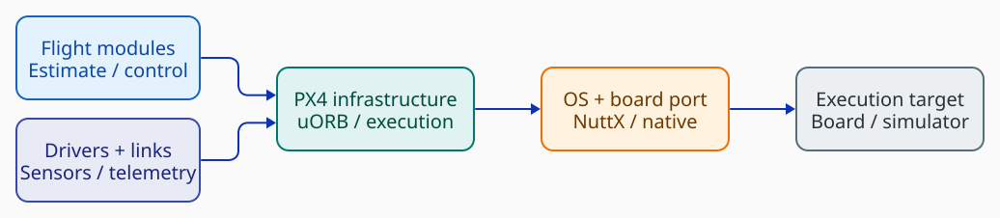

*Dependency overview, not a sensor pipeline. The infrastructure box groups facilities; it is not a broker thread or a requirement that hardware transfers pass through uORB. [D2](diagrams/architecture.d2).*

PX4 provides flight estimation/control/navigation together with supporting middleware and drivers. NuttX supplies the underlying embedded OS; PX4 also has native POSIX platform support. The application-facing facilities extend beyond OS primitives: sensor conventions, typed topics, parameters, module lifecycle and work-item scheduling are PX4 concerns. [Architecture guide][architecture]

POSIX already supplies threads and synchronization. Indeed, PX4's work-queue manager uses `pthread_create()` on NuttX **flat** builds and native POSIX builds. For non-flat NuttX it uses the PX4 task-spawn interface instead. That wrapper calls `task_create()` in non-kernel code and `kthread_create()` in kernel code. It is therefore inaccurate to describe PX4 as generally avoiding pthreads. [Worker creation][manager] · [NuttX task wrapper][tasks]

A NuttX task starts a separate task group, while a pthread joins its creator's group and shares group resources such as the descriptor table. Separate task groups in a flat build do not imply separate protected address spaces. Replacing tasks with pthreads changes resource sharing, not merely function spelling. This distinction does not require every application to invent another OS abstraction. [NuttX task groups][task-groups]

Hardware reuse is also not identical to POSIX portability. The inspected IMU driver performs register and FIFO transfers through PX4's bus/driver facilities. The existence of NuttX underneath does not establish that every PX4 sensor is consumed through a uniform `open/read/ioctl` sensor API. The useful product-facing boundary is normalized measurements, not a particular system-call spelling. [ICM42688P source][icm]

## 2. A module is not an OS process

| Concept | Responsibility | Example |
| --- | --- | --- |
| Module | Functionality, state and lifecycle | EKF2 or multicopter rate control |
| Algorithm object | Local computation owned by a component | The controller object called inside rate control |
| Topic/instance | Typed data stream and its retained storage | An IMU instance or vehicle attitude |
| Work item | Object with a schedulable `Run()` method | Rate controller instance |
| Work queue | Worker execution context serving several items | `wq:rate_ctrl` |
| Dedicated task | Component execution with its own blocking loop/stack | GPS receive loop |

*Concrete mechanisms: [rate-control implementation][rate], [uORB storage][node-copy], [worker implementation][worker], [GPS receive loop][gps].*

Conventional modules expose `start`, `stop` and `status`; common infrastructure includes `ModuleBase`, `ModuleParams` and `WorkItem`/`ScheduledWorkItem`. The task and work-queue templates are alternative execution models, not a mandate to make each helper algorithm independently scheduled. [Module templates][templates]

Modules are normally compiled into one PX4 executable. Startup scripts beginning with `rcS` select and start configured components. On native POSIX, shell-facing module commands can use client processes to contact the main PX4 instance; that command mechanism must not be mistaken for a process per running flight module. [Startup][startup]

Inside a module, ordinary direct calls remain normal. The rate-control wrapper owns a controller object, updates its parameters and invokes its methods. EKF2 likewise passes measurements to its EKF object and invokes the estimator update directly. Messaging separates meaningful components; it does not replace every function call. [Rate control][rate] · [EKF2][ekf]

## 3. Two execution models coexist

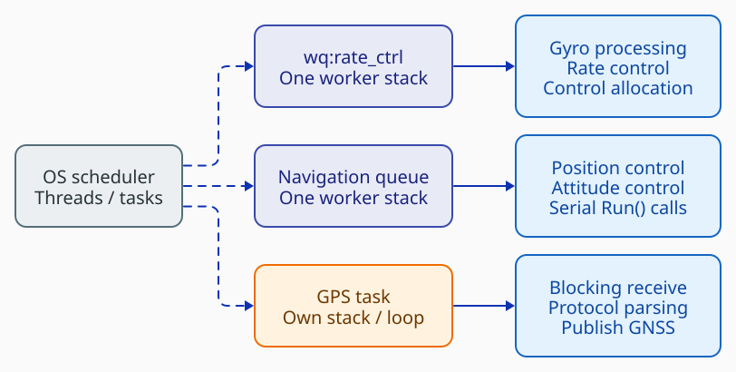

*Selected execution contexts, not an exhaustive thread list. The navigation queue is `wq:nav_and_controllers`. Listed work items share a worker; their listing order does not prescribe execution order. [D2](diagrams/execution-contexts.d2).*

### Dedicated tasks

A dedicated task owns its stack and can block while waiting for an input or timeout. For example, the GPS driver configures its protocol helper and enters a receive loop. A uORB consumer can alternatively wait on topic descriptors with `poll()`, including several inputs in one wait. There is no universal event-handler signature imposed on all tasks. [GPS][gps] · [Polling example][hello]

Conceptually, a blocking component waits, reads ready inputs, updates owned state and publishes results. Blocking is compatible with this model because it stops that execution context, not every component in the system.

### Shared work queues

A work item implements a bounded `Run()` and returns; the shared worker supplies the wait loop. The inspected worker waits on a semaphore, removes a pending item under a queue lock, releases the lock, invokes `RunPreamble()` and `Run()`, and then continues draining ready work. The queue lock is not held across the handler. [Worker loop][worker]

There are two scheduling levels. The OS schedules tasks/worker threads. Within a worker, items execute serially: a handler cannot preempt another handler on that same queue. A higher-priority OS context can still preempt the worker, and different workers may run concurrently on suitable hardware. A module boundary is therefore neither guaranteed parallelism nor a context-switch boundary. [Worker loop][worker]

In the pinned source, `VehicleAngularVelocity`, multicopter rate control and control allocation use `rate_ctrl`. Position and attitude control use `nav_and_controllers`. Sharing avoids a dedicated stack for each item, but couples their latency to one another's execution time. [Gyro processing][angular] · [Rate][rate] · [Allocation][allocation] · [Position][position] · [Attitude][attitude]

Work items should not sleep or perform long blocking waits. Deferred hardware access still consumes worker time: the inspected IMU driver performs synchronous bus transfers inside its work. The engineering requirement is a bounded, acceptable execution cost, not the assumption that every operation became asynchronous. [ICM42688P][icm]

### What makes an item runnable?

A uORB callback can call `ScheduleNow()`. A component can request execution explicitly. `ScheduledWorkItem` can also arrange delayed, periodic or absolute-time callbacks; the timer trampoline schedules the item rather than running its full algorithm in timer context. [Subscription callback][callback] · [Timer scheduling][scheduled]

The work-queue manager creates and tracks workers. Its creation-request queue is not the path through which sensor publications are dispatched. Worker priorities and stack attributes are selected during creation; a message's semantic importance does not independently reorder an already-running handler. [Manager][manager]

## 4. uORB: data storage plus notification, not a broker loop

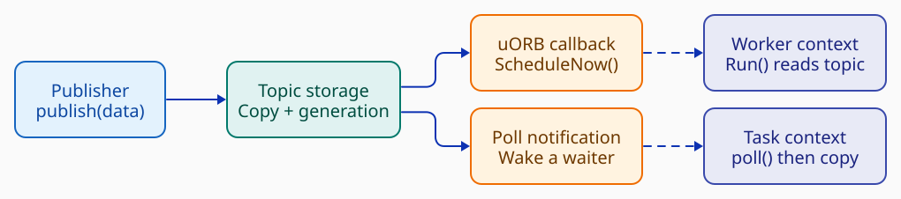

*The first three columns are publication/notification work. Dashed arrows make consumers ready. Payloads remain in topic storage and are copied by consumers, not carried inside a scheduled `Run()`. [D2](diagrams/uorb-delivery.d2).*

The ordinary local `publish()` path calls the topic node's write method. It checks payload size, advances a generation counter, copies the payload into the topic buffer, calls registered callbacks, and notifies polling subscribers. It does not enqueue every publication into a central broker's inbox. Optional inter-system communication paths are outside this local-path description. [DeviceNode publication][node]

**The callback runs synchronously in the publisher's context.** `SubscriptionCallbackWorkItem::call()` applies any configured publication-count/interval gates and requests scheduling. The receiving module's `Run()` executes in its worker context, not recursively inside the publisher. Cheap notification work is therefore part of publication cost; consumer computation is a separate scheduling cost. [Callback implementation][callback]

Each subscriber maintains its own generation/cursor. One subscriber reading does not remove the sample for other subscribers. uORB's topic-level ring plus independent reader progress is different from a competing-consumer queue where each value is received by only one reader. Topic instances distinguish streams such as several sensors of one type. [Copy implementation][node-copy] · [Topic/instance guide][uorb]

### Three different events

| Milestone | What has happened | What has not been established |
| --- | --- | --- |
| Publication | Data entered topic storage | Every reader observed it |
| Scheduling | A work item became pending | One execution per publication |
| Processing | A consumer read data and ran | End-to-end command acknowledgment or actuator completion |

These distinctions follow from the separate [write][node], [callback][callback] and [Run][worker] paths. An application must define any stronger completion protocol itself.

### Pending work can coalesce

The intrusive runnable queue refuses to insert a work item that is already queued. Several publications can therefore leave one pending execution. Once popped, the item can be queued again, including while its current handler is running; coalescing does not mean it can never have a follow-up run. [Intrusive queue][intrusive] · [Worker loop][worker]

The **runnable queue stores work items; the topic buffer stores measurements**. A single `Run()` may drain multiple retained samples, process a limited number, or read a latest value. That is consumer policy, not something inferred from the number of wakeups. Lost sample history cannot be recovered merely by executing a handler more often afterward.

### Latest state and retained history are different contracts

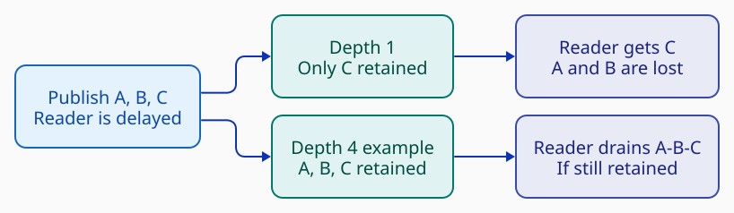

*Illustration: an already-subscribed reader does not run until A, B and C have been published. Depth four is an example, not the configuration of a named PX4 topic. [D2](diagrams/topic-retention.d2).*

uORB defaults to one retained message; topics can declare a larger `ORB_QUEUE_LENGTH`. A delayed depth-one consumer sees the current value, not every intermediate publication. With a deeper buffer, a reader can retrieve retained history. If it lags beyond capacity, the copy path advances it to the oldest still-retained generation. There is no unbounded retention or producer backpressure waiting for every subscriber. [uORB guide][uorb] · [Copy path][node-copy]

A plain copy can return the retained value even without a new publication. Consumers use the appropriate `updated()`/`update()` checks when distinguishing new data matters. Reusing a retained setpoint intentionally is different from accidentally counting it as a fresh measurement. [Copy semantics][node-copy] · [Controller consumption][rate]

A larger buffer changes how much history can survive, not whether delivery is infallible. Separate topics isolate storage capacity but do not reserve CPU time for a delayed consumer. A reliable command protocol needs explicit outcomes and, where required, acknowledgments/retry rules. EKF2's `vehicle_command_ack` handling is an example of acknowledgment logic above transport, not a property automatically supplied to every uORB publication. [EKF2 command handling][ekf]

### Copying, allocation and ordering

The inspected local path copies into topic storage and copies back out into subscriber storage. Topic data storage is lazily allocated; ordinary subsequent writes reuse the buffer. This is not a zero-copy API, a universal allocation-free claim, or a lock-free claim. Cost depends on payload size, readers, callbacks, locks and target. [Write][node] · [Read][node-copy]

Per-topic generations do not provide a transactional snapshot across topics. A controller reading gyro, setpoint and status may obtain values produced at different times. There is no central dispatcher establishing one global order of all sensor and command events. Consumers need explicit timestamps, freshness checks and policy for combinations that matter. This is an architectural consequence of independently stored topics, not a measured race in a particular flight.

## 5. IMU: interrupt, acquisition and two processing branches

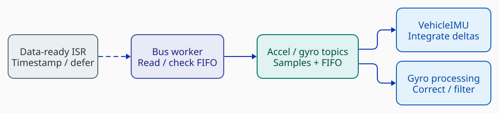

*Concrete acquisition example: ICM42688P. The dashed edge defers work from the interrupt. The two right-hand branches have different purposes and need not publish at the raw sensor rate. [D2](diagrams/imu-acquisition.d2).*

The ICM42688P data-ready callback records a timestamp and schedules the driver. It does not run the complete estimator/controller chain in the ISR. The driver's later work reads and checks the FIFO, handles transfer/overflow failures and maintains configuration. If interrupts cannot be configured, it uses interval scheduling; interrupt operation also has backup scheduling. These are driver-specific recovery mechanisms, not a universal scheduler guarantee. [Driver state machine and ISR][icm]

One FIFO transfer can contain several hardware samples. Raw sample count, interrupt count, topic-publication count and downstream `Run()` count are therefore different quantities. The sample timestamp carried forward must describe the measurement represented, not simply the time the consumer happened to run. [FIFO acquisition][icm]

`VehicleIMU` owns accelerometer/gyro calibration and integration state and publishes `vehicle_imu`/status. Its structure explicitly has an ordinary accelerometer subscription and a **callback gyro subscription**. This is a useful example of one input scheduling work that also consumes other available inputs. Its integrators and gap/timing state belong to the component; it does not need an independent thread for each calculation. [VehicleIMU structure][imu]

The angular-velocity branch selects a gyro source and provides the control-facing angular-velocity stream. Its sensor/FIFO callbacks and work-item lifecycle are separate from VehicleIMU's integration path. It runs on `rate_ctrl`; the rate controller consumes `vehicle_angular_velocity`. Thus fast rate feedback is not forced to wait for a newly completed GNSS-aided position estimate. [Angular-velocity component][angular] · [Rate controller][rate]

## 6. GNSS and estimator coordination

The GPS driver contains protocol-specific helpers, including UBX and NMEA. It configures the helper and publishes when its receive loop reports a completed navigation update. In this snapshot the per-receiver report is `sensor_gnss`. The EKF does not receive UART bytes or parse UBX packets. Any receiver-level selection/processing between acquisition and fusion is distinct from parsing and from the estimator's execution trigger. [GPS driver][gps]

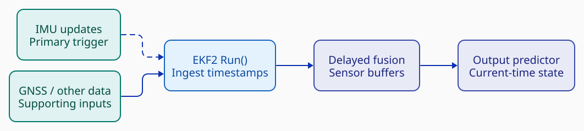

*Conceptual estimator phases, not separate tasks. The dashed IMU edge marks the primary scheduling trigger; IMU measurements also carry data. GNSS and other inputs are checked by estimator code. [D2](diagrams/estimator-inputs.d2).*

EKF2 registers its principal subscription callback on `sensor_combined` in its single-estimator path or `vehicle_imu` in multi-instance mode. Its `Run()` obtains an inertial sample, passes it to the EKF, checks enabled supporting inputs such as GNSS/barometer/vision, calls the estimator update and publishes outputs. It also uses a backup timeout and handles commands; it is not exclusively a one-trigger-only machine. [EKF2 execution][ekf]

Consequently, a GNSS publication does not by itself imply immediate full EKF execution. The measurement becomes available for the estimator to ingest under its own state owner. The transport's retention and the estimator's internal sensor buffers are separate stages and must not be conflated.

PX4's EKF uses a delayed fusion horizon with sensor FIFO buffers to account for measurement delays. An output predictor propagates state toward current time using IMU data. The selected delay/buffer configuration affects latency compensation; it does not eliminate acquisition/transport loss. Multiple estimator configurations can evaluate different sensor combinations with output selection afterward. [EKF guide][ekf-guide]

Three times must remain distinct: **measurement time**, **publication time**, and **consumer execution time**. Notification says data is available; it does not synchronize these clocks or make independently published inputs simultaneous. In nxrs, timestamp semantics therefore belong in capability contracts, not solely in an event-loop implementation.

## 7. The control cascade has different triggers

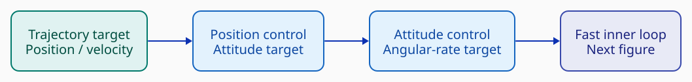

*Setpoint flow only. Omitted local feedback triggers position control from local-position updates and attitude control from attitude updates. This is not a complete feedback block diagram. [D2](diagrams/outer-control.d2).*

Position control and attitude control are separate modules on `nav_and_controllers`. Each registers its own principal feedback subscription; the existence of a subscription does not mean that every input independently triggers execution. Their setpoint flow ultimately supplies the inner rate loop. [Position controller][position] · [Attitude controller][attitude]

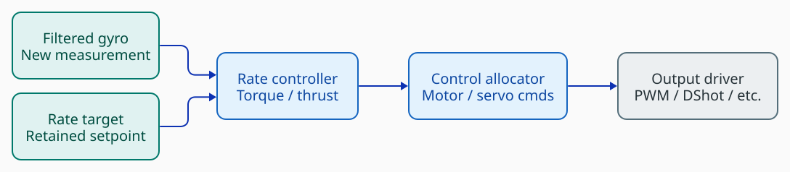

*The rate target can remain unchanged across several new gyro measurements. The picture is data flow, not a fixed thread-switch sequence. [D2](diagrams/fast-control.d2).*

Rate control registers for `vehicle_angular_velocity`, checks supporting state/setpoints during its execution and retains its rate target when no replacement arrives. It calls its controller object directly and produces torque/thrust requests. Manual rate modes may generate their own targets rather than using the complete outer-loop cascade. [Rate controller][rate]

Control allocation registers for torque-setpoint updates, maps control effort according to vehicle effectiveness/geometry and publishes actuator motor/servo commands. Output drivers separately map command functions onto physical outputs such as PWM or DShot. Allocation and electrical output are distinct responsibilities. [Allocator source][allocation] · [Allocation/output guide][allocation-guide]

An illustrative execution is: the bus worker publishes gyro data; angular-velocity work becomes pending; that work publishes filtered feedback; rate control becomes pending and uses the retained target; allocation becomes pending after the torque request. Same-queue stages still execute as separate `Run()` calls. Other ready work can intervene, and a faster repeated publication may coalesce before execution. This is a valid conceptual sequence, **not an observed timing trace or guaranteed adjacency**. [Publication][node] · [Workers][worker] · [Rate][rate] · [Allocator][allocation]

## 8. What is centralized, and what is not?

PX4 centralizes some names, configuration and decisions without centralizing all high-rate computation. The work-queue manager owns worker creation, not sensor dispatch. uORB supplies shared topic infrastructure, not a mandatory broker loop. Module-owned control state remains distinct from the OS scheduler's execution decisions. [Manager][manager] · [uORB][node]

For example, `commander` owns the mode-switching and failsafe state machine. That central decision responsibility is not a requirement for every gyro sample to pass through commander before reaching rate control. [System-module reference][system]

The specifically named **Events Interface** is for structured occurrences such as state changes, arming readiness and calibration completion, forwarded to ground stations/logs. It is not the worker scheduler described above. A system-wide reporting API should not be interpreted as proof of centralized sensor-event processing. [Events Interface][events]

There is no universal rule that every event must receive a separate callback/handler. Some inputs trigger work, some are checked during another trigger, and some activities use periodic scheduling or dedicated blocking receive loops. That flexibility is useful, but the freshness and loss policies have to be understood component by component. [Callback][callback] · [Timer][scheduled] · [GPS][gps] · [Rate control][rate]

## 9. Timing, overload and lifecycle: what the architecture does not prove

For analysis, separate acquisition/FIFO delay, topic publication cost, runnable-queue wait, handler time, downstream queue waits and output delay. This decomposition is an engineering model, not a PX4 benchmark. More worker threads can reduce some same-queue interference while adding stacks/scheduling costs; fewer workers do not automatically improve worst-case latency.

A finite buffer can absorb a bounded burst or bounded consumer stall, not an indefinitely slower consumer. Coalescing work notifications does not prevent a hardware FIFO or topic ring from overflowing. Conversely, no topic loss does not prove that a control deadline was met. Examine sample age and tail latency as well as counts.

Shutdown needs more than removing a pending entry: callbacks and timers must stop, in-flight execution must become quiescent, and state must outlive all uses. The inspected angular-velocity stop path unregisters callbacks before deinitialization; the worker tracks in-flight runs. These examples are not a proof of every module's restart/shutdown correctness. The NuttX task-join wrapper itself documents limitations, reinforcing that a shared API name does not guarantee identical lifecycle semantics across platforms. [Angular lifecycle][angular] · [Worker lifecycle][worker] · [Task join][tasks]

For inspection, combine the execution view (`top`, `work_queue status`) with the data view (`uorb top`, `listener`). Worker status and topic rate alone cannot establish measurement-to-actuation latency. The source also exposes generation-gap, FIFO/transfer and cycle counters in relevant components; inspect these together with sample timestamps and target traces. [Architecture/debug entry points][architecture] · [Worker status][worker] · [IMU counters][imu] · [Driver counters][icm]

## 10. Lessons for nxrs

Borrow **separation of acquisition, retained data, notification and state ownership**, not necessarily uORB, PX4's module shell or a global topic namespace. Preserve ordinary Rust composition and the existing capability boundaries. Shared workers are an optional execution tradeoff to qualify, not a prerequisite for the nxrs application model.

The [nxrs design notes](nxrs-design-notes.md) compare the two systems, show the proposed capacity-isolated one-wait-point layout, and state the required qualification evidence. The current nxrs concurrency document is on the inspected main branch but explicitly labels its baseline as proposed with implementation qualification pending. This research does not convert that proposal into implemented or target-qualified behavior, and does not propose a PX4 or other-RTOS port. [Pinned nxrs baseline][nxrs-events]

[architecture]: https://docs.px4.io/main/en/concept/architecture
[templates]: https://docs.px4.io/main/en/modules/module_template
[startup]: https://docs.px4.io/main/en/concept/system_startup
[hello]: https://docs.px4.io/main/en/modules/hello_sky
[uorb]: https://docs.px4.io/main/en/middleware/uorb
[ekf-guide]: https://docs.px4.io/main/en/advanced_config/tuning_the_ecl_ekf
[allocation-guide]: https://docs.px4.io/main/en/concept/control_allocation
[events]: https://docs.px4.io/main/en/concept/events_interface
[task-groups]: https://nuttx.apache.org/docs/latest/implementation/tasks_vs_threads.html
[node]: https://github.com/PX4/PX4-Autopilot/blob/b798249a61af32c355d95decd2805a6ab4e9d9f1/platforms/common/uORB/uORBDeviceNode.cpp
[node-copy]: https://github.com/PX4/PX4-Autopilot/blob/b798249a61af32c355d95decd2805a6ab4e9d9f1/platforms/common/uORB/uORBDeviceNode.hpp
[callback]: https://github.com/PX4/PX4-Autopilot/blob/b798249a61af32c355d95decd2805a6ab4e9d9f1/platforms/common/uORB/SubscriptionCallback.hpp
[worker]: https://github.com/PX4/PX4-Autopilot/blob/b798249a61af32c355d95decd2805a6ab4e9d9f1/platforms/common/px4_work_queue/WorkQueue.cpp
[manager]: https://github.com/PX4/PX4-Autopilot/blob/b798249a61af32c355d95decd2805a6ab4e9d9f1/platforms/common/px4_work_queue/WorkQueueManager.cpp
[intrusive]: https://github.com/PX4/PX4-Autopilot/blob/b798249a61af32c355d95decd2805a6ab4e9d9f1/src/include/containers/IntrusiveQueue.hpp
[scheduled]: https://github.com/PX4/PX4-Autopilot/blob/b798249a61af32c355d95decd2805a6ab4e9d9f1/platforms/common/px4_work_queue/ScheduledWorkItem.cpp
[tasks]: https://github.com/PX4/PX4-Autopilot/blob/b798249a61af32c355d95decd2805a6ab4e9d9f1/platforms/nuttx/src/px4/common/tasks.cpp
[icm]: https://github.com/PX4/PX4-Autopilot/blob/b798249a61af32c355d95decd2805a6ab4e9d9f1/src/drivers/imu/invensense/icm42688p/ICM42688P.cpp
[imu]: https://github.com/PX4/PX4-Autopilot/blob/b798249a61af32c355d95decd2805a6ab4e9d9f1/src/modules/sensors/vehicle_imu/VehicleIMU.hpp
[angular]: https://github.com/PX4/PX4-Autopilot/blob/b798249a61af32c355d95decd2805a6ab4e9d9f1/src/modules/sensors/vehicle_angular_velocity/VehicleAngularVelocity.cpp
[gps]: https://github.com/PX4/PX4-Autopilot/blob/b798249a61af32c355d95decd2805a6ab4e9d9f1/src/drivers/gps/gps.cpp
[ekf]: https://github.com/PX4/PX4-Autopilot/blob/b798249a61af32c355d95decd2805a6ab4e9d9f1/src/modules/ekf2/EKF2.cpp
[rate]: https://github.com/PX4/PX4-Autopilot/blob/b798249a61af32c355d95decd2805a6ab4e9d9f1/src/modules/mc_rate_control/MulticopterRateControl.cpp
[attitude]: https://github.com/PX4/PX4-Autopilot/blob/b798249a61af32c355d95decd2805a6ab4e9d9f1/src/modules/mc_att_control/mc_att_control_main.cpp
[position]: https://github.com/PX4/PX4-Autopilot/blob/b798249a61af32c355d95decd2805a6ab4e9d9f1/src/modules/mc_pos_control/MulticopterPositionControl.cpp
[allocation]: https://github.com/PX4/PX4-Autopilot/blob/b798249a61af32c355d95decd2805a6ab4e9d9f1/src/modules/control_allocator/ControlAllocator.cpp
[nxrs-events]: https://github.com/yongkyuns/nxrs/blob/5c0d6360ef5190346ddfd41aec766895800ba287/docs/concurrency-event-communication.md
[system]: https://docs.px4.io/main/en/modules/modules_system
