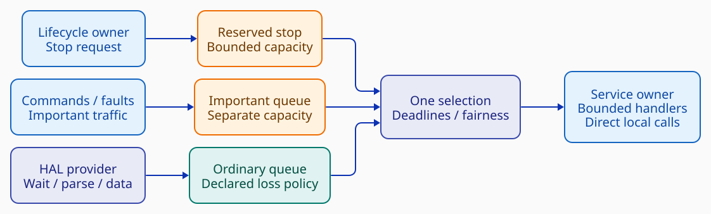

# PX4 lessons for nxrs

Design recommendations derived from the [PX4 architectural analysis](README.md) and [detailed atlas](architecture-atlas.md), within the [common prior-art evaluation](../README.md). The nxrs concurrency baseline is proposed, with implementation qualification pending; this note changes no production behavior and proposes no PX4/RTOS port. [Source scope](sources.md).

## Keep the existing ownership boundary

PX4 demonstrates that acquisition, notification and computation need not share one execution context. It does not establish that nxrs needs a global topic registry, actor runtime, service graph or a thread for every processing stage. Nxrs already specifies app-owned `main()`, capability-local facades, selected providers and ordinary owning service state. Retain those boundaries. [Nxrs app/HAL model][nxrs-readme] · [HAL architecture][nxrs-hal]

| Concern | PX4 mechanism inspected | Direction for nxrs |
| --- | --- | --- |
| OS execution | Dedicated tasks and shared worker threads | Continue qualified std threads; add narrow target controls only where needed. |
| Hardware input | Drivers/protocol helpers produce normalized reports | Provider owns acquisition/waits/parsing; service receives semantic data. |
| Fan-out | Topic storage with independent reader cursors | Explicit typed wiring; cloned competing-consumer senders are not broadcast. |
| Scheduling | Callback/timer makes a work item pending | Separate data availability from the notification that wakes an owner. |
| State updates | Principal feedback trigger plus supporting inputs | Declare trigger, freshness and retention policy per input. |
| Important traffic | Topic capacity is finite; acknowledgments are higher-level logic | Independent capacity and explicit full/closed/retry/completion outcomes. |
| Local processing | Direct algorithm calls within components | Keep tightly coupled work together; no messages between every helper. |

*PX4 mechanisms are sourced in [the atlas](architecture-atlas.md); nxrs direction follows the [proposed baseline][nxrs-events], not a claim of production qualification.*

## Separate capacity, one logical wait

*Proposed nxrs delivery, not PX4/uORB. Solid arrows mean typed admission through injected sinks, not calls into a receiver's handler. HAL terminal faults may route to the important queue; the lower path illustrates ordinary measurements. [D2](diagrams/nxrs-direction.d2).*

An active owner can select among independently bounded stop, important and ordinary queues. There is one logical blocking selection point, not sequential blocking receives and not a service-side hardware reactor. Deadline checks and bounded handlers remain with the state owner. Separate capacity prevents ordinary measurements occupying important slots; it does not make important capacity infinite or let an important event preempt a running handler. [Nxrs baseline][nxrs-events]

A GNSS provider may use a blocking receive worker, an existing driver context or a shared provider loop. It normalizes units, axes, timestamps, validity and source status before invoking a narrow delivery sink. The sink maps and admits values; it neither parses on the service thread nor executes the service's algorithm in the publisher's context. A relay-only thread and an intermediate HAL-output queue are not required. [HAL/event ownership][nxrs-events]

The proposed multi-queue implementation candidate is pinned Crossbeam bounded channels/selection. Existing std bounded channels remain valid for simpler cases. This is not a reason to claim every NuttX/browser target is already supported, assume ISR safety, or replace standard channels everywhere. Provider interrupts need a qualified deferred delivery path. [Qualification boundary][nxrs-events]

## Borrow semantics before infrastructure

**Retention and wakeups need independent contracts.** An IMU integrator may require all accepted samples in a bounded interval; a UI may want only the latest state. A wakeup can mean “inspect the buffer” rather than carrying one event per sample. If notifications can be rejected or coalesced, pending data must not become permanently invisible after a partial drain. Source sequence and gap indicators must survive normalization.

**Trigger inputs need to be explicit.** IMU can drive prediction while GNSS is a supporting input, but a stop request or critical command may need an independent wake path. Do not accidentally impose an IMU-arrival dependency on lifecycle progress. Cross-topic arrival order is not measurement-time order; define stale/out-of-order behavior and coherent epochs where required.

**Shared workers are optional.** They may reduce stack memory when several components have short, bounded work. They also couple tail latency and prohibit long blocking handlers. Prefer direct composition under one owner for tightly coupled algorithms. Introduce a shared executor only after a measured requirement justifies its extra scheduling/lifecycle machinery; do not copy PX4's worker manager by default.

These are engineering recommendations derived from the [PX4 mechanisms](architecture-atlas.md), consistent with nxrs's [current proposed ownership/queue contract][nxrs-events]. No new public API is selected by this note.

## Qualification before adoption

The acceptance fixture should exercise normalized multi-source delivery, data gaps and out-of-order timestamps; prove ordinary saturation cannot consume reserved capacity; and make important-full/closed outcomes observable even when another notification cannot be admitted. It should test deadlines and ordinary progress under sustained important traffic, plus cancellation with full queues and blocked device reads. These are distinct from merely demonstrating that a channel sends a value.

Lifecycle tests need partial-start rollback, stop admission, provider cancellation, callback quiescence, in-flight completion and resource reclamation. Joining a producer while it still needs the service to drain a queue can deadlock. Stop requested, stopped and joined must remain separate milestones. A synthetic provider test does not qualify a real UART driver's cancellation path. [Existing lifecycle requirements][nxrs-events]

Measure construction, first blocking use and steady-state allocation separately; then measure latency and final linked flash/static RAM/heap/stack costs without conflating instrumentation overhead. Compare matched std-channel and multi-queue candidates under the same target/toolchain/configuration. No zero-allocation, negligible-overhead or hard-real-time conclusion follows from PX4's architecture alone. [Existing measurement plan][nxrs-events]

**Scope:** this reference changes no runtime, dependencies, HAL contracts or product execution policy. It supplies a source-backed comparison and acceptance questions; it does not migrate nxrs to PX4 or replace the current implementation.

[nxrs-events]: https://github.com/yongkyuns/nxrs/blob/5c0d6360ef5190346ddfd41aec766895800ba287/docs/concurrency-event-communication.md
[nxrs-readme]: https://github.com/yongkyuns/nxrs/blob/5c0d6360ef5190346ddfd41aec766895800ba287/README.md
[nxrs-hal]: https://github.com/yongkyuns/nxrs/blob/5c0d6360ef5190346ddfd41aec766895800ba287/docs/hal-platform-architecture.md
