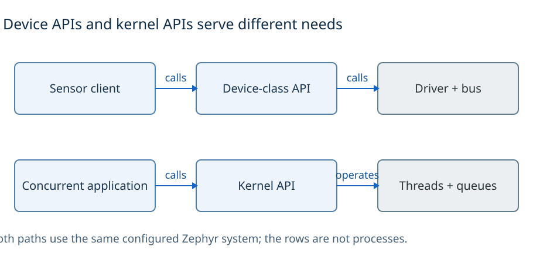
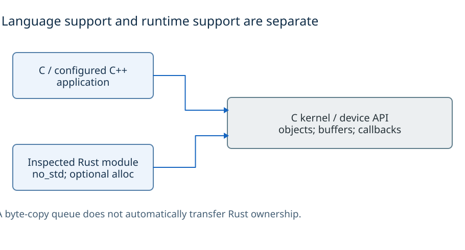
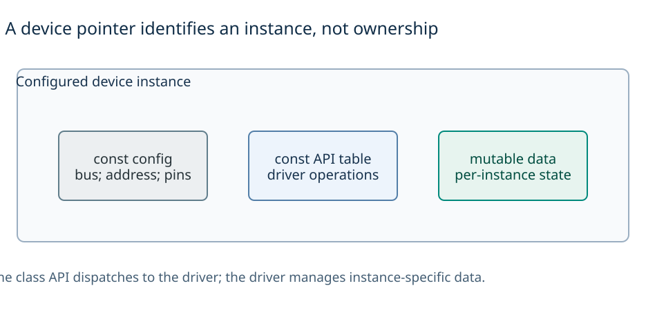
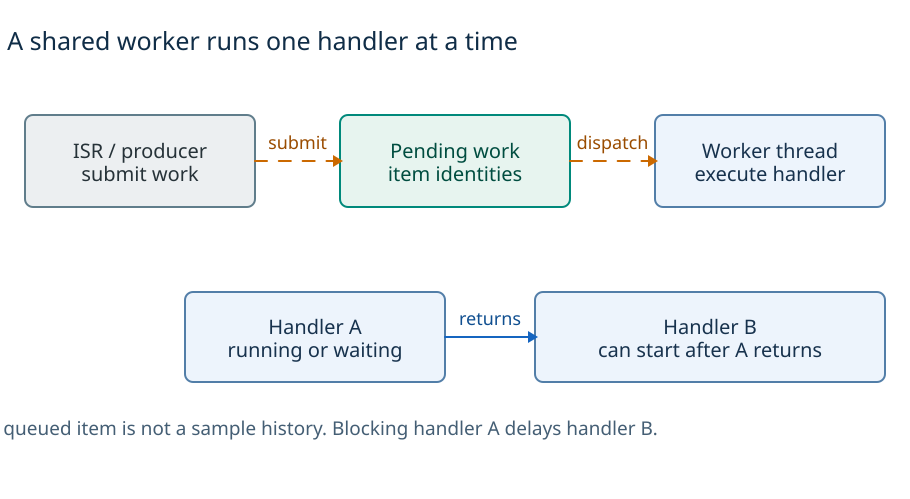
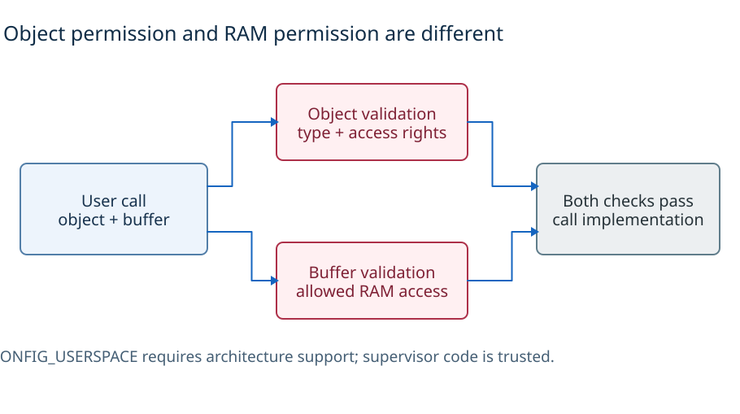
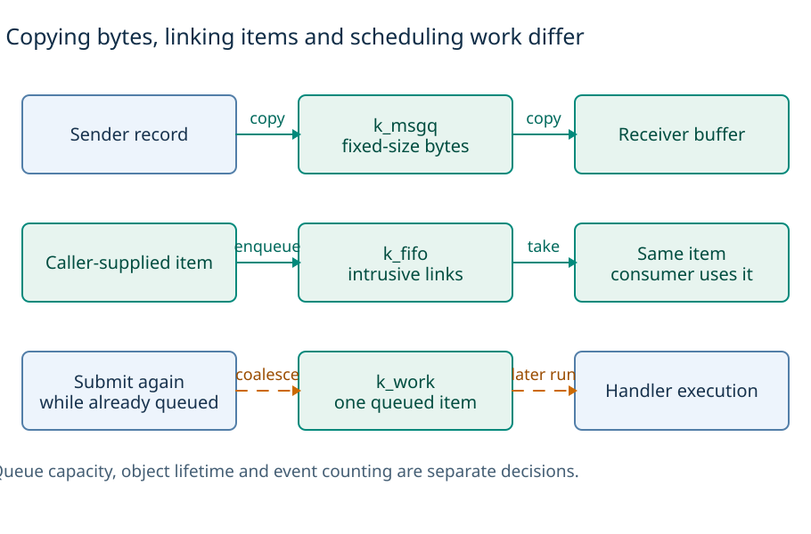
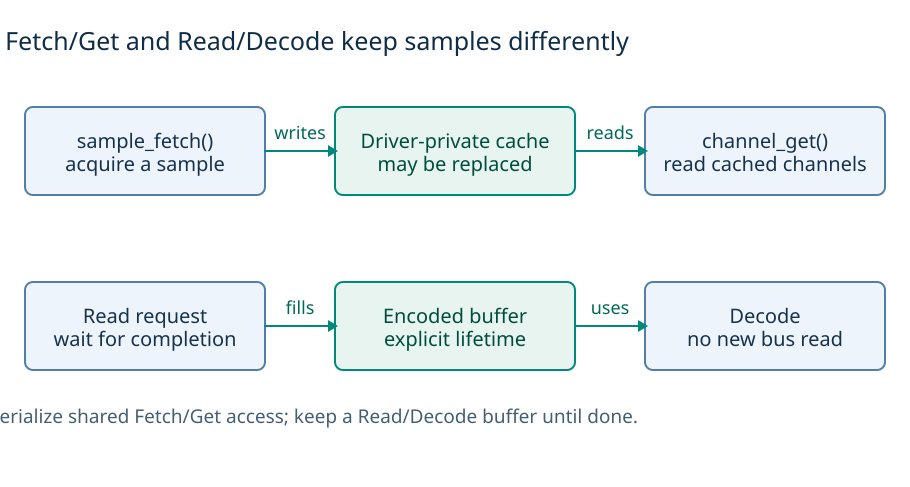
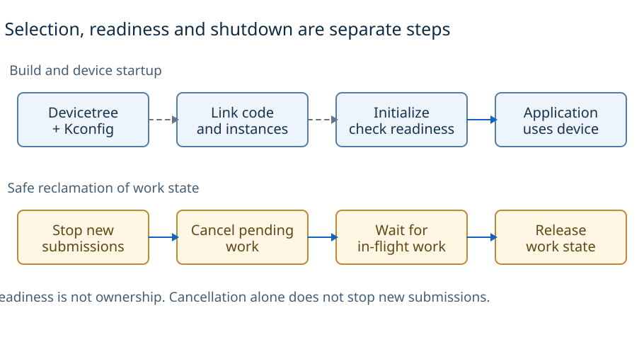
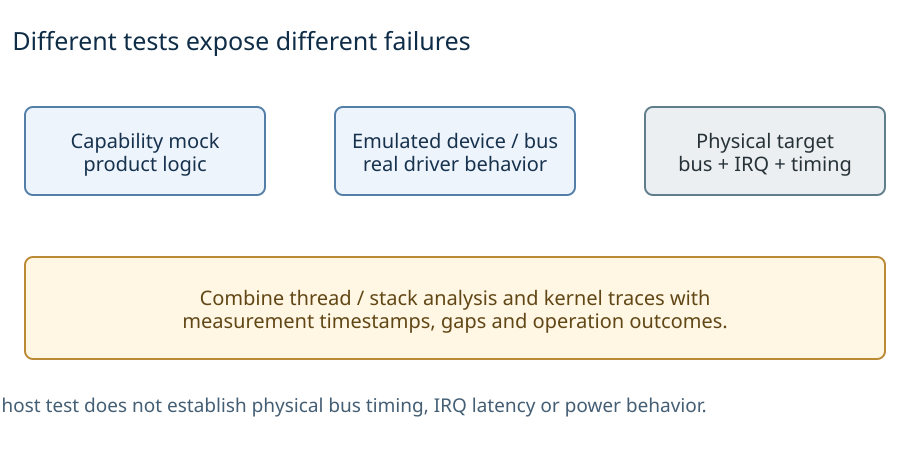
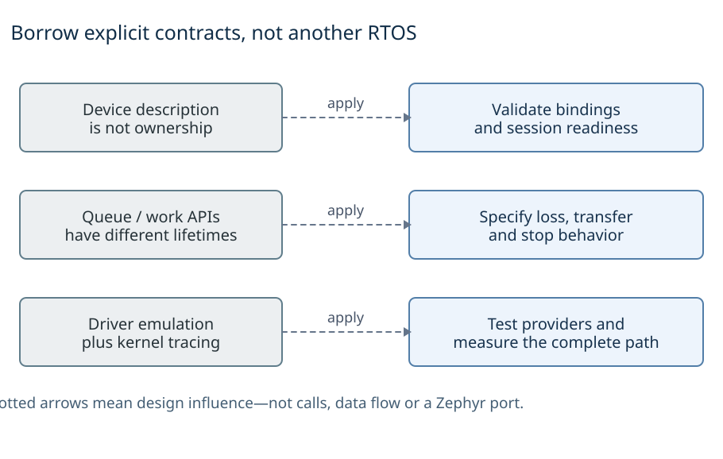

# Zephyr architecture

Zephyr combines an RTOS kernel, device drivers and a configurable build system. For nxrs, the useful ideas are **how it represents devices, schedules work, manages buffers and tests drivers**—not how to add a Zephyr port.

[Comparison guide](../README.md) · [Architecture atlas](architecture-atlas.md) · [Sources](sources.md) · [Diagram reproduction](diagrams/README.md)

## 1. Overview

*Applications normally use native APIs. Optional POSIX compatibility covers selected OS services, not every peripheral contract.* [D2](diagrams/inline/overview.d2) · [Device model][device-model] · [POSIX scope][posix-overview]

Zephyr combines a kernel, device drivers, configurable subsystems and build integration. Applications normally use native kernel and device APIs; POSIX is optional compatibility over enabled facilities, not the architecture underneath every peripheral API. This is an OS and driver foundation; PX4 instead adds flight-specific modules and message conventions. Zephyr does not prescribe nxrs's product-level decomposition, GNSS/EKF policy or service graph. [POSIX design][posix-design] · [Device model][device-model]

This study examines device dispatch and configuration; threads/workqueues; memory/object access; copied versus linked data; acquisition buffers; and host/driver testing. This is not a complete inventory of Zephyr subsystems. In particular, the queue comparison is not an exhaustive inventory of every available IPC or optional messaging subsystem.

## 2. Languages and runtime

*The Rust row describes the inspected module, not every possible Rust port. All bindings still need valid C-side lifetimes and callback rules.* [D2](diagrams/inline/languages.d2) · [Pinned Rust module][rust-guide] · [C++ support][cpp] · [Message queues][msgq]

The kernel and device interfaces examined here use C: `struct device`, operation tables, kernel objects, buffers and callback functions. An object address identifies a kernel resource; it does not grant exclusive access. Native clients can use public Zephyr interfaces without going through a uniform descriptor API. Generated syscall wrappers implement mode-dependent dispatch, not a universal serialization boundary. [Device model][device-model] · [System calls][syscalls]

### Rust and C++ support

The inspected official Rust module documents **`no_std` with optional `alloc`**, including `CONFIG_RUST_ALLOC`, not Rust std support in that integration. This is a pinned observation, not a statement that a separate/custom std port is impossible or that all targets have identical support. It demonstrates why source language, language runtime, kernel ABI and application architecture are separate dimensions. [Pinned module guide][rust-guide] · [Pinned allocator source][rust-alloc] · [Language integration][rust-docs]

**A byte copy is not an ownership transfer.** A C queue does not automatically implement Rust move/drop semantics. Copying the representation of an owning value can duplicate pointers rather than transfer the resource safely. Conversely, explicit C lifetime protocols can be sound when obeyed. Nxrs should use language-level ownership where applicable while testing FFI, cancellation, callback and buffer-lifetime requirements at its existing NuttX boundary. [Message queues][msgq] · [Nxrs baseline][nxrs-events]

Zephyr also supports configured C++ applications, with toolchain/library and initialization restrictions; its C++ guide separates application use from kernel, driver and system-initialization code. A language front end and its library/runtime support are separate compatibility questions. This matters when comparing C APIs, PX4's C++ composition and nxrs's Rust ownership model. [C++ support][cpp]

## 3. APIs and abstraction boundaries

*Configuration, operations and mutable state have different jobs. Obtaining a device pointer does not grant exclusive access or prove readiness.* [D2](diagrams/inline/apis.d2) · [Device structure][device-model] · [Device lookup and readiness][dt-howtos]

[Detailed diagram: Zephyr native APIs and device dispatch](diagrams/zephyr-abstractions.svg). Z1: dependency and call paths, not implicit process boundaries. [D2](diagrams/zephyr-abstractions.d2) · [Atlas](architecture-atlas.md#z1-native-contracts-optional-compatibility-one-runtime).

| Header or symbol | Contract or dependency |
| --- | --- |
| `<zephyr/kernel.h>` and `k_*` | Public Zephyr-specific OS services, not automatically private kernel internals. |
| `<zephyr/device.h>` and `<zephyr/drivers/sensor.h>` | Hardware-independent device-class operations within the Zephyr model. |
| `<zephyr/devicetree.h>` and `DT_*` | Build-time hardware description, not a product-facing OS-neutral API. |
| Generated `zephyr/syscalls/...` headers | Public dispatch/verification support; not proof of a trap on every call. |

### Device calls and generated wrappers

The accelerometer example uses kernel, device and sensor interfaces together. For `__syscall` APIs, generated wrappers select direct or user-mode dispatch as appropriate; permission validation is separate from the device-class abstraction. Public OS-specific headers are not by themselves broken layering. [Pinned sample][accel-sample] · [System calls][syscalls]

The device instance separates constant configuration/API operations from mutable runtime data. Drivers hide chip details behind class operations; bus APIs hide controller details. Neither the common call signature nor an optional POSIX library supplies uniform timestamp, FIFO, trigger, lifetime or error behavior for every device. [Device model][device-model] · [Sensor contracts][fetch-get]

**Portability boundary:** client reuse across supported hardware differs from independence from Zephyr APIs. The lesson for nxrs is to make its own product-facing contract intentional and contain implementation types. POSIX compatibility likewise requires checking enabled functions and semantics rather than assuming a complete application/runtime will work unchanged. [POSIX scope][posix-overview]

## 4. Threads, scheduling and interrupts

*The ISR schedules work rather than running all application logic. The worker is one thread; other threads and interrupts can still execute.* [D2](diagrams/inline/execution.d2) · [Workqueue execution and coalescing][work] · [Scheduling][scheduling]

A Zephyr thread owns an execution stack and kernel scheduling state. The scheduler distinguishes cooperative and preemptible threads; readying a thread is not equivalent to an immediate execution guarantee. Interrupts are separate contexts, and allowed no-wait operations must be checked per API. On multicore configurations, other contexts may run concurrently: same-thread serialization is not global mutual exclusion. [Threads][threads] · [Scheduling][scheduling]

### Shared workers

A workqueue uses a thread to execute queued handlers serially. The system workqueue and additional application/subsystem queues are placement choices. Repeated submission of an already queued item does not retain one execution per event, although a running item may have follow-up work queued. A long or blocking handler delays later work on that queue. Zephyr permits blocking APIs in appropriate workqueue thread contexts, but that permission does not make the interference acceptable. [Workqueues][work]

For a representative sensor path, hardware indicates readiness; a driver-specific trigger/deferred context notifies or performs acquisition; a client fetches cached channels or receives a completed encoded buffer; application state processing runs in its chosen owner. The trigger callback's context depends on the driver/configuration and is not itself a retained sample queue. No mandatory broker or one-thread-per-sensor model follows from the API. [Fetch/Get and triggers][fetch-get] · [Read/Decode][read-decode]

This differs from PX4's product policy of principal IMU triggers and supporting GNSS inputs. Zephyr supplies mechanisms; the application decides which inputs wake processing, which values are retained and what deadlines matter. A task/queue count alone does not describe that policy.

## 5. Memory and data ownership

*This illustrates a user-mode call that uses both a kernel object and a user buffer. Object authorization and buffer access are checked separately. Both applicable validations must succeed; their order is not prescribed here.* [D2](diagrams/inline/memory.d2) · [System calls][syscalls] · [Object access][objects] · [Memory domains][domains]

[Z2 shows userspace and access verification](architecture-atlas.md#z2-object-authorization-and-memory-access-are-independent). In the ordinary single-image model, a device/component/queue is not a separate process. With `CONFIG_USERSPACE` and suitable architecture support, user calls traverse generated validation and privilege gates, while supervisor callers can use direct implementation paths. Verifiers check relevant object type/authorization and user-memory arguments. [System calls][syscalls] · [Userspace][user]

`k_object_access_grant()` permits operations on a kernel object; a memory domain controls accessible RAM regions. These are distinct permissions: a usable object identifier is not permission to dereference all its storage. Domains are not a claim of Linux-style per-process virtual address spaces. Shared partitions and architecture/configuration-dependent stack access need explicit treatment; supervisor code remains trusted. [Kernel objects][objects] · [Memory domains][domains]

### Buffer ownership without userspace

Storage contracts are equally important without userspace. `k_msgq` copies fixed-size records; ordinary intrusive `k_fifo` links caller-supplied items; Fetch/Get uses driver-private sample state; Read/Decode exposes encoded-buffer lifetime. Heap allocation is not required for every object: memory slabs provide fixed-size blocks with explicit finite availability. A bounded pool limits those blocks, not all program allocations, fragmentation or stack use. [Queues][msgq] · [FIFO][fifo] · [Memory slabs][slabs] · [Sensor ownership view](architecture-atlas.md#z3-sensor-interfaces-differ-in-who-owns-the-data)

Rust ownership, buffer bounds, allocator budgets, DMA/coherence and hardware privilege therefore remain separate review questions. A service boundary or a successful borrow check is not an MPU boundary or a timing proof.

## 6. Messages, data flow and wakeups

*These are three different mechanisms, not stages of one pipeline. A pointer copied by k_msgq still needs a referent-lifetime contract.* [D2](diagrams/inline/data-flow.d2) · [Message queues][msgq] · [Intrusive FIFO][fifo] · [Workqueues][work]

[Z5 compares the actual storage and scheduling contracts](architecture-atlas.md#z5-copy-transfer-and-scheduling-are-different-contracts).

| Mechanism | Storage / transfer contract | Overload and completion implications |
| --- | --- | --- |
| `k_msgq` | Fixed-size byte records in bounded storage, or direct copy to a waiting receiver | Full-queue wait/error policy; a copied pointer does not copy its referent; receiving is not application acknowledgment. |
| Ordinary `k_fifo_put` | Intrusive caller-owned item; linkage uses its first word | Item must remain alive and not be simultaneously enqueued twice; capacity comes from supplied items/pool, not a fixed FIFO element limit. |
| `k_work` | Schedulable handler state, not a measurement history | Pending submissions can coalesce; work/state must live through execution and cancellation. |
| `k_poll` | Readiness of supported kernel objects | Not acquisition/ownership; dequeue/take, race handling and event-state reset remain necessary. |

These mechanisms are documented in [message queues][msgq], [FIFO][fifo], [workqueues][work] and [polling][poll]. Allocating FIFO variants have different costs and are outside the ordinary intrusive path above. `k_poll` is not a general wait on arbitrary POSIX descriptors or Rust channel receivers.

**Design consequence:** sending records through one queue can order those accepted records, but does not create a transactional snapshot across other queues, device caches or independently produced data. A readiness signal need not equal a sample, and a work completion need not mean a physical operation or service request completed. Define the application's exact retention, loss, ordering and completion policy rather than labeling every mechanism “events.”

## 7. Drivers and sensor data

*The upper path shares the driver cache. The lower path exposes a completed encoded buffer. Async behavior and supported operations remain driver-dependent.* [D2](diagrams/inline/sensor-data.d2) · [Fetch/Get][fetch-get] · [Read/Decode][read-decode]

The sample's `DT_ALIAS(accel0)` names a role, `DEVICE_DT_GET(...)` obtains its configured device pointer, and `device_is_ready(...)` checks initialization. The driver must be enabled and initialized; a pointer neither acquires exclusive ownership nor guarantees every requested operation exists. Changing hardware can preserve client code only when the replacement supplies the required behavior. [Device acquisition][dt-howtos] · [Pinned sample][accel-sample]

**Fetch/Get:** `sensor_sample_fetch()` performs acquisition into driver-private sample state; `sensor_channel_get()` returns channels from that cached sample. Multiple callers must synchronize the whole transaction, not just individual API calls, to avoid another fetch replacing the intended sample. This is not independent retained history for each client. [Fetch/Get][fetch-get]

**Read/Decode:** acquisition produces encoded data that can be decoded without a second hardware read, with RTIO-oriented submission/completion and buffer lifetime requirements. Preserve request/storage until completion and retain the completed buffer until consumers finish. Streaming, bus behavior and actual asynchronous operation depend on the backend; an async-facing interface does not turn a blocking driver into nonblocking hardware. [Read/Decode][read-decode]

For nxrs, borrow the explicit acquisition/ownership distinction. Provider code should normalize units, axes, validity, source gaps and measurement-time meaning; product calibration/fusion stays with the service. Do not fabricate unavailable timestamps or equate consumer execution time with measurement time. This does not require another processing thread for each helper. [Nxrs ownership baseline][nxrs-events]

## 8. Build, startup and shutdown

*The build row summarizes static device startup. The work-item row requires a context that can wait safely; it is not a universal peripheral shutdown API.* [D2](diagrams/inline/lifecycle.d2) · [Device startup][device-model] · [Build selection][dt-kconfig] · [Work cancellation][work-api]

[Detailed diagram: Build-time selection versus runtime device state](diagrams/zephyr-build-selection.svg). Z4: descriptions and selected code lead to an image; readiness and ownership remain runtime questions. [D2](diagrams/zephyr-build-selection.d2).

Devicetree/overlays describe hardware instances and properties: buses, addresses, pins, interrupts, aliases and chosen roles. Bindings constrain properties; Kconfig selects software/features and dependencies. CMake/build integration produces compiled device objects and initialization entries. A hardware node is not evidence that the driver exists in the image or initialized successfully. [Devicetree versus Kconfig][dt-kconfig] · [Build][build] · [Device model][device-model]

The system main thread performs initialization and calls application `main()`; the chosen sample/device path has explicit readiness checks. Common static MCU configuration is not a claim that every bus/device has the same dynamic lifecycle or that readiness transfers ownership. [System threads][system-threads] · [Device acquisition][dt-howtos]

### Stopping in-flight work

For deferred work, pending cancellation and in-flight completion differ. `k_work_cancel_sync()` waits for cancellation/completion under its documented thread/context constraints; a concurrent producer can submit again afterward. Prevent new submissions before reclamation and do not invoke the synchronous wait from the workqueue executing that same work. Generic cancellation cannot alone certify a driver-specific trigger or peripheral has stopped. [Workqueue API][work-api]

Borrow the **selection/initialization/ownership/quiescence distinction**, not the entire devicetree/Kconfig machinery. Nxrs's app metadata, product-platform bindings and capability-local providers already form its composition boundary. Validate resource identities and excluded providers; do not create a global HAL object, generated service graph or second Kconfig merely for similarity. [Nxrs HAL/build architecture][nxrs-hal]

## 9. Debugging and performance

*Test scopes are complementary, not a runtime pipeline. Zephyr bus emulation is prior art for stronger testing of nxrs’s existing providers, not a port target.* [D2](diagrams/inline/debugging.d2) · [Peripheral emulation][emulation] · [Native simulation][native-sim] · [nxrs tests][nxrs-events]

Analyze acquisition/bus time, ISR deferral, workqueue wait, handler duration, consumer wait and sample age separately. Cooperative execution and shared workqueues make handler bounds especially important; preemption and time slicing do not prove deadline or fairness requirements. Fixed storage gives a capacity bound, not a response-time guarantee. This is an evaluation framework rather than a Zephyr benchmark. [Scheduling][scheduling] · [Workqueues][work]

Zephyr's thread analyzer reports configured stack usage and thread statistics; tracing hooks expose kernel/subsystem execution. Add semantic timestamps, source IDs/gaps and operation outcomes to understand a product path. Measure instrumentation overhead and dropped trace data, rather than treating observability as free. [Thread analyzer][analyzer] · [Tracing][tracing]

`native_sim` runs Zephyr's kernel and libraries in a host executable; it is not OS-independent native Rust service testing or proof of browser compatibility. Peripheral emulation exercises real drivers against modeled devices/buses, complementing capability mocks and physical tests. Borrow that **test layering**, not a new nxrs target. [Native simulator][native-sim] · [Peripheral emulation][emulation]

Nxrs acceptance still needs full-queue stop, blocked-read cancellation, completion of all callbacks, initialization failure, multi-instance ownership, gaps/out-of-order time, fairness and deadlines. Measure construction, first blocking use, repeated blocking/timeouts, steady-state allocation and final linked flash/RAM/stack/heap separately. A source review, successful compilation or rendered diagram is not that evidence. [Qualification baseline][nxrs-events]

## 10. What nxrs should borrow

*Apply these ideas inside nxrs’s Rust/NuttX design. Keep product configuration, lifetime and test requirements explicit without copying Zephyr’s build system.* [D2](diagrams/inline/nxrs-lessons.d2) · [Device model][device-model] · [Queue contracts][msgq] · [nxrs baseline][nxrs-events]

**Borrow:** explicit device/configuration separation, distinct queue/storage contracts, readiness versus ownership, synchronous cancellation obligations, and driver-emulation/trace practices. **Adapt:** express those obligations in nxrs's existing Rust/NuttX capability and service model. **Do not import by default:** Zephyr APIs into product logic, a Zephyr port, a global service graph, a mandatory async/no_std rewrite, or a second build-description system.

[Detailed diagram: Applying Zephyr's contract lessons within nxrs](diagrams/nxrs-direction.svg). Z6: a design comparison and acceptance checklist, not an nxrs-on-Zephyr architecture. [D2](diagrams/nxrs-direction.d2) · [Shared borrowing decisions](../README.md#ideas-to-borrow-and-how-to-test-them).

Retain provider-owned waiting/parsing/normalization, narrow typed delivery sinks and one service state owner. The proposed stop, important-event and ordinary-event queues have separate capacities and one logical blocking selection point; simple single-queue services can retain std channels. Crossbeam is a candidate for selection that still needs target testing, not proof of universal allocation freedom or ISR safety. Bulk buffers need a notification contract that cannot strand data after rejection or partial draining. These remain nxrs design choices that need their own tests; studying Zephyr does not implement them. [Concurrency baseline][nxrs-events]

The next architectural work is to strengthen product-profile validation and contract/overload/lifecycle evidence on nxrs's existing intended environments. **No Zephyr proof-of-concept or execution-port milestone follows from this reference.** The purpose is to improve nxrs using prior-art insight without copying an RTOS or its application framework. [Evidence and scope](sources.md)

[device-model]: https://docs.zephyrproject.org/latest/kernel/drivers/index.html
[posix-design]: https://docs.zephyrproject.org/latest/services/portability/posix/implementation/index.html
[posix-overview]: https://docs.zephyrproject.org/latest/services/portability/posix/overview/index.html
[accel-sample]: https://github.com/zephyrproject-rtos/zephyr/blob/fa4f8fb0e470210aee0ae6fb069a281bc6ac887a/samples/sensor/accel_polling/src/main.c
[syscalls]: https://docs.zephyrproject.org/latest/kernel/usermode/syscalls.html
[dt-howtos]: https://docs.zephyrproject.org/latest/build/dts/howtos.html
[fetch-get]: https://docs.zephyrproject.org/latest/hardware/peripherals/sensor/fetch_and_get.html
[read-decode]: https://docs.zephyrproject.org/latest/hardware/peripherals/sensor/read_and_decode.html
[dt-kconfig]: https://docs.zephyrproject.org/latest/build/dts/dt-vs-kconfig.html
[build]: https://docs.zephyrproject.org/latest/build/cmake/index.html
[msgq]: https://docs.zephyrproject.org/latest/kernel/services/data_passing/message_queues.html
[poll]: https://docs.zephyrproject.org/latest/kernel/services/polling.html
[rust-guide]: https://github.com/zephyrproject-rtos/zephyr-lang-rust/blob/b7c19a642f2a433726cf0ea2c4ec2f205c6cee7b/README.rst
[rust-alloc]: https://github.com/zephyrproject-rtos/zephyr-lang-rust/blob/b7c19a642f2a433726cf0ea2c4ec2f205c6cee7b/zephyr/src/alloc_impl.rs
[rust-docs]: https://docs.zephyrproject.org/latest/develop/languages/rust/index.html
[native-sim]: https://docs.zephyrproject.org/latest/boards/native/native_sim/doc/index.html
[emulation]: https://docs.zephyrproject.org/latest/hardware/emulator/bus_emulators.html
[nxrs-hal]: https://github.com/yongkyuns/nxrs/blob/5c0d6360ef5190346ddfd41aec766895800ba287/docs/hal-platform-architecture.md
[nxrs-readme]: https://github.com/yongkyuns/nxrs/blob/5c0d6360ef5190346ddfd41aec766895800ba287/README.md
[nxrs-events]: https://github.com/yongkyuns/nxrs/blob/5c0d6360ef5190346ddfd41aec766895800ba287/docs/concurrency-event-communication.md
[posix]: https://docs.zephyrproject.org/latest/services/portability/posix/implementation/index.html
[device]: https://docs.zephyrproject.org/latest/kernel/drivers/index.html
[objects]: https://docs.zephyrproject.org/latest/kernel/usermode/kernelobjects.html
[domains]: https://docs.zephyrproject.org/latest/kernel/usermode/memory_domain.html
[user]: https://docs.zephyrproject.org/latest/kernel/usermode/overview.html
[fetch]: https://docs.zephyrproject.org/latest/hardware/peripherals/sensor/fetch_and_get.html
[decode]: https://docs.zephyrproject.org/latest/hardware/peripherals/sensor/read_and_decode.html
[dt-get]: https://docs.zephyrproject.org/latest/build/dts/howtos.html
[fifo]: https://docs.zephyrproject.org/latest/kernel/services/data_passing/fifos.html
[work]: https://docs.zephyrproject.org/latest/kernel/services/threads/workqueue.html
[rust]: https://github.com/zephyrproject-rtos/zephyr-lang-rust/blob/b7c19a642f2a433726cf0ea2c4ec2f205c6cee7b/zephyr/src/alloc_impl.rs
[native]: https://docs.zephyrproject.org/latest/boards/native/native_sim/doc/index.html
[nxrs-device]: https://github.com/yongkyuns/nxrs/blob/5c0d6360ef5190346ddfd41aec766895800ba287/docs/nuttx-device-access.md
[scheduling]: https://docs.zephyrproject.org/latest/kernel/services/scheduling/index.html
[threads]: https://docs.zephyrproject.org/latest/kernel/services/threads/index.html
[system-threads]: https://docs.zephyrproject.org/latest/kernel/services/threads/system_threads.html
[slabs]: https://docs.zephyrproject.org/latest/kernel/memory_management/slabs.html
[work-api]: https://docs.zephyrproject.org/latest/doxygen/html/group__workqueue__apis.html
[tracing]: https://docs.zephyrproject.org/latest/services/tracing/index.html
[analyzer]: https://docs.zephyrproject.org/latest/services/debugging/thread-analyzer.html

[cpp]: https://docs.zephyrproject.org/latest/develop/languages/cpp/index.html
