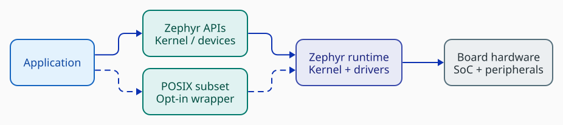
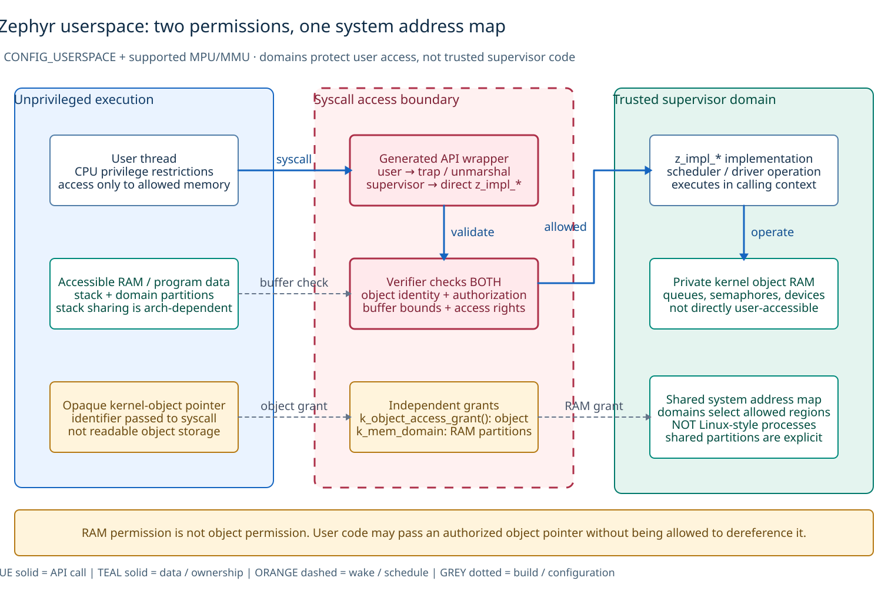
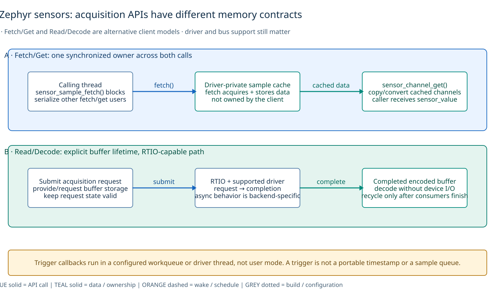
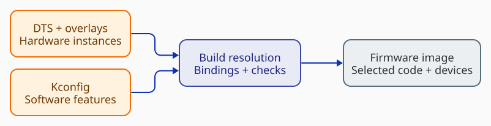
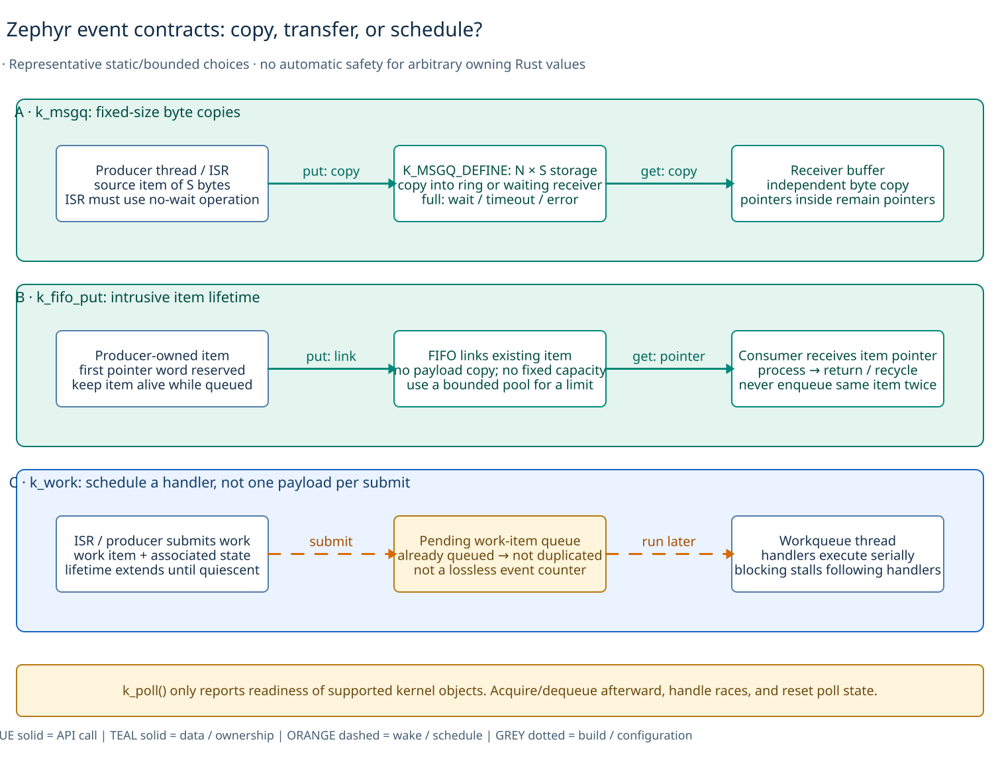
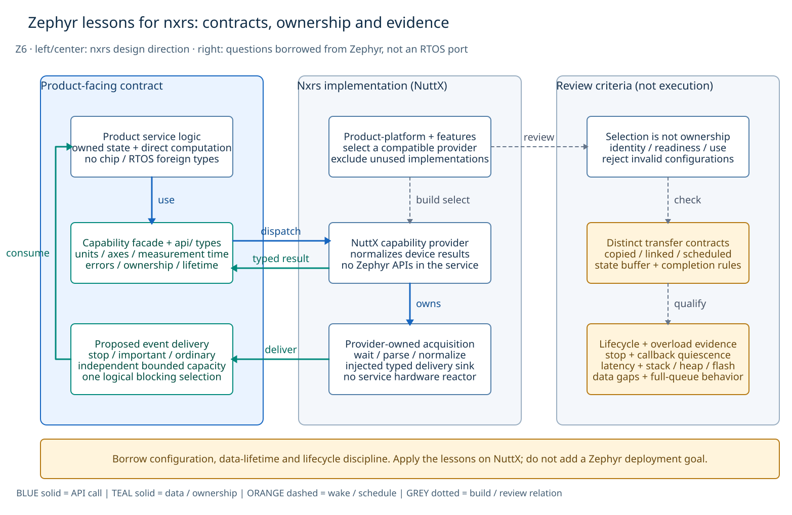

# Zephyr architecture atlas

These six views explain Zephyr's architecture and the contracts worth learning from it. Read the [architecture study](README.md) for the common ten-topic review and the [cross-system comparison](../README.md) for borrowing decisions. The subject is prior art for nxrs, not running nxrs on Zephyr.

## View guide

| View | Question and intended picture |
| --- | --- |
| **Z1 — architecture** | Separate application APIs, kernel/device contracts, and driver/hardware implementation. Show native and optional POSIX routes without inventing process boundaries. |
| **Z2 — protection** | Draw an unprivileged caller, syscall verification, and trusted implementation. Distinguish RAM access from kernel-object authorization. |
| **Z3 — sensor ownership** | Contrast Fetch/Get's driver-private cache with Read/Decode's explicit encoded-buffer lifetime. |
| **Z4 — build versus runtime** | Trace devicetree and Kconfig into a linked image, initialization, readiness checks and use. A device pointer is not ownership. |
| **Z5 — event contracts** | Compare copied message records, intrusive item transfer and scheduled work. Show what storage/lifetime and event-counting promises differ. |
| **Z6 — lessons for nxrs** | Apply device/configuration separation, explicit data ownership and lifecycle checks to nxrs on NuttX. Borrow the contract questions, not Zephyr APIs or an RTOS port. |

Region titles identify whether a boundary is logical, execution-related, memory-related or a syscall access boundary. Blue solid arrows are calls; teal solid arrows carry data/ownership; orange dashed arrows schedule/notify; grey dotted arrows are configuration/build relationships (or the explicitly labeled design checks in Z6). Red gates indicate access/protection checks. **The colors do not imply that every component has a separate thread or address space.** Arrow labels and each view's scope are essential parts of the model.

## Z1. Native contracts, optional compatibility, one runtime

[Editable D2](diagrams/zephyr-abstractions.d2)

Native applications use Zephyr kernel and device APIs. POSIX is an optional compatibility library over enabled services, not the foundation of all peripheral access. Device-class calls dispatch through the API associated with an instance; they do not require a universal `open/read/ioctl` device layer. The instance separates constant configuration and operations from mutable runtime data. A device object or queue is not itself a worker thread. [POSIX implementation][posix] · [Device model][device]

This view focuses on thread/object and sensor paths, not a complete inventory of filesystem, networking and power-management subsystems. Its application call sites can share a thread. The columns represent dependencies in the ordinary single-image model. They are not user/kernel/process partitions. Even with userspace enabled, an API call is not automatically a new thread, an IPC message or a context switch: generated wrappers choose the appropriate dispatch path according to execution mode. That distinction is expanded in Z2. [System calls][syscalls]

## Z2. Object authorization and memory access are independent

[Editable D2](diagrams/memory-protection.d2)

With `CONFIG_USERSPACE` and a supported architecture, user threads enter system APIs through generated trap/unmarshal/verification machinery; supervisor callers can invoke the implementation directly. A verifier must validate the relevant object and permissions, and validate user-memory arguments before trusted code uses them. `k_object_access_grant()` authorizes operations on an object; memory-domain partitions govern which RAM is accessible. These are **different permissions**. A valid object pointer can be passed as an identifier without permission to dereference its underlying kernel storage. [System calls][syscalls] · [Kernel objects][objects]

Zephyr memory domains select accessible regions within the system's address map; this is not a claim of Linux-style per-process virtual address spaces. Shared partitions are explicit. Stack accessibility details depend on architecture/configuration, and supervisor code is trusted rather than confined by user-domain rules. The map deliberately does not promise that every other user stack is inaccessible on every port. [Memory protection design][domains] · [Userspace overview][user]

## Z3. Sensor interfaces differ in who owns the data

[Editable D2](diagrams/sensor-ownership.d2)

Fetch/Get is the established blocking acquisition/cache model. `sensor_sample_fetch()` updates driver-private sample state; `sensor_channel_get()` obtains channels from that cached acquisition. Multiple clients must synchronize the **whole fetch/get transaction**, not just individual calls, or another acquisition can replace the intended sample. This is neither a per-client event queue nor a universal measurement timestamp. [Fetch/Get contract][fetch]

Read/Decode exposes a buffer-oriented model with RTIO integration: acquisition produces encoded data that can be decoded without another device access. Storage and request state must remain valid until completion, and the completed buffer cannot be recycled while consumers still need it. Actual asynchronous operation, streaming and bus behavior depend on the backend. Trigger callbacks are a separate execution concern: their supported thread/workqueue context is not user mode, and a trigger is not a retained sample queue. [Read/Decode contract][decode] · [Fetch/Get and triggers][fetch]

## Z4. Hardware selection is not runtime construction or ownership

[Editable D2](diagrams/zephyr-build-selection.d2)

Devicetree plus overlays/bindings describes hardware instances and properties; Kconfig selects software and its dependencies. Compilation/linking combines metadata, selected code, device objects and initialization entries into the configured image. Neither source description alone proves that a functioning driver exists in the binary. [Devicetree versus Kconfig][dt-kconfig] · [Device model][device]

The right-hand runtime lane is deliberately separate. `DEVICE_DT_GET` obtains a pointer; `device_is_ready()` checks successful initialization. Neither grants exclusive use or solves synchronization, power state, missing operations or lifetime policy. The diagram chooses the common statically configured MCU path; dynamic buses and deferred initialization need their specific rules. [Device acquisition][dt-get]

## Z5. Copy, transfer and scheduling are different contracts

[Editable D2](diagrams/queue-contracts.d2)

`k_msgq` transfers fixed-size byte records into bounded storage or directly to a waiting receiver. The sender's original bytes and the receiver's copy are separate storage, but a pointer inside the record is still a pointer—not a deep copy of its referent. Full-queue waiting/error policy and ISR no-wait constraints must be respected. This C byte-copy behavior is not automatically safe for arbitrary owning Rust values. [Message queues][msgq]

Ordinary intrusive `k_fifo_put` links caller-owned items rather than copying payloads. The first word is reserved for the FIFO linkage, and an item must stay valid while queued and must not be simultaneously enqueued twice. The FIFO itself has no fixed element-capacity bound; a bounded allocation pool can provide one. The separately available allocating variants are outside this illustrated path. [FIFO contract][fifo]

`k_work` schedules a handler on a workqueue thread. A work item already queued is not duplicated for every submit, so it is not a lossless sample/event counter. Work and associated state must remain alive until their execution is quiescent; a blocking handler holds up subsequent work on that same queue. `k_poll()` reports readiness of supported kernel objects, not ownership or arbitrary fd/Rust-channel readiness. Consumers must acquire/dequeue, handle races and reset poll state as required. [Workqueue semantics][work] · [Polling][poll]

## Z6. Borrow contract discipline, not a new RTOS dependency

[Editable D2](diagrams/nxrs-direction.d2)

This view is **nxrs design direction informed by Zephyr**, not a diagram of nxrs executing on Zephyr. Z1/Z4 show why configuration, device identity, initialization and exclusive ownership are separate. Z3/Z5 show why copied records, linked storage, scheduled work and completed operations cannot be treated as the same event contract. Apply these distinctions to the existing NuttX providers and ordinary Rust service owners. Do not import a global device graph or a byte-copy queue API merely because another system has one. [Cross-system borrowing decisions](../README.md#borrowing-decisions-and-acceptance-criteria) · [Nxrs capability architecture][nxrs-hal]

The product-facing contract states units, coordinates, timestamps, gaps, errors and lifetime. The provider owns acquisition/normalization and contains target-specific ABI details. Independently bounded queues and one logical selection point follow the proposed nxrs concurrency baseline; they are not a claim that Zephyr `k_poll` can select arbitrary Rust channels, or that a sensor API supplies a Rust execution environment. The right-hand column contains **design/qualification checks**, not a second running subsystem. [Concurrency baseline][nxrs-events] · [Polling contract][poll]

Retain the language/runtime distinction as an analytical lesson: the inspected official Rust module documents `no_std` and optional `alloc`, not a Rust `std` implementation; `native_sim` runs the Zephyr kernel, unlike OS-independent native service tests. These facts explain why language syntax, device abstraction and execution support are different promises. They do not create a Zephyr-provider or execution-port milestone for nxrs. [Pinned Rust allocator][rust] · [Native simulator][native] · [Languages and runtime](README.md#2-languages-and-runtime-model)

## Evidence and limits

The [source index](sources.md) separates immutable code examples from rolling upstream manuals and uses the same nxrs architecture baseline as the other studies. Independently reviewed snapshots are not a tested release pair. No runtime benchmark, memory-safety proof or target conformance test is claimed.

[Full-size viewing, geometry checks and reproduction](diagrams/README.md) records the diagram qualification separately from RTOS behavior.

[posix]: https://docs.zephyrproject.org/latest/services/portability/posix/implementation/index.html
[device]: https://docs.zephyrproject.org/latest/kernel/drivers/index.html
[syscalls]: https://docs.zephyrproject.org/latest/kernel/usermode/syscalls.html
[objects]: https://docs.zephyrproject.org/latest/kernel/usermode/kernelobjects.html
[domains]: https://docs.zephyrproject.org/latest/kernel/usermode/memory_domain.html
[user]: https://docs.zephyrproject.org/latest/kernel/usermode/overview.html
[fetch]: https://docs.zephyrproject.org/latest/hardware/peripherals/sensor/fetch_and_get.html
[decode]: https://docs.zephyrproject.org/latest/hardware/peripherals/sensor/read_and_decode.html
[dt-kconfig]: https://docs.zephyrproject.org/latest/build/dts/dt-vs-kconfig.html
[dt-get]: https://docs.zephyrproject.org/latest/build/dts/howtos.html
[msgq]: https://docs.zephyrproject.org/latest/kernel/services/data_passing/message_queues.html
[fifo]: https://docs.zephyrproject.org/latest/kernel/services/data_passing/fifos.html
[work]: https://docs.zephyrproject.org/latest/kernel/services/threads/workqueue.html
[poll]: https://docs.zephyrproject.org/latest/kernel/services/polling.html
[rust]: https://github.com/zephyrproject-rtos/zephyr-lang-rust/blob/b7c19a642f2a433726cf0ea2c4ec2f205c6cee7b/zephyr/src/alloc_impl.rs
[native]: https://docs.zephyrproject.org/latest/boards/native/native_sim/doc/index.html

[nxrs-hal]: https://github.com/yongkyuns/nxrs/blob/5c0d6360ef5190346ddfd41aec766895800ba287/docs/hal-platform-architecture.md

[nxrs-events]: https://github.com/yongkyuns/nxrs/blob/5c0d6360ef5190346ddfd41aec766895800ba287/docs/concurrency-event-communication.md

[nxrs-readme]: https://github.com/yongkyuns/nxrs/blob/5c0d6360ef5190346ddfd41aec766895800ba287/README.md

[nxrs-device]: https://github.com/yongkyuns/nxrs/blob/5c0d6360ef5190346ddfd41aec766895800ba287/docs/nuttx-device-access.md
