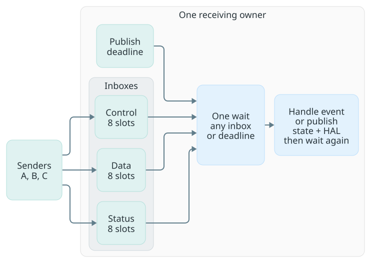
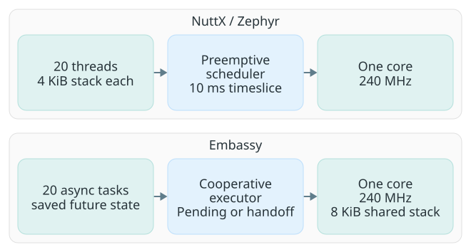
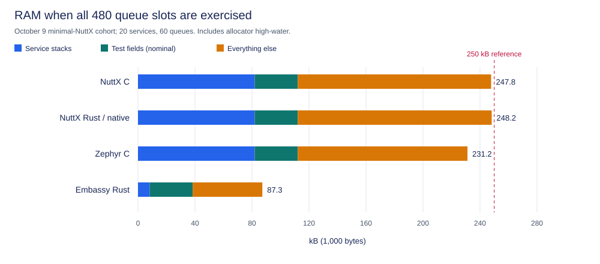
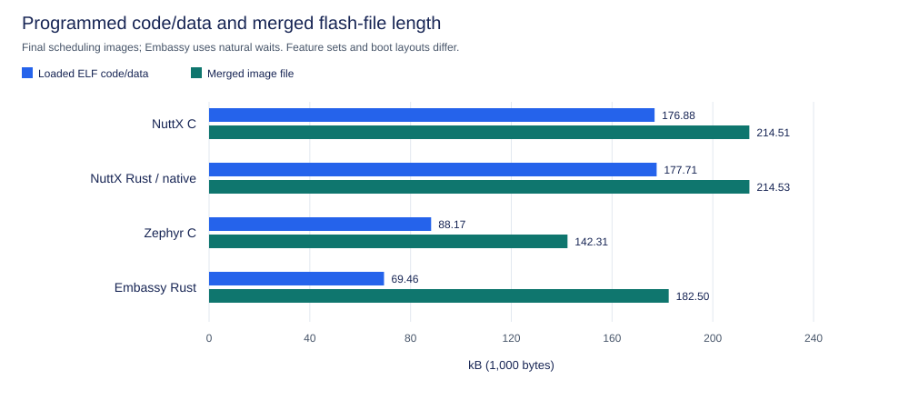
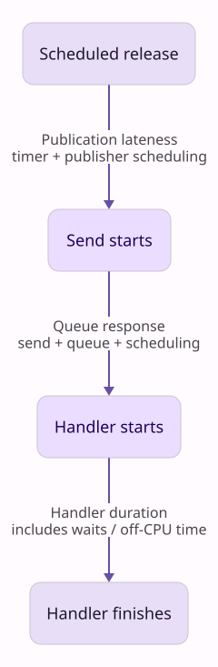
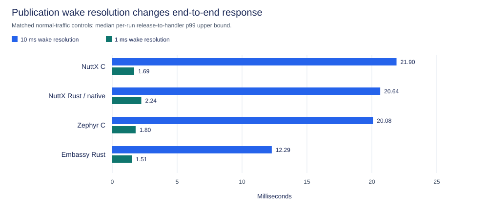

# Event-driven services on NuttX, Zephyr and Embassy

Twenty services and sixty bounded queues can run correctly on all four tested
implementations. Their main differences are execution storage, platform
features and responsiveness during CPU-heavy work—not simply C versus Rust.

Rust on NuttX can add little overhead when it shares C's native queue/thread
boundary. Embassy uses much less RAM here, but synchronous work blocks its
single cooperative executor. Zephyr's native C configuration handles the tested
heavy work well. None of these results qualifies a finished 250 kB product.

## Workload and fairness

Each service owns an event loop, receives from multiple senders and has one
wait point for its inboxes and publication calendar. There are no reply
round trips or sequential queue-poll timeouts.

The main layout is 20 services × 3 queues × 8 slots × 64 bytes: **30,720 bytes
of payload capacity**. A 20-mailbox alternative preserves capacity by combining
each service's inboxes into one 24-slot FIFO. Normal traffic offers 3,900
deliveries in two seconds; burst traffic offers 6,240, then a 500 ms drain.

Accepted events are checked for delivery, order and payload correctness.
Nonblocking sends can reject overload; correct queues alone cannot guarantee
that every offered event fits or meets its deadline.

| Held equal | Different by design |
| --- | --- |
| One 240 MHz core, flash/cache settings, routing, payloads, calendar and application `-O2` | Native POSIX, Zephyr or Embassy facilities |
| Same minimal NuttX kernel configuration and C/Rust native adapter; NuttX/Zephyr kernel `-Os`, applications `-O2` | NuttX retains POSIX/VFS/libc; Zephyr and Embassy expose different native APIs |
| 20 × 4 KiB native worker stacks in C and Rust | Embassy uses an 8 KiB shared stack plus saved task state |

NuttX Rust here does **not** use `std::thread`, std MPSC, Crossbeam or
`println!`. This isolates application-language cost, not full std convenience.
Zephyr Rust integration and other Embassy executor arrangements were not tested.

## RAM: count provisioned capacity

NuttX allocates queued messages on demand; Zephyr and Embassy reserve buffers
statically. Comparing a quiet NuttX run with a fully reserved async image would
understate NuttX's capacity requirement. The capacity control repeatedly fills
and drains every slot, including a deliberately rejected overflow send.

| October 9 full-capacity control | 60 class queues |
| --- | ---: |
| NuttX C, minimal | 247,204 B |
| NuttX Rust, minimal / native threads | 247,620 B |
| Zephyr C | 231,208 B |
| Embassy Rust, natural waits | 87,256 B |

Totals count resident RAM plus allocator high-water, or static buffers, stacks
and arenas once. All eight capacity invocations passed three fill/drain cycles
and deliberate overflow checks each. All four images have PSRAM disabled.

The reference budget is **250,000 bytes**, not 250 KiB. The 60-queue NuttX
fixture now fits by less than 3 kB, which is not useful product headroom.
Zephyr also leaves limited margin. Embassy leaves much more room for drivers
and application state. Earlier 20-mailbox controls reduce queue-object costs,
but belong to a separate, broader NuttX configuration.

These are whole-fixture totals, not messaging costs: native service stacks
reserve 81,920 bytes and nominal test diagnostics account for 30,196 bytes.
Common stacks are not a Rust tax. Subtracting diagnostics is not qualification
of a rebuilt lean image. Queue-event storage is a configurable **30,720 bytes**
here: reducing each queue from eight slots to four halves that storage to
15,360 bytes, but also halves its burst capacity. Actual total RAM savings depend
on platform allocation and bookkeeping. Event size and queue count are also
application choices, not fixed framework requirements.

"Other platform/service RAM" is the remainder after those three categories,
including queue metadata, service state, OS/runtime memory and unseparated
stack/alignment costs. It is not a measured messaging-only overhead or entirely
fixed cost. Queue storage and owner-specific buffers remain recurring costs;
async buffers held across an await also consume RAM.

## Image size: distinguish contents from address span

The chart uses the October 9 minimal-NuttX cohort, with freshly built NuttX
and remeasured frozen Zephyr/Embassy images.[^flash-size]

The minimal profile removes NSH, procfs/mount support, RAM-disk utilities,
unused UART/random/C++/floating-point printing support, environment/child-task
bookkeeping and PSRAM. A bounded command loop replaces the shell.
Native queues, `poll`, pthreads, LED readback,
assertions, stack coloration, timing, TLS and 64-bit ABI settings remain.
Kernel/libc use `-Os`, matching Zephyr; both application handlers stay `-O2`.
This is a workload-specific profile, not a general-purpose std configuration.

| Current image | Stored contents, no gaps | Gap-free package | Flash address span |
| --- | ---: | ---: | ---: |
| NuttX C | 114,764 B | 115,835 B | 138,992 B |
| NuttX Rust | 115,580 B | 116,651 B | 139,008 B |
| Zephyr C | 88,248 B | 89,319 B | 142,312 B |
| Embassy Rust | 91,012 B | 92,362 B | 182,656 B |

The matched NuttX comparison across the earlier NSH/board baseline and minimal
benchmark was:

| Matched NuttX profile | C code + initialized data | Rust code + initialized data | C / Rust flat flash file |
| --- | ---: | ---: | ---: |
| Earlier NSH/board baseline | 176,884 B | 177,708 B | 214,508 / 214,532 B |
| Minimal benchmark | 114,667 B | 115,483 B | 138,992 / 139,008 B |

NuttX C's code + initialized data falls by **62,217 B (35%)** and its binary
by **75,516 B (35%)**. These are combined configuration/build-policy savings,
not an attribution to any single subsystem. Rust adds **816 B of code +
initialized data**, also **816 B to the gap-free package**, over matched C.
The flat `.bin` grows only 16 B because the extra code consumes existing padding.

The same uncompressed ZIP format omits only validated alignment/inter-component
gaps on every platform. Real zero-filled application data is retained. A small
manifest restores the exact addresses/fill bytes; round trips reproduce every
measured image's SHA-256. Packages are distribution files, not directly bootable
images. Flashing still uses the reconstructed `.bin`, because the ESP32's mapped
flash requires alignment. This does **not** shrink the on-device address span.

Embassy's stored contents include its 21,072 B bootloader and 128 B of partition
records; NuttX/Zephyr use simple boot with loader code already in the application.
Its remaining 91,644 B is empty address space, not debugging information or
runtime code. The smaller Embassy application therefore does not imply the
smallest complete bootable system. All spans fit within 2 MB; budget partitions
using the span, not the ZIP size. No bootloader/linker policy was changed.

Remaining NuttX C bytes, from its ELF and retained link-map intervals:

| Component | Bytes |
| --- | ---: |
| Architecture/HAL, startup and board code | 42,663 |
| Scheduler, threads, signals and queues | 20,024 |
| VFS code | 8,385 |
| libc, drivers and heap code | 15,850 |
| Benchmark code | 8,938 |
| In-section padding/unattributed code bytes | 1,867 |
| Constants and initialized data | 16,940 |
| Total | 114,667 |

Architecture/HAL includes boot and flash initialization. These platform costs
are shared by C and Rust; they are not a Rust tax or debug information.

For formatting, startup, thread wrappers and containers, see the separate
[Rust footprint analysis](rust-std-footprint.md). Those choices should not be
charged to this native-API fixture.

## Speed: responsiveness is not queue-operation time

Release-to-handler response includes late publication and queue response.
Handler duration includes sleeps and preemption; it is not CPU utilization.
Means alone can hide a stalled service, so the checks also retain tail
latency, deadline misses and rejected-send counts.

Changing publication wake resolution from 10 ms to 1 ms reduces median
per-run release-to-handler p99 from roughly 12–22 ms to 1.5–2.2 ms.
The native 10 ms timeslice is unchanged. Timer resolution can dominate a
small-handler benchmark; the CPU/power cost of finer wakes was not measured.

### I/O and CPU work need different treatment

In the October 9 cohort, all 205,920 offered messages arrived correctly,
without rejections. All 40 traffic invocations outside the long-CPU profile
had no deadline misses; every simulated-I/O run completed 117 operations.
Embassy's natural policy needed no explicit handoffs: its timer-backed future
suspended naturally. Earlier budgeted/chunked controls showed the same I/O
behavior.

An await that is immediately ready does not suspend. A cooperative service
therefore needs bounded ready-loop work, and a long synchronous handler must
be split if peers need timely service. A between-handler budget cannot
interrupt the handler itself.

The October 9 cohort retains the frozen six-patch Rust compiler, without
further tuning. The long profile adds 400,000 arithmetic iterations to one
handler; all four implementations process it monolithically.

| Long-CPU profile, two runs each | Longest handler | Peer queue maximum | Deadline misses |
| --- | ---: | ---: | ---: |
| NuttX C, minimal | 11.267 ms | 10.993 ms | 2 |
| NuttX Rust, minimal / patched compiler | 12.839 ms | 10.929 ms | 23 |
| Zephyr C | 10.879 ms | 10.035 ms | 0 |
| Embassy natural, patched compiler | 10.032 ms | 21.002 ms | 4 |

Earlier chunked Embassy controls reduced peer queue maximum to 1.251 ms,
at the cost of more elapsed handler time; those samples are not pooled here.
Loss-free delivery is not deadline qualification. Maxima are observations,
not hard bounds; this table does not isolate queue overhead or establish a
stable speed ranking from two runs. The
[compiler assessment](../tests/arithmetic-parity/RESULTS.md) explains remaining
gaps. Its frozen 29-patch candidate is opt-in, not SDK or CI activation.

## Lean NuttX application check

The separate [LED-service qualification](../tests/service-qualification/README.md)
uses 16-byte events, 1/8/8 queue capacities, real GPIO readback and ordinary
Rust startup with PSRAM disabled. Its workload and results are separate from
the multicast comparison here. It reports image size, RAM and latency, plus
restart, fault, sustained-delivery and controlled-pressure checks. Zephyr and
Embassy were not tested with this workload; IRQ latency remains untested.

## Development choice

| Approach | Benefit | Cost or constraint |
| --- | --- | --- |
| nxrs / Rust on NuttX | Rust app types/ownership, existing drivers and POSIX/std options, preemptive blocking work | Broader platform footprint, FFI boundaries, deliberate API and RAM budgeting |
| C on NuttX | Same native facilities; small matched application | Manual ownership/lifetime discipline; common OS costs remain |
| Zephyr C | Compact tested image, native wait-any queues, good tested CPU-load response | Different driver/configuration ecosystem; threaded RAM remains substantial |
| Embassy Rust | Much lower execution RAM, bounded channels/tasks, naturally suspending I/O | Async drivers and bounded synchronous work; no in-handler preemption on this executor |

The evidence supports continuing with Rust on NuttX, not calling its overhead
zero. For a hard 250 kB budget with many mostly-waiting services, async execution
deserves consideration. The next useful qualification is actual interrupt-driven
I/O under concurrent traffic, with publication/completion deadlines and a full
driver/buffer budget—not more synthetic compiler tuning.

## Evidence and reproduction

- [Shared event-service contract and local tools](../tests/event-services-comparison/README.md)
  and [numeric evidence index](../tests/event-services-comparison/results/README.md).
- [nxrs before/after demo](../tests/service-footprint/README.md) and
  [current LED qualification](../tests/service-qualification/README.md).
- [Compiler coverage and assessment](../tests/arithmetic-parity/RESULTS.md);
  [figure regeneration](assets/rtos-comparison/README.md).

Separate workloads and compiler cohorts are not pooled. Reports retain numeric
runs and artifact/configuration provenance, without private backups or raw
device identifiers. Zephyr/Embassy are isolated experiments, not production
workspace dependencies.

[^flash-size]: Code + initialized data counts stored firmware ELF sections,
    including read-only data and initial RAM values. Stored image contents add
    boot components/headers but exclude explicit gaps; packages add ZIP/manifest
    overhead without compression. Flash address span includes gaps needed by
    the chosen boot/flash layout. Debug symbols stay in the separate ELF;
    uninitialized RAM such as `.bss` is not stored in these files.
